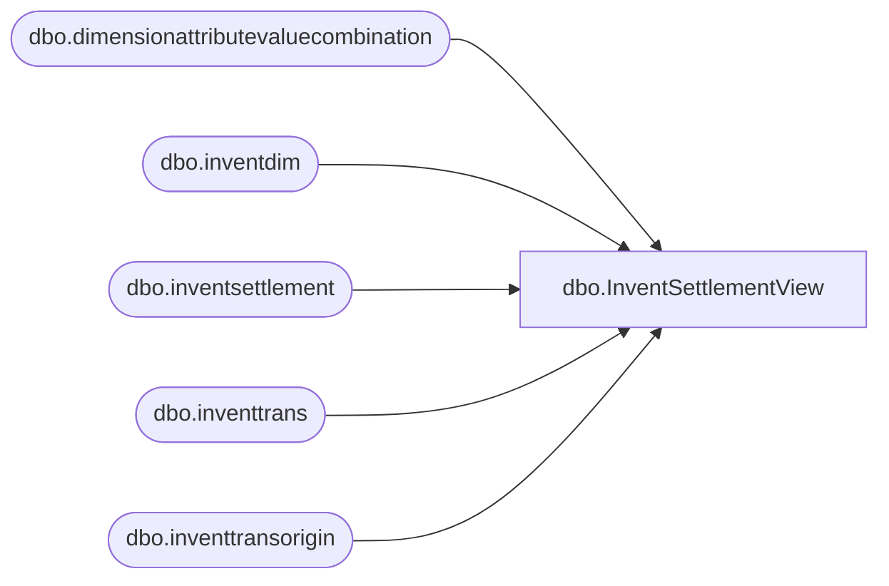

# dbo.InventSettlementView

**Database:** LH_D365  
**Server:** 4db76rlxaxcuvmuh5kw37wbnqq-ovsykae43znuhlmnflcdwm4ohu.datawarehouse.fabric.microsoft.com  

## Architecture Diagram



## Table Dependencies

| Referenced Table |
|---|
| dbo.dimensionattributevaluecombination |
| dbo.inventdim |
| dbo.inventsettlement |
| dbo.inventtrans |
| dbo.inventtransorigin |

## View Code

```sql
-- ============================================= -- Description: A view to summarize inventory settlement adjustments. -- ============================================= CREATE   VIEW [dbo].[InventSettlementView] AS WITH JurisdictionMapping AS (     SELECT         jurisdiction_code,         LegalEntity     FROM     (         VALUES             ('US', '1100'),             ('US', '1200'),             ('US', '1700'),             ('CA', '1700'),             ('UK', '2110'),             ('IE', '2110'), -- The IN ('UK', 'IE') becomes two separate rows             ('CN', '3001')     ) AS v (jurisdiction_code, LegalEntity) ) SELECT     id.inventlocationid,     CONCAT(id.inventlocationid, '-', isett.dataareaid) AS 'LocationKey', 	CONCAT(isett.itemid, isett.dataareaid,jm.jurisdiction_code) AS 'product_key',     isett.transdate,     isett.voucher,     isett.dataareaid,     davc.mainaccountvalue,     isett.itemid,     SUM(isett.costamountadjustment) AS TotalCostAmountAdjustment FROM     LH_D365.dbo.[inventsettlement] AS isett INNER JOIN     LH_D365.dbo.[inventtrans] AS it ON isett.transrecid = it.recid INNER JOIN     LH_D365.dbo.[inventtransorigin] AS ito ON it.inventtransorigin = ito.recid INNER JOIN      LH_D365.dbo.[inventdim] id ON id.inventdimid = it.inventdimid INNER JOIN     JurisdictionMapping jm ON jm.LegalEntity = isett.dataareaid INNER JOIN      LH_D365.dbo.[dimensionattributevaluecombination] davc ON davc.recid = isett.operationsledgerdimension WHERE     isett.transdate >= DATEADD(MONTH, -36, GETDATE())     --AND isett.voucher LIKE 'IAV%'     --AND davc.mainaccountvalue = '500840' GROUP BY     isett.itemid,     id.inventlocationid,     isett.voucher,     isett.transdate,     davc.mainaccountvalue,     isett.dataareaid,     jm.jurisdiction_code
```

