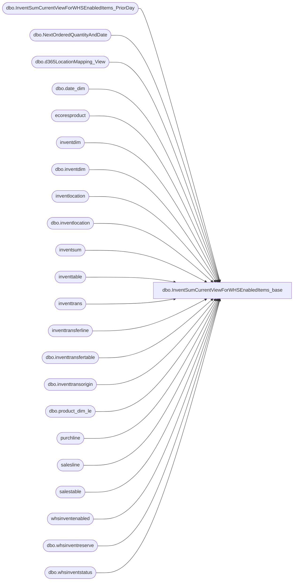

# dbo.InventSumCurrentViewForWHSEnabledItems_base

**Database:** LH_D365  
**Server:** 4db76rlxaxcuvmuh5kw37wbnqq-ovsykae43znuhlmnflcdwm4ohu.datawarehouse.fabric.microsoft.com  

## Architecture Diagram



## Table Dependencies

| Referenced Table |
|---|
| dbo.InventSumCurrentViewForWHSEnabledItems_PriorDay |
| dbo.NextOrderedQuantityAndDate |
| dbo.d365LocationMapping_View |
| dbo.date_dim |
| ecoresproduct |
| inventdim |
| dbo.inventdim |
| inventlocation |
| dbo.inventlocation |
| inventsum |
| inventtable |
| inventtrans |
| inventtransferline |
| dbo.inventtransfertable |
| dbo.inventtransorigin |
| dbo.product_dim_le |
| purchline |
| salesline |
| salestable |
| whsinventenabled |
| dbo.whsinventreserve |
| dbo.whsinventstatus |

## View Code

```sql
/****** Object:  View [dbo].[InventSumCurrentViewForWHSEnabledItems_base]    Script Date: 3/30/2026 1:26:40 PM ******/ /****** Object:  View [dbo].[InventSumCurrentViewForWHSEnabledItems_base]    Script Date: 3/27/2026 12:13:17 PM ******/  CREATE   VIEW [dbo].[InventSumCurrentViewForWHSEnabledItems_base] AS WITH ItemWHSEnabled AS (     SELECT         [it].[dataareaid],         [it].[itemid],         CASE WHEN [whsenabled].[itemid] IS NOT NULL THEN 1 ELSE 0 END AS [IsWhsEnabled]     FROM [inventtable] AS [it]     LEFT JOIN [whsinventenabled] AS [whsenabled]         ON [it].[itemid] = [whsenabled].[itemid]         AND [it].[dataareaid] = [whsenabled].[dataareaid]         AND [whsenabled].[IsDelete] IS NULL     WHERE [it].[IsDelete] IS NULL ), -- Pre-calculate current week date range once CurrentWeekDates AS (     SELECT          MIN(actual_date) AS WeekStart,         MAX(actual_date) AS WeekEnd,         CONCAT(fiscal_year, fiscal_week) AS CurrentFiscalWeek     FROM [LH_Mart].[dbo].[date_dim]     WHERE actual_date = CAST(GETDATE() AS DATE)     GROUP BY CONCAT(fiscal_year, fiscal_week) ), /* -- TESTING ONLY: Filter entire query to a single PO and style POItems AS (     SELECT DISTINCT         itt.dataareaid,         itt.itemid     FROM inventtrans AS itt     INNER JOIN inventtransorigin AS ito         ON ito.recid = itt.inventtransorigin         AND ito.dataareaid = itt.dataareaid     WHERE ito.referencecategory = 3         AND ito.referenceid = 'PO170012103' -- TESTING ONLY         AND itt.itemid = '058380' -- TESTING ONLY ), */ SumInventSum AS (     SELECT         [isum].[dataareaid],         [isum].[inventsiteid],         [isum].[inventlocationid],         UPPER([isum].[inventstatusid]) as [inventstatusid],         [isum].[itemid],         SUM([isum].[postedqty] + [isum].[received] + [isum].[registered] - [isum].[deducted] - [isum].[picked] - [isum].[reservphysical]) AS [AvailablePhysicalCalculated],         SUM([isum].[onorder]) AS [onorder],         MAX([lastupddateexpected]) AS [lastupddateexpected],         SUM([isum].[arrived]) AS [arrived],         SUM([isum].[availordered]) AS [availordered],         SUM([isum].[availphysical]) AS [availphysical],         SUM([deducted]) AS [deducted],         SUM([ordered]) AS [ordered],         SUM([physicalinvent]) AS [physicalinvent],         SUM([picked]) AS [picked],         SUM([postedqty]) AS [postedqty],         SUM([quotationissue]) AS [quotationissue],         SUM([quotationreceipt]) AS [quotationreceipt],         SUM([received]) AS [received],         SUM([registered]) AS [registered],         SUM([isum].[reservordered]) AS [reservordered],         SUM([isum].[reservphysical]) AS [reservphysical], 		sum(isum.postedvalue)   as postedvalue,         sum(isum.physicalvalue) as physicalvalue     FROM [inventsum] AS [isum]     WHERE [isum].[closed] = 0         AND [isum].[IsDelete] IS NULL     GROUP BY         [isum].[dataareaid],         [isum].[inventsiteid],         [isum].[inventlocationid],         UPPER([isum].[inventstatusid]),         [isum].[itemid] ) , OnhandCost AS (   SELECT     isum.dataareaid,     isum.itemid,     isum.inventlocationid,     p.producttype,     it.propertyid,      ROUND(       coalesce(         SUM(isum.postedvalue + isum.physicalvalue)         / nullif(             (SUM(isum.postedqty + isum.received) - SUM(abs(isum.deducted))),             0           ),         0       ),       2     ) AS on_hand_unit_cost,      ROUND(       coalesce(         SUM(isum.postedvalue + isum.physicalvalue)         / nullif(             (SUM(isum.postedqty + isum.received) - SUM(abs(isum.deducted))),             0           ),         0       )       * (         (SUM(isum.postedqty + isum.received + isum.registered) - SUM(isum.deducted - isum.picked))       ),       2     ) AS on_hand_cost    FROM SumInventSum isum   INNER JOIN inventtable it     ON it.itemid = isum.itemid    AND it.dataareaid = isum.dataareaid   INNER JOIN ecoresproduct p     ON p.recid = it.product   GROUP BY     isum.dataareaid, isum.itemid, isum.inventlocationid, p.producttype, it.propertyid ),  DistinctInventTrans AS (     SELECT DISTINCT         itt.dataareaid,         idd.inventsiteid,         itl.inventlocationid,         idd.inventstatusid,         itt.itemid,         ito.inventtransid,         qtyremainship AS CreatedNotShippedQty,         qtyshipped - qtyreceived AS ShippedNotReceivedQty     FROM inventtrans AS itt     INNER JOIN dbo.inventtransorigin AS ito         ON ito.recid = itt.inventtransorigin         AND ito.dataareaid = itt.dataareaid         AND ito.referencecategory = 22     INNER JOIN dbo.inventtransfertable AS invt         ON invt.transferid = ito.referenceid         AND invt.dataareaid = itt.dataareaid         AND invt.transferstatus IN (0, 1)     INNER JOIN dbo.inventdim AS idd         ON idd.inventdimid = itt.inventdimid         AND idd.dataareaid = itt.dataareaid     INNER JOIN dbo.inventlocation AS itl         ON itl.inventlocationid = idd.inventlocationid         AND itl.dataareaid = itt.dataareaid     INNER JOIN inventtransferline AS itransl         ON invt.transferid = itransl.transferid         AND invt.dataareaid = itransl.dataareaid         AND itt.itemid = itransl.itemid         AND ito.inventtransid = itransl.inventtransidreceive     WHERE itt.statusreceipt = 5 ), IntercompanyShippedNotReceived AS (     -- Intercompany SO Delivered / PO Open Order: shipped by selling entity, not yet received at buying entity     SELECT         pl.dataareaid,         il.inventsiteid,         idpurch.inventlocationid,         idpurch.inventstatusid,         sl.itemid,         SUM(pl.remainpurchphysical) AS ShippedNotReceivedQty     FROM salestable st     INNER JOIN salesline sl         ON sl.dataareaid = st.dataareaid         AND sl.salesid = st.salesid     INNER JOIN purchline pl         ON pl.dataareaid = st.intercompanycompanyid         AND pl.purchid = st.intercompanypurchid         AND pl.itemid = sl.itemid         AND pl.inventtransid = sl.intercompanyinventtransid     INNER JOIN inventdim idpurch         ON idpurch.inventdimid = pl.inventdimid     INNER JOIN dbo.inventlocation il         ON il.inventlocationid = idpurch.inventlocationid         AND il.dataareaid = pl.dataareaid     WHERE (sl.salesstatus IN (2, 3) OR (sl.salesstatus = 1 AND sl.salesqty > sl.remainsalesphysical))         AND pl.purchstatus = 1     GROUP BY         pl.dataareaid, il.inventsiteid, idpurch.inventlocationid, idpurch.inventstatusid, sl.itemid ), IntercompanyCreatedNotShipped AS (     -- Intercompany SO Open Order / PO Open Order: ordered but nothing shipped yet from selling entity     SELECT         pl.dataareaid,         il.inventsiteid,         idpurch.inventlocationid,         idpurch.inventstatusid,         sl.itemid,         SUM(pl.remainpurchphysical) AS CreatedNotShippedQty     FROM salestable st     INNER JOIN salesline sl         ON sl.dataareaid = st.dataareaid         AND sl.salesid = st.salesid     INNER JOIN purchline pl         ON pl.dataareaid = st.intercompanycompanyid         AND pl.purchid = st.intercompanypurchid         AND pl.itemid = sl.itemid         AND pl.inventtransid = sl.intercompanyinventtransid     INNER JOIN inventdim idpurch         ON idpurch.inventdimid = pl.inventdimid     INNER JOIN dbo.inventlocation il         ON il.inventlocationid = idpurch.inventlocationid         AND il.dataareaid = pl.dataareaid     WHERE sl.salesstatus = 1         AND sl.remainsalesphysical >= sl.salesqty  -- nothing shipped yet         AND pl.purchstatus = 1     GROUP BY         pl.dataareaid, il.inventsiteid, idpurch.inventlocationid, idpurch.inventstatusid, sl.itemid ), TransferQuantities AS ( SELECT     dataareaid,     inventsiteid,     inventlocationid,     inventstatusid,     itemid,     SUM(CreatedNotShippedQty) AS [CreatedNotShippedQty],     SUM(ShippedNotReceivedQty) AS [ShippedNotReceivedQty] FROM (     SELECT dataareaid, inventsiteid, inventlocationid, inventstatusid, itemid,            CreatedNotShippedQty, ShippedNotReceivedQty     FROM DistinctInventTrans     UNION ALL     SELECT dataareaid, inventsiteid, inventlocationid, inventstatusid, itemid,            0 AS CreatedNotShippedQty, ShippedNotReceivedQty     FROM IntercompanyShippedNotReceived     UNION ALL     SELECT dataareaid, inventsiteid, inventlocationid, inventstatusid, itemid,            CreatedNotShippedQty, 0 AS ShippedNotReceivedQty     FROM IntercompanyCreatedNotShipped ) AS src GROUP BY     dataareaid,     inventsiteid,     inventlocationid,     inventstatusid,     itemid ), -- Combine SO and PO queries to share inventtrans scan OrderQuantities AS (     SELECT         itt.dataareaid,         idd.inventsiteid,         itl.inventlocationid,         idd.inventstatusid,         itt.itemid,         SUM(CASE WHEN ito.referencecategory = 0 AND itt.statusissue IN (5, 6) THEN itt.qty * -1 ELSE 0 END) AS [SOOnOrder],         SUM(CASE WHEN ito.referencecategory = 3 AND itt.statusreceipt IN (1, 2) THEN itt.qty ELSE 0 END) AS [POOrdered],         SUM(CASE              WHEN ito.referencecategory = 0                  AND itt.statusissue = 1                  AND itt.[datefinancial] BETWEEN cwd.WeekStart AND cwd.WeekEnd             THEN itt.qty * -1              ELSE 0          END) AS [CurrentWeekSales]     FROM inventtrans AS itt     INNER JOIN dbo.inventtransorigin AS ito         ON ito.recid = itt.inventtransorigin         AND ito.dataareaid = itt.dataareaid     INNER JOIN dbo.inventdim AS idd         ON idd.inventdimid = itt.inventdimid         AND idd.dataareaid = itt.dataareaid     INNER JOIN dbo.inventlocation AS itl         ON itl.inventlocationid = idd.inventlocationid         AND itl.dataareaid = itt.dataareaid     CROSS JOIN CurrentWeekDates AS cwd     WHERE (         (ito.referencecategory = 0 AND itt.statusissue IN (1, 5, 6))         OR (ito.referencecategory = 3 AND itt.statusreceipt IN (1, 2))     )     GROUP BY         itt.dataareaid,         idd.inventsiteid,         itl.inventlocationid,         idd.inventstatusid,         itt.itemid ), InTransitIntercompany AS (   SELECT     st.dataareaid,     st.intercompanycompanyid,     idsales.inventlocationid AS fromlocation,     CASE WHEN idsales.inventlocationid IN ('9990','9991','9980','9970','9960','9942','9941','9940','8010') THEN 1 ELSE 0 END AS fromDC,     CASE WHEN idpurch.inventlocationid  IN ('9990','9991','9980','9970','9960','9942','9941','9940','8010') THEN 1 ELSE 0 END AS toDC,     idpurch.inventlocationid AS tolocation,     idsales.inventstatusid AS salesinventstatusid,     idpurch.inventstatusid AS purchinventstatusid,     sl.itemid AS itemid,     SUM(sl.lineamount) AS saleslineamount,     SUM(sl.salesqty)   AS salesqty,     SUM(pl.remainpurchphysical) AS purchqty,     SUM(pl.remainpurchphysical * pl.purchprice) AS purchamount   FROM salestable st   INNER JOIN salesline sl     ON sl.dataareaid = st.dataareaid    AND sl.salesid    = st.salesid   INNER JOIN inventdim idsales     ON idsales.inventdimid = sl.inventdimid   INNER JOIN purchline pl     ON pl.dataareaid = st.intercompanycompanyid    AND pl.purchid    = st.intercompanypurchid    AND pl.itemid     = sl.itemid    AND pl.inventtransid = sl.intercompanyinventtransid   INNER JOIN inventdim idpurch     ON idpurch.inventdimid = pl.inventdimid   WHERE sl.salesstatus IN (2, 3)     AND pl.purchstatus = 1   GROUP BY     st.dataareaid, st.intercompanycompanyid,     idsales.inventlocationid, idpurch.inventlocationid,     idsales.inventstatusid, idpurch.inventstatusid,     sl.itemid ),  InTransit AS (   SELECT     isum.dataareaid,     isum.itemid,     isum.inventstatusid,     substring(isum.inventlocationid, 1, 4) AS inventlocationid,     SUM(isum.physicalinvent) AS intransit_units   FROM SumInventSum isum   WHERE isum.inventstatusid <> ''     AND EXISTS (       SELECT 1       FROM inventlocation il       WHERE il.inventlocationid = isum.inventlocationid         AND il.inventlocationtype = 2     )   GROUP BY     isum.dataareaid, isum.itemid, isum.inventlocationid, isum.inventstatusid    UNION ALL    SELECT     it.dataareaid,     it.itemid,     it.salesinventstatusid AS inventstatusid,     it.fromlocation AS inventlocationid,     SUM(it.purchqty) AS intransit_units   FROM InTransitIntercompany it   WHERE it.toDC = 0   GROUP BY it.dataareaid, it.itemid, it.salesinventstatusid, it.fromlocation    UNION ALL    -- Intercompany in-transit from the BUYING entity's perspective (SO Delivered / PO Open Order)   SELECT     it.intercompanycompanyid AS dataareaid,     it.itemid,     it.purchinventstatusid AS inventstatusid,     it.tolocation AS inventlocationid,     SUM(it.purchqty) AS intransit_units   FROM InTransitIntercompany it   GROUP BY it.intercompanycompanyid, it.itemid, it.purchinventstatusid, it.tolocation ) ,InTransitSum AS ( 	SELECT  		it.itemid, it.inventlocationid,it.dataareaid, it.inventstatusid, 		SUM(it.intransit_units) as intransit_units 	from InTransit it 	group by  	it.itemid, it.inventlocationid,it.dataareaid, it.inventstatusid  ) ---------FINAL SELECT---------------- SELECT     [isum].[inventlocationid] + '-' + [isum].[dataareaid] AS [LocationKey],     [pd].[product_key],     [isum].[dataareaid],     [isum].[inventsiteid],     [isum].[inventlocationid],     UPPER(ISNULL([invStatus].[inventstatusid], [isum].[inventstatusid])) AS [inventstatusid],         [isum].[itemid],         CASE          WHEN [ItemEnabled].[IsWhsEnabled] = 1 THEN [whsinvres].[availphysical]         ELSE [isum].[AvailablePhysicalCalculated]     END AS [AvailablePhysicalCalculated],     CASE          WHEN [ItemEnabled].[IsWhsEnabled] = 1          THEN [whsinvres].[availphysical] - ([whsinvres].[availordered] + [whsinvres].[reservordered] - [whsinvres].[availphysical])         ELSE [isum].[AvailablePhysicalCalculated] - ([isum].[ordered] + [isum].[arrived])     END AS [Available to Distribute],     CASE          WHEN [ItemEnabled].[IsWhsEnabled] = 1          THEN ([whsinvres].[availordered] + [whsinvres].[reservordered] - [whsinvres].[availphysical])         ELSE ([isum].[ordered] + [isum].[arrived])     END AS [AllocationUnit],     [isum].[onorder],     CASE          WHEN [oq].[POOrdered] != 0 THEN CONVERT(VARCHAR(10), [isum].[lastupddateexpected])         ELSE ''     END AS [lastupddateexpected],     CASE          WHEN [ItemEnabled].[IsWhsEnabled] = 1          THEN [isum].[physicalinvent] - [whsinvres].[reservphysical] + ([whsinvres].[availordered] + [whsinvres].[reservordered] - [whsinvres].[availphysical]) - [whsinvres].[reservordered]         ELSE [isum].[physicalinvent] - [isum].[reservphysical] + [isum].[ordered] - [isum].[reservordered]     END AS [AVAIL + INTRANS],     CASE          WHEN [ItemEnabled].[IsWhsEnabled] = 1          THEN [isum].[physicalinvent] - [whsinvres].[reservphysical]         ELSE [isum].[physicalinvent] - [isum].[reservphysical]     END AS [CUR AVAI O/H],     CASE          -- Using whsinventstatus table enum for blocking classification         WHEN ISNULL([invStatus].[inventstatusblocking], 0) = 0 THEN         -- Hardcoded fallback (uncomment if whsinventstatus table is removed):         -- WHEN UPPER([isum].[inventstatusid]) NOT IN ('BLOCKED', 'DAMAGED', 'WRITE-OFFS', 'QUALITY') OR [isum].[inventstatusid] IS NULL THEN             CASE                  WHEN [ItemEnabled].[IsWhsEnabled] = 1                  THEN [isum].[physicalinvent] - [whsinvres].[reservphysical]                 ELSE [isum].[physicalinvent] - [isum].[reservphysical]             END         ELSE 0     END AS [CUR AVAI O/H Sellable],     CASE          -- Using whsinventstatus table enum for blocking classification         WHEN ISNULL([invStatus].[inventstatusblocking], 0) != 0 THEN         -- Hardcoded fallback (uncomment if whsinventstatus table is removed):         -- WHEN UPPER([isum].[inventstatusid]) IN ('BLOCKED', 'DAMAGED', 'WRITE-OFFS', 'QUALITY') THEN             CASE                  WHEN [ItemEnabled].[IsWhsEnabled] = 1                  THEN [isum].[physicalinvent] - [whsinvres].[reservphysical]                 ELSE [isum].[physicalinvent] - [isum].[reservphysical]             END         ELSE 0     END AS [CUR AVAI O/H Non-Sellable],     CASE          WHEN [ItemEnabled].[IsWhsEnabled] = 1          THEN ([whsinvres].[availordered] + [whsinvres].[reservordered] - [whsinvres].[availphysical]) - [whsinvres].[reservordered]         ELSE [isum].[ordered] - [isum].[reservordered]     END AS [InTr Qty],     [isum].[arrived],     CASE WHEN [ItemEnabled].[IsWhsEnabled] = 1 THEN [whsinvres].[availordered] ELSE [isum].[availordered] END AS [availordered],     CASE WHEN [ItemEnabled].[IsWhsEnabled] = 1 THEN [whsinvres].[availphysical] ELSE [isum].[availphysical] END AS [availphysical],     [isum].[deducted],     CASE          WHEN [ItemEnabled].[IsWhsEnabled] = 1          THEN [whsinvres].[availordered] + [whsinvres].[reservordered] - [whsinvres].[availphysical]         ELSE [isum].[ordered]     END AS [ordered],     [isum].[physicalinvent],     [isum].[picked],     [isum].[postedqty],     [isum].[quotationissue],     [isum].[quotationreceipt],     [isum].[received],     [isum].[registered],     CASE WHEN [ItemEnabled].[IsWhsEnabled] = 1 THEN [whsinvres].[reservordered] ELSE [isum].[reservordered] END AS [reservordered],     CASE WHEN [ItemEnabled].[IsWhsEnabled] = 1 THEN [whsinvres].[reservphysical] ELSE [isum].[reservphysical] END AS [reservphysical],     [tq].[CreatedNotShippedQty],     [tq].[ShippedNotReceivedQty],     [oq].[SOOnOrder] AS [SO On Order],     [oq].[POOrdered] AS [PO Ordered],     [oq].[CurrentWeekSales], 	[ISumWHSPrior].[CUR AVAI O/H]  	--CASE   --       WHEN [ItemEnabled].[IsWhsEnabled] = 1   --       THEN [isum].[physicalinvent] - [whsinvres].[reservphysical]  --       ELSE [isum].[physicalinvent] - [isum].[reservphysical]  --   END  	AS [CUR AVAI O/H Prior Day], 	[isum].[postedvalue], 	[isum].[physicalvalue], 	noqad.nextorderedqty AS [Next Ordered Quantity], 	noqad.nextdate AS [Next Ordered Date], 	IsNull(it.intransit_units ,0) as intransit_units,     oh.on_hand_unit_cost     FROM SumInventSum AS [isum] /* INNER JOIN POItems AS [poi] -- TESTING ONLY     ON [poi].[dataareaid] = [isum].[dataareaid]     AND [poi].[itemid] = [isum].[itemid] */ INNER JOIN ItemWHSEnabled AS [ItemEnabled]     ON [isum].[dataareaid] = [ItemEnabled].[dataareaid]     AND [isum].[itemid] = [ItemEnabled].[itemid] LEFT JOIN OnhandCost oh     ON oh.itemid = isum.itemid      AND oh.dataareaid = isum.dataareaid      AND oh.inventlocationid = isum.inventlocationid --/* -- Uncomment when whsinventstatus table is available in the Lakehouse LEFT JOIN [dbo].[whsinventstatus] AS [invStatus]     ON [invStatus].[dataareaid] = [isum].[dataareaid]     AND UPPER([invStatus].[inventstatusid]) = UPPER([isum].[inventstatusid])      -- (     --     UPPER([invStatus].[inventstatusid]) = UPPER([isum].[inventstatusid])     --     OR UPPER([invStatus].[name]) = UPPER([isum].[inventstatusid])     -- )     AND [invStatus].[IsDelete] IS NULL --*/ LEFT JOIN [dbo].[whsinventreserve] AS [whsinvres]     ON [whsinvres].[dataareaid] = [isum].[dataareaid]     AND [whsinvres].[inventsiteid] = [isum].[inventsiteid]     AND [whsinvres].[inventlocationid] = [isum].[inventlocationid]     AND UPPER([whsinvres].[inventstatusid]) = UPPER([isum].[inventstatusid])     AND [whsinvres].[itemid] = [isum].[itemid]     AND [whsinvres].[licenseplateid] IS NULL     AND [whsinvres].[wmslocationid] IS NULL     AND [whsinvres].[hierarchylevel] = 3 LEFT JOIN [dbo].[d365LocationMapping_View] AS [locationMapping]     ON [isum].[inventlocationid] = [locationMapping].[inventlocationid]     AND [locationMapping].[legalentity] = [isum].[dataareaid] LEFT JOIN [LH_D365].[dbo].[product_dim_le] AS [pd]     ON [pd].[style_code] = [isum].[itemid]     AND [pd].[jurisdiction_code] = [locationMapping].[JurisidictionCode]     AND [isum].[dataareaid] = [pd].[LegalEntity] LEFT JOIN TransferQuantities AS [tq]     ON [isum].[dataareaid] = [tq].[dataareaid]     AND [isum].[inventsiteid] = [tq].[inventsiteid]     AND [isum].[inventlocationid] = [tq].[inventlocationid]     AND [isum].[inventstatusid] = [tq].[inventstatusid]     AND [isum].[itemid] = [tq].[itemid] LEFT JOIN OrderQuantities AS [oq]     ON [isum].[dataareaid] = [oq].[dataareaid]     AND [isum].[inventsiteid] = [oq].[inventsiteid]     AND [isum].[inventlocationid] = [oq].[inventlocationid]     AND [isum].[inventstatusid] = [oq].[inventstatusid]     AND [isum].[itemid] = [oq].[itemid] LEFT JOIN [LH_Mart].[dbo].[InventSumCurrentViewForWHSEnabledItems_PriorDay] AS [ISumWHSPrior]  ON [isum].[dataareaid] = [ISumWHSPrior].[dataareaid]     AND [isum].[inventsiteid] = [ISumWHSPrior].[inventsiteid]     AND [isum].[inventlocationid] = [ISumWHSPrior].[inventlocationid]     AND [isum].[inventstatusid] = [ISumWHSPrior].[inventstatusid]     AND [isum].[itemid] = [ISumWHSPrior].[itemid] LEFT JOIN [dbo].[NextOrderedQuantityAndDate] AS noqad     ON [isum].[dataareaid] = noqad.[dataareaid]     AND [isum].[inventsiteid] = noqad.[inventsiteid]     AND [isum].[inventlocationid] = noqad.[inventlocationid]     AND [isum].[inventstatusid] = noqad.[inventstatusid]     AND [isum].[itemid] = noqad.[itemid] LEFT JOIN InTransitSum AS it 	ON it.itemid = isum.itemid 	AND it.inventlocationid = isum.inventlocationid 	AND it.dataareaid = isum.dataareaid 	AND UPPER(it.inventstatusid) = UPPER(isum.inventstatusid) --Where locationMapping.LocationKey = '9980-1100' --   Where isum.itemid = '133639' --   and isum.dataareaid = '1100' --   and isum.inventlocationid = '1552' --'9980'
```

