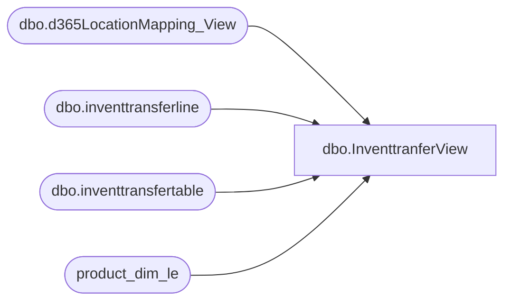

# dbo.InventtranferView

**Database:** LH_D365  
**Server:** 4db76rlxaxcuvmuh5kw37wbnqq-ovsykae43znuhlmnflcdwm4ohu.datawarehouse.fabric.microsoft.com  

## Architecture Diagram



## Table Dependencies

| Referenced Table |
|---|
| dbo.d365LocationMapping_View |
| dbo.inventtransferline |
| dbo.inventtransfertable |
| product_dim_le |

## View Code

```sql
CREATE   VIEW [dbo].[InventtranferView] AS (     SELECT         it.shipdate AS actual_date,         ISNULL(SUM(it.qtytransfer), 0) AS amount,         lm.IsDC,         lmTo.IsDC as 'To_DC',         lm.LocationKey,         le.product_key,         tt.transferstatus     FROM         dbo.inventtransferline AS it         INNER JOIN dbo.inventtransfertable AS tt             ON tt.transferid = it.transferid 		INNER JOIN dbo.d365LocationMapping_View AS lm             ON lm.inventlocationid = tt.inventlocationidfrom AND lm.legalentity = tt.dataareaid         INNER JOIN [product_dim_le] le             ON le.style_code = it.itemid AND le.LegalEntity = it.dataareaid AND le.jurisdiction_code = lm.JurisidictionCode         INNER JOIN dbo.d365LocationMapping_View AS lmTo             ON lmTo.inventlocationid = tt.inventlocationidto AND lmTo.legalentity = tt.dataareaid     WHERE         it.shipdate >= DATEADD(MONTH, -36, GETDATE())     GROUP BY         it.shipdate,         lm.IsDC,         lmTo.IsDC,         lm.LocationKey,         le.product_key,         tt.transferstatus );
```

