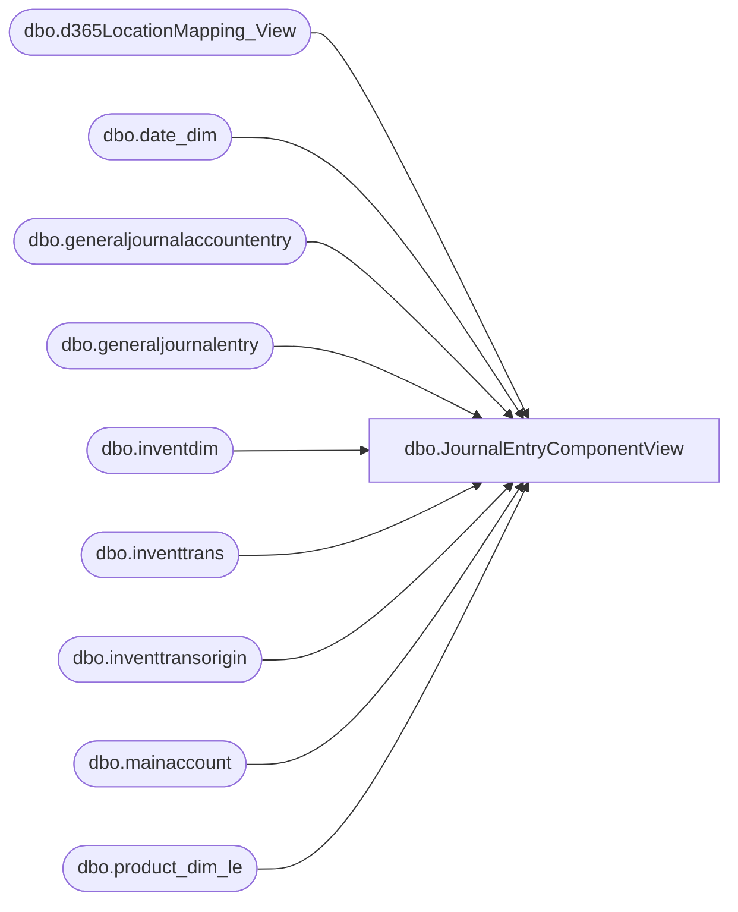

# dbo.JournalEntryComponentView

**Database:** LH_D365  
**Server:** 4db76rlxaxcuvmuh5kw37wbnqq-ovsykae43znuhlmnflcdwm4ohu.datawarehouse.fabric.microsoft.com  

## Architecture Diagram



## Table Dependencies

| Referenced Table |
|---|
| dbo.d365LocationMapping_View |
| dbo.date_dim |
| dbo.generaljournalaccountentry |
| dbo.generaljournalentry |
| dbo.inventdim |
| dbo.inventtrans |
| dbo.inventtransorigin |
| dbo.mainaccount |
| dbo.product_dim_le |

## View Code

```sql
CREATE   VIEW [dbo].JournalEntryComponentView AS WITH DatePeriods AS (     -- Defines the date range and calculates the week-ending Saturday for each actual date     SELECT         d.actual_date,         MAX(CASE WHEN d.day_of_week = 7 THEN d.actual_date END) OVER (PARTITION BY d.fiscal_year, d.fiscal_week) AS WeekEndingDate     FROM         LH_Mart.dbo.[date_dim] d     WHERE         d.actual_date >= DATEADD(MONTH, -12, CAST(GETDATE() AS DATE))         AND d.actual_date <= GETDATE() ), JournalEntryBase AS (     -- Pre-filters the general journal tables by the required accounts and date range     -- **** THIS CTE IS UPDATED to include ledgeraccount and the new mainaccountid ****     SELECT          dp.WeekEndingDate,         ma.mainaccountid,         LEFT(j.subledgervoucher, 3) as subledgervoucherinitial, 		j.subledgervoucher,         ge.reportingcurrencyamount,         j.subledgervoucherdataareaid,         ge.ledgeraccount -- Added for ActivationFeesComponents     FROM         dbo.generaljournalentry j     INNER JOIN DatePeriods dp ON dp.actual_date = j.accountingdate     INNER JOIN dbo.generaljournalaccountentry ge ON j.recid = ge.generaljournalentry     INNER JOIN dbo.mainaccount ma ON ma.recid = ge.mainaccount     WHERE          ma.mainaccountid IN ('100500', '200570', '200050', '601040') -- Added '60104A0'      AND (             j.subledgervoucher LIKE 'API%'             OR j.subledgervoucher LIKE 'IPR%'                         OR j.subledgervoucher LIKE 'PACK%' 			OR ISNUMERIC(j.subledgervoucher) = 1         ) ), JournalEntryComponents AS (     -- This CTE handles components based on the 'voucher' column     SELECT         j.WeekEndingDate,         CONCAT(idim.inventlocationid, '-', j.subledgervoucherdataareaid) AS LocationKey,         CAST(pd.product_key AS VARCHAR(50)) AS ProductKey,                  SUM(CASE WHEN j.subledgervoucherinitial = 'API' AND j.mainaccountid = '100500' THEN j.reportingcurrencyamount ELSE 0 END) AS POCost,         SUM(CASE WHEN LEFT(ito.referenceid, 2) = 'SO' AND j.mainaccountid = '100500' THEN j.reportingcurrencyamount * -1 ELSE 0 END) AS TotalSalesCost,         SUM(CASE WHEN j.subledgervoucherinitial = 'API' AND j.mainaccountid = '200570' THEN j.reportingcurrencyamount * -1 ELSE 0 END) AS FobRoyaltyCost,         SUM(CASE WHEN j.subledgervoucherinitial = 'API' AND j.mainaccountid = '200050' THEN j.reportingcurrencyamount * -1 ELSE 0 END) AS FreightMdseCost,         SUM(CASE WHEN ito.referencecategory = 4 /*InventTransfer*/ AND j.mainaccountid = '100500' AND j.reportingcurrencyamount < 0 THEN j.reportingcurrencyamount ELSE 0 END) AS ShipmentOutCost,         SUM(CASE WHEN ito.referencecategory = 4 /*InventTransfer*/ AND j.mainaccountid = '100500' AND j.reportingcurrencyamount > 0 THEN j.reportingcurrencyamount ELSE 0 END) AS ShipmentInCost     FROM         JournalEntryBase j     INNER JOIN dbo.inventtrans itran ON itran.voucher = j.subledgervoucher AND itran.dataareaid = j.subledgervoucherdataareaid -- **** JOIN ON VOUCHER ****     INNER JOIN dbo.inventdim idim ON idim.inventdimid = itran.inventdimid AND idim.dataareaid = itran.dataareaid     INNER JOIN dbo.product_dim_le pd ON pd.style_code = itran.itemid AND pd.LegalEntity = itran.dataareaid         INNER JOIN dbo.d365LocationMapping_View locationMapping -- Ensures location mapping exists         ON locationMapping.inventlocationid = idim.inventlocationid         AND locationMapping.legalentity = itran.dataareaid         AND locationMapping.JurisidictionCode = pd.jurisdiction_code         INNER JOIN dbo.inventtransorigin ito ON ito.recid = itran.inventtransorigin AND ito.dataareaid = itran.dataareaid         AND ito.dataareaid = itran.dataareaid 	WHERE ito.referencecategory in (0,3,4) AND j.mainaccountid IN ('100500', '200570', '200050')     GROUP BY         j.WeekEndingDate,         CONCAT(idim.inventlocationid, '-', j.subledgervoucherdataareaid),         pd.product_key ), JournalEntryReceiptComponent AS (     -- This CTE handles components based on the 'voucherphysical' column     SELECT         j.WeekEndingDate,         CONCAT(idim.inventlocationid, '-', j.subledgervoucherdataareaid) AS LocationKey,         CAST(pd.product_key AS VARCHAR(50)) AS ProductKey,         SUM(CASE WHEN j.subledgervoucherinitial = 'IPR' AND j.mainaccountid = '100500' THEN j.reportingcurrencyamount ELSE 0 END) AS NetReceiptsCost,         SUM(CASE WHEN LEFT(j.subledgervoucherinitial, 2) = 'CN' AND j.mainaccountid = '100500' THEN j.reportingcurrencyamount ELSE 0 END) AS SalesCreditNoteCost,         SUM(CASE WHEN j.subledgervoucherinitial = 'PAC' AND j.mainaccountid = '100500' THEN j.reportingcurrencyamount * -1 ELSE 0 END) AS PackingSlipsCost     FROM         JournalEntryBase j     INNER JOIN dbo.inventtrans itran ON itran.voucherphysical = j.subledgervoucher AND itran.dataareaid = j.subledgervoucherdataareaid -- **** JOIN ON VOUCHERPHYSICAL ****     INNER JOIN dbo.inventdim idim ON idim.inventdimid = itran.inventdimid AND idim.dataareaid = itran.dataareaid     INNER JOIN dbo.product_dim_le pd ON pd.style_code = itran.itemid AND pd.LegalEntity = itran.dataareaid 	 INNER JOIN dbo.d365LocationMapping_View locationMapping -- Ensures location mapping exists         ON locationMapping.inventlocationid = idim.inventlocationid         AND locationMapping.legalentity = itran.dataareaid         AND locationMapping.JurisidictionCode = pd.jurisdiction_code 	INNER JOIN dbo.inventtransorigin ito ON ito.recid = itran.inventtransorigin AND ito.dataareaid = itran.dataareaid         AND ito.dataareaid = itran.dataareaid 	WHERE ito.referencecategory in (0,3)  AND j.mainaccountid IN ('100500')     GROUP BY         j.WeekEndingDate,         CONCAT(idim.inventlocationid, '-', j.subledgervoucherdataareaid),         pd.product_key ), ActivationFeesComponents AS (     -- **** THIS CTE IS UPDATED to read from JournalEntryBase ****     SELECT         j.WeekEndingDate,         CONCAT(RIGHT(LEFT(j.ledgeraccount,11), 4), '-', j.subledgervoucherdataareaid) AS LocationKey,         '-1' AS ProductKey,         SUM(j.reportingcurrencyamount) AS GiftCardFees -- Simplified SUM     FROM         JournalEntryBase j -- Now reads from the base CTE     WHERE          j.mainaccountid = '601040' -- Filters for the specific account         AND j.subledgervoucherinitial = 'API' -- Filter for voucher     GROUP BY         j.WeekEndingDate,         CONCAT(RIGHT(LEFT(j.ledgeraccount,11), 4), '-', j.subledgervoucherdataareaid) )  -- Final SELECT to combine all components from all CTEs into the specified format SELECT WeekEndingDate AS actual_date, LocationKey, ProductKey, 'Net Receipts - Cost' AS SL_Component_Label, NetReceiptsCost AS SL_History_Value FROM JournalEntryReceiptComponent WHERE NetReceiptsCost <> 0 UNION ALL SELECT WeekEndingDate AS actual_date, LocationKey, ProductKey, 'Packing Slips', COALESCE(PackingSlipsCost, 0) FROM JournalEntryReceiptComponent WHERE PackingSlipsCost <> 0 UNION ALL SELECT WeekEndingDate AS actual_date, LocationKey, ProductKey, 'Sales Credit Note', SalesCreditNoteCost FROM JournalEntryReceiptComponent WHERE SalesCreditNoteCost <> 0 UNION ALL SELECT WeekEndingDate AS actual_date, LocationKey, ProductKey, 'Activation Fee', GiftCardFees FROM ActivationFeesComponents WHERE GiftCardFees <> 0 UNION ALL SELECT WeekEndingDate AS actual_date, LocationKey, ProductKey, 'Purchase', POCost FROM JournalEntryComponents WHERE POCost <> 0 UNION ALL SELECT WeekEndingDate AS actual_date, LocationKey, ProductKey, 'Total Sales - Cost', TotalSalesCost FROM JournalEntryComponents WHERE TotalSalesCost <> 0 UNION ALL SELECT WeekEndingDate AS actual_date, LocationKey, ProductKey, 'FOB Royalty', COALESCE(FobRoyaltyCost, 0) FROM JournalEntryComponents WHERE FobRoyaltyCost <> 0 UNION ALL SELECT WeekEndingDate AS actual_date, LocationKey, ProductKey, 'Freight -Mdse', COALESCE(FreightMdseCost, 0) FROM JournalEntryComponents WHERE FreightMdseCost <> 0 UNION ALL SELECT WeekEndingDate AS actual_date, LocationKey, ProductKey, 'Shipment Out - Cost', ShipmentOutCost * -1 FROM JournalEntryComponents WHERE ShipmentOutCost <> 0 UNION ALL SELECT WeekEndingDate AS actual_date, LocationKey, ProductKey, 'Shipment In - Cost', ShipmentInCost FROM JournalEntryComponents WHERE ShipmentInCost <> 0 --UNION ALL --UNION ALL
```

