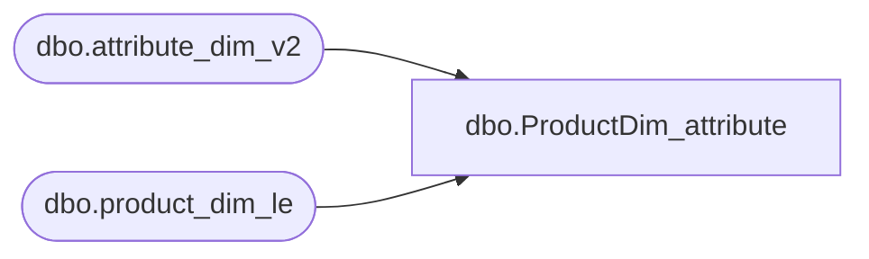

# dbo.ProductDim_attribute

**Database:** LH_D365  
**Server:** 4db76rlxaxcuvmuh5kw37wbnqq-ovsykae43znuhlmnflcdwm4ohu.datawarehouse.fabric.microsoft.com  

## Architecture Diagram



## Table Dependencies

| Referenced Table |
|---|
| dbo.attribute_dim_v2 |
| dbo.product_dim_le |

## View Code

```sql
CREATE   VIEW [dbo].[ProductDim_attribute] AS      Select DISTINCT         product_dim.product_key,         attr.AttributeCode as AttributeName, 		attr.StyleCode as style_code, 		attr.AttributeSetLabel as AttributeLabel, 		attr.AttributeSetCode as AttributeValue,         attr.AttributeSetLabel as AttributeValueLabel     FROM         LH_Mart.dbo.attribute_dim_v2 AS attr         INNER JOIN LH_D365.dbo.product_dim_le AS product_dim             ON attr.StyleCode = product_dim.style_code
```

