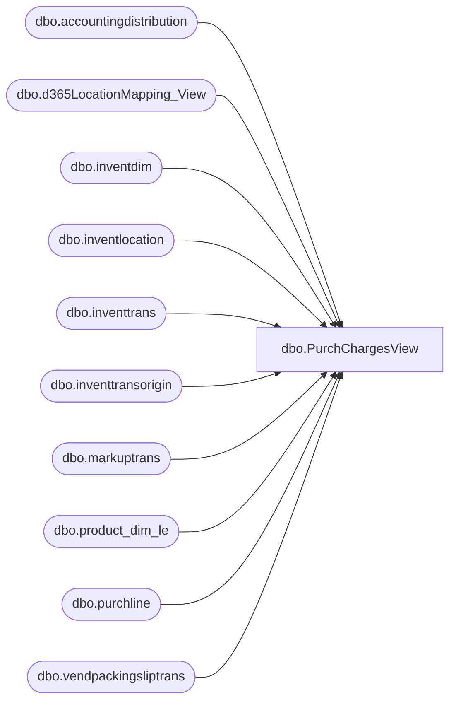

# dbo.PurchChargesView

**Database:** LH_D365  
**Server:** 4db76rlxaxcuvmuh5kw37wbnqq-ovsykae43znuhlmnflcdwm4ohu.datawarehouse.fabric.microsoft.com  

## Architecture Diagram



## Table Dependencies

| Referenced Table |
|---|
| dbo.accountingdistribution |
| dbo.d365LocationMapping_View |
| dbo.inventdim |
| dbo.inventlocation |
| dbo.inventtrans |
| dbo.inventtransorigin |
| dbo.markuptrans |
| dbo.product_dim_le |
| dbo.purchline |
| dbo.vendpackingsliptrans |

## View Code

```sql
/****** Object:  View [dbo].[PurchChargesView]    Script Date: 1/29/2026 3:13:05 PM ******/     CREATE   VIEW [dbo].[PurchChargesView] AS WITH LatestAccountingDistribution AS (     SELECT         *,         ROW_NUMBER() OVER (PARTITION BY sourcedocumentline ORDER BY number DESC) AS RowNum     FROM         dbo.accountingdistribution ) SELECT     ad.number,     pl.purchid,     pl.itemid,     pl.linenumber,     pl.sourcedocumentline,     pl.purchstatus,     pl.lineamount,     CASE WHEN locationMapping.JurisidictionCode <> 'US' THEN ISNULL(packingSlip.valuemst, 0.00) ELSE ISNULL(ad.transactioncurrencyamount, 0.00) END AS 'receipt_amount', 	ISNULL(CASE WHEN locationMapping.JurisidictionCode <> 'US' THEN packingSlip.valuemst ELSE packingSlip.lineamount_w END, 0) AS 'Receipt_cost_w/o_charges',     ad.transactioncurrencyamount AS TransactionCurrencyAmountParent,     ad1.accountingdate,     mt.markupcode,     mt.value,     (NULLIF(ad1.transactioncurrencyamount, 0) / NULLIF(pl.purchqty, 0)) * NULLIF(packingSlip.qty, 0) AS ChargeAmount, 	ISNULL(ad1.transactioncurrencyamount, 0) AS LineChargeAmount,     ad1.accountingcurrencyamount AS ChargeAmountAcc,     pl.recid AS PurchLineRecId,     pl.dataareaid,     invloc.inventlocationid AS loc,     pd.[MDSE\Supply],     pd.style_desc,     invloc.name AS 'loc name',     idm.inventlocationid + '-' + pl.dataareaid AS 'LocationKey',     CAST(pd.product_key AS VARCHAR(50)) AS product_key,     packingSlip.deliverydate AS received_date, 	--LatestInventTrans.datephysical AS received_date, --changed to use the delivery date from the packingslip     LatestInventTrans.voucherphysical AS voucher,     packingSlip.packingslipid,     CASE WHEN packingSlip.packingslipid IS NOT NULL THEN CONCAT(pl.recid, '-', packingSlip.packingslipid) ELSE NULL END AS 'PurchChargeview_Key' FROM     LatestAccountingDistribution AS ad     INNER JOIN dbo.purchline AS pl         ON pl.sourcedocumentline = ad.sourcedocumentline     INNER JOIN dbo.accountingdistribution AS ad1         ON ad1.parentdistribution = ad.recid AND ad1.sourcedocumentheader = ad.sourcedocumentheader     INNER JOIN dbo.markuptrans AS mt         ON mt.transtableid = pl.tableid AND mt.transrecid = pl.recid AND mt.sourcedocumentline = ad1.sourcedocumentline     INNER JOIN LH_D365.dbo.inventdim AS idm         ON pl.inventdimid = idm.inventdimid     INNER JOIN LH_D365.dbo.inventlocation AS invloc         ON invloc.inventlocationid = idm.inventlocationid AND invloc.dataareaid = pl.dataareaid     INNER JOIN LH_D365.dbo.d365LocationMapping_View AS locationMapping         ON invloc.inventlocationid = locationMapping.inventlocationid          AND locationMapping.legalentity = pl.dataareaid     INNER JOIN LH_D365.dbo.product_dim_le AS pd         ON pd.style_code = pl.itemid          AND pd.jurisdiction_code = locationMapping.JurisidictionCode         AND pd.LegalEntity = pl.dataareaid     LEFT JOIN LH_D365.dbo.vendpackingsliptrans packingSlip         ON pl.inventtransid = packingSlip.inventtransid AND pl.dataareaid = packingSlip.dataareaid AND packingSlip.qty <> 0     OUTER APPLY     (         SELECT TOP 1             it.datephysical,             it.voucherphysical,             it.statusreceipt         FROM             dbo.inventtrans AS it             JOIN dbo.inventtransorigin AS ito                 ON ito.recid = it.inventtransorigin         WHERE             ito.inventtransid = pl.inventtransid         ORDER BY             it.datephysical DESC     ) AS LatestInventTrans WHERE     ad1.monetaryamount = 5 AND ad.RowNum = 1 AND pl.purchstatus <> 4 AND ad1.accountingdate >= DATEADD(MONTH, -36, GETDATE())
```

