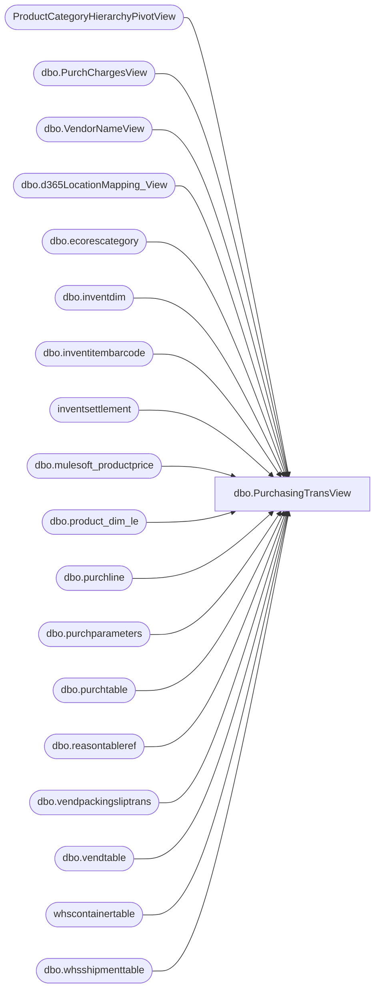

# dbo.PurchasingTransView

**Database:** LH_D365  
**Server:** 4db76rlxaxcuvmuh5kw37wbnqq-ovsykae43znuhlmnflcdwm4ohu.datawarehouse.fabric.microsoft.com  

## Architecture Diagram



## Table Dependencies

| Referenced Table |
|---|
| ProductCategoryHierarchyPivotView |
| dbo.PurchChargesView |
| dbo.VendorNameView |
| dbo.d365LocationMapping_View |
| dbo.ecorescategory |
| dbo.inventdim |
| dbo.inventitembarcode |
| inventsettlement |
| dbo.mulesoft_productprice |
| dbo.product_dim_le |
| dbo.purchline |
| dbo.purchparameters |
| dbo.purchtable |
| dbo.reasontableref |
| dbo.vendpackingsliptrans |
| dbo.vendtable |
| whscontainertable |
| dbo.whsshipmenttable |

## View Code

```sql
CREATE   VIEW [dbo].[PurchasingTransView] AS  /* =========================================================================================    CHANGE LOG (keep existing comments below; additions are marked with "CHANGE:")     Recent changes:    - Add CurrentRetailDecimal from LH_Source.dbo.mulesoft_productprice (per PO line)    - Use PO create date (purchtable.createddatetime) for effective dating (StartDate/StopDate)    - Per PO line (PurchLine RecId + dataareaid), not per receipt    - Fallback when no StartDate <= PO create date:        -> use oldest record for StyleCode + Jurisdiction (CreateDate ASC, StartDate ASC)    - If Style starts with '1' and JurisdictionCode = 'US', also try CandidateJurisdiction = 'CA'    - **Optimization:** only create the CA candidate when a CA price exists for the StyleCode (reduces unnecessary joins)    - Protect against NULL: default CurrentRetailDecimal to 0    - Use Style (ISNULL(purchline.itemid, ecat.name)) as the lookup key for productprice.StyleCode    - Fabric SQL endpoint notes: use CURRENT_TIMESTAMP, avoid OUTER APPLY ========================================================================================= */  WITH base AS (     SELECT DISTINCT         purchtable.purchstatus AS 'PO Status', 	    packingSlip.packingslipid AS 'Receipt number',          -- LOC (exclude null/WEBSUP in WHERE)         idm.inventlocationid AS 'LOC',         idm.inventlocationid + '-' + purchline.dataareaid AS 'LocationKey',          purchline.purchid AS 'PO number',         packingSlip.deliverydate AS 'Receipt Date',          ISNULL(purchline.itemid, ecat.name) AS 'Style',         pd.style_desc AS 'Short Desciption',          COALESCE(              CASE             -- If item begins with 8: always use US version barcode (0 + rest), per doc from Paul             WHEN LEFT(purchline.itemid, 1) = '8'                 THEN usBC.itembarcode              -- If item begins with 9 AND its barcode is "000000" + itemid: use US version barcode in 1100             WHEN LEFT(purchline.itemid, 1) = '9'                     AND curBC.itembarcode = CONCAT('000000', purchline.itemid)                 THEN usBC.itembarcode              -- Else: display what is found for the item itself             ELSE curBC.itembarcode         END,         curBC.itembarcode) AS 'EAN-13',          pd.department_code AS 'Department',         purchline.purchqty AS 'on order units',         packingSlip.qty AS 'units received',         ((ISNULL(             CASE                 WHEN pd.jurisdiction_code <> 'US' THEN packingSlip.valuemst                 ELSE packingSlip.lineamount_w             END,             0         ) + ISNULL(pc.TotalCharge, 0)) / ISNULL(packingSlip.qty, 1)) AS 'Cost',         (ISNULL(             CASE                 WHEN pd.jurisdiction_code <> 'US' THEN packingSlip.valuemst                 ELSE packingSlip.lineamount_w             END,             0         ) + ISNULL(pc.TotalCharge, 0)) AS 'X-Cost',         ISNULL(packingSlip.qty, 0) * ((ISNULL(             CASE                 WHEN pd.jurisdiction_code <> 'US' THEN packingSlip.valuemst                 ELSE packingSlip.lineamount_w             END,             0         ) + ISNULL(pc.TotalCharge, 0)) / NULLIF(packingSlip.qty, 1) - purchline.purchprice) AS 'Costfactor', 	    --packingSlip.qty * purchline.purchprice AS 'Receipt cost w/o charges', -- commented b/c it doesn;t work for other currencies 	    ISNULL(CASE WHEN locationMapping.JurisidictionCode <> 'US' THEN packingSlip.valuemst ELSE packingSlip.lineamount_w END, 0) AS 'Receipt cost w/o charges', 	    --Added following column to include cost adjustment posted against the po receipt  	    --ISNULL(s.costamountadjustment, 0)+ ISNULL(pc.TotalCharge, 0) + ISNULL(CASE WHEN locationMapping.JurisidictionCode <> 'US' THEN packingSlip.valuemst ELSE packingSlip.lineamount_w END, 0) AS 'Receipt_cost_w_adjustment_old', 	    ISNULL(s.costamountadjustment, 0)+ Case When pp.productreceiptcharges = 1 THEN ISNULL(pc.TotalCharge, 0) ELSE 0 END + ISNULL(CASE WHEN locationMapping.JurisidictionCode <> 'US' THEN packingSlip.valuemst ELSE packingSlip.lineamount_w END, 0) AS 'Receipt_cost_w_adjustment',         purchline.vendaccount AS 'Vendor',         vendorName.name AS 'Vendor Purch Name', 	    vendorName.vendgroup AS 'Vendor Group',         purchline.purchprice AS 'first cost',         locationMapping.name AS 'Location name',         purchline.deliverydate AS 'Expected Receipt date',         pd.concept AS 'Concept',         pd.concept_code AS 'Concept Code',         pd.concept_name AS 'Concept Name',         pd.consumer_group_code AS 'Consumer Group Code',         pd.consumer_group AS 'Consumer Group',         pd.department AS 'Dept Label',         pd.class_code AS 'Class',         pd.class AS 'Class Label',         pd.subclass_code AS 'SubClass',         pd.subclass AS 'SubClass label',         purchline.babcanceldate AS 'Cancel date',         purchline.babshipdate AS 'Ship date',         ISNULL(pd.current_retail * packingSlip.qty, 0) AS 'retail received',         purchline.lineamount + ISNULL(pc.TotalCharge, 0) AS 'on order total cost',         purchline.lineamount AS 'on order total cost without chargeAmout', 	    pc.TotalChargeNotInvoiced AS 'Total Charge not invoiced', 	    pc.LineChargeAmount AS 'LineChargeAmount', 	    purchline.remaininventphysical AS 'Remaining Physical', 	    ((ISNULL(purchline.remaininventphysical, 0)) * purchline.purchprice) 		    + ((ISNULL(pc.LineChargeAmount, 0) / NULLIF(purchline.purchqty, 0)) * ISNULL(purchline.remaininventphysical, 0)) AS 'Balance total cost', 	    --purchline.lineamount + ISNULL(pc.TotalChargeNotInvoiced,0) AS 'on order total cost not invoiced',         ISNULL(pd.current_retail * purchline.purchqty, 0) AS 'on order retail',         pd.product_key,         locationMapping.store_key,         purchline.tableid AS 'PurchLine TableId',         purchline.recid AS 'PurchLine RecId',         purchline.linenumber AS 'PurchLine Number',         purchline.dataareaid AS 'dataareaid',         purchtable.babfactorycode,         purchtable.babfobport,         purchtable.babvendorcode,         purchtable.createddatetime,         purchline.name,         pd.[MDSE\Supply],         reasonTable.reason AS 'PO attribute set code',         reasonTable.reasoncomment AS 'PO Attribute set label',         purchtable.vendorref AS 'PO description',         purchtable.babaptosporefnum AS 'Aptos PO Reference Number',         ecat.name AS 'idprocurementcategory',         packingSlip.costledgervoucher AS 'voucher',         (             SELECT TOP 1                 shiptable.shipmentid             FROM                 LH_D365.dbo.whsshipmenttable shiptable             WHERE                 shiptable.ordernum = purchtable.purchid AND shiptable.dataareaid = purchtable.dataareaid AND shiptable.loaddirection = 1         ) AS ASN#,               pd.color_code,         pd.color_desc,         (             SELECT TOP 1                 leafcode             FROM                 [ProductCategoryHierarchyPivotView]             WHERE                 [ProductCategoryHierarchyPivotView].itemid = pd.style_code         ) AS categoryHierarchyGroup,         (             SELECT                 COUNT(containerid)             FROM                 whscontainertable                 JOIN LH_D365.dbo.whsshipmenttable shiptable                     ON shiptable.shipmentid = whscontainertable.shipmentid AND shiptable.dataareaid = whscontainertable.dataareaid AND shiptable.ordernum = purchtable.purchid AND shiptable.dataareaid = purchtable.dataareaid AND shiptable.loaddirection = 1             HAVING                 COUNT(whscontainertable.shipmentid) > 1         ) AS NoOfCarton,         CASE WHEN packingSlip.packingslipid IS NOT NULL THEN CONCAT(purchline.recid, '-', packingSlip.packingslipid) ELSE NULL END AS 'PurchChargeview_Key',          /* ========================= CHANGE: Price lookup driver fields ========================= */         CAST(purchtable.createddatetime AS datetime2(0)) AS PO_CreateDate,             -- CHANGE: effective date for price lookup         -- CHANGE: Jurisdiction will be derived from LOC (locationMapping) instead of style/itemid         locationMapping.JurisidictionCode               AS JurisdictionCode,          -- CHANGE: jurisdiction for price lookup (from LOC)         -- CHANGE: use the Style value (ISNULL(itemid, ecat.name)) as the Style_ForPrice so we don't need separate raw itemid field         ISNULL(purchline.itemid, ecat.name)             AS Style_ForPrice            -- CHANGE: Style used for price lookup         /* =========================================================================== */      FROM         LH_D365.dbo.purchline purchline         INNER JOIN LH_D365.dbo.purchtable purchtable             ON purchtable.purchid = purchline.purchid AND purchtable.dataareaid = purchline.dataareaid         INNER JOIN dbo.vendtable vt             ON vt.accountnum = purchline.vendaccount AND purchline.dataareaid = vt.dataareaid         INNER JOIN dbo.inventdim idm             ON purchline.inventdimid = idm.inventdimid AND purchline.dataareaid = idm.dataareaid         INNER JOIN LH_D365.dbo.VendorNameView vendorName             ON vendorName.accountnum = purchline.vendaccount AND vendorName.dataareaid = purchline.dataareaid         LEFT JOIN dbo.d365LocationMapping_View locationMapping             ON idm.inventlocationid = locationMapping.inventlocationid AND locationMapping.legalentity = purchline.dataareaid         LEFT JOIN LH_D365.dbo.product_dim_le pd             ON pd.style_code = purchline.itemid AND pd.jurisdiction_code = locationMapping.JurisidictionCode AND purchline.dataareaid = pd.LegalEntity         LEFT JOIN LH_D365.dbo.vendpackingsliptrans packingSlip             ON purchline.inventtransid = packingSlip.inventtransid AND purchline.dataareaid = packingSlip.dataareaid AND packingSlip.qty <> 0         LEFT JOIN LH_D365.dbo.reasontableref reasonTable             ON purchtable.reasontableref = reasonTable.recid AND purchline.dataareaid = reasonTable.dataareaid         LEFT JOIN LH_D365.dbo.ecorescategory ecat             ON purchline.procurementcategory = ecat.recid 	    LEFT JOIN 	    ( 		    SELECT 			    pch.PurchLineRecId, 			    pch.dataareaid, 			    SUM(pch.ChargeAmount) AS TotalCharge, 			    SUM(pch.value) AS TotalChargeNotInvoiced, 			    SUM(pch.LineChargeAmount) / 				    CASE  					    WHEN COUNT(DISTINCT pch.packingslipid) = 0 THEN 1 					    ELSE COUNT(DISTINCT pch.packingslipid) 				    END AS LineChargeAmount 				    -- Divide by 1 when no receipt lines; otherwise by # of distinct receipts 		    FROM LH_D365.dbo.PurchChargesView pch 		    GROUP BY pch.PurchLineRecId, pch.dataareaid 	    ) pc 		    ON pc.PurchLineRecId = purchline.recid AND pc.dataareaid     = purchline.dataareaid 	    LEFT JOIN  	    (Select s.itemid, 			    s.voucher, 			    s.dataareaid, 			    Sum(s.costamountadjustment) as costamountadjustment 			    From inventsettlement s 			    group by s.itemid, s.voucher,s.dataareaid 	    ) as s 		    on s.itemid = packingSlip.itemid 		    AND s.voucher = packingSlip.costledgervoucher 		    and s.dataareaid = packingSlip.dataareaid 	    LEFT JOIN dbo.purchparameters pp 		    ON pp.dataareaid = purchline.dataareaid          LEFT JOIN         (             SELECT dataareaid, itemid, itembarcode             FROM             (                 SELECT                     iib.dataareaid,                     iib.itemid,                     iib.itembarcode,                     ROW_NUMBER() OVER                     (                         PARTITION BY iib.dataareaid, iib.itemid                         ORDER BY iib.recid ASC      -- FIRST record                     ) AS rn                 FROM LH_D365.dbo.inventitembarcode iib             ) x             WHERE x.rn = 1         ) curBC             ON curBC.dataareaid = purchline.dataareaid            AND curBC.itemid     = purchline.itemid          -- Barcode for the US version of the item in legal entity 1100 (leading 0 version)         LEFT JOIN         (             SELECT dataareaid, itemid, itembarcode             FROM             (                 SELECT                     iib.dataareaid,                     iib.itemid,                     iib.itembarcode,                     ROW_NUMBER() OVER                     (                         PARTITION BY iib.dataareaid, iib.itemid                         ORDER BY iib.recid ASC      -- FIRST record                     ) AS rn                 FROM LH_D365.dbo.inventitembarcode iib                 WHERE iib.dataareaid = '1100'             ) x             WHERE x.rn = 1         ) usBC             ON usBC.dataareaid = '1100'            AND usBC.itemid     = CONCAT('0', SUBSTRING(purchline.itemid, 2, LEN(purchline.itemid) - 1))      WHERE         purchline.deliverydate >= DATEADD(MONTH, -36, CURRENT_TIMESTAMP)         AND purchline.purchstatus <> 4         AND idm.inventlocationid IS NOT NULL            -- CHANGE: exclude NULL LOC         AND idm.inventlocationid <> 'WEBSUP'            -- CHANGE: exclude WEBSUP LOC ),  /* ========================= CHANGE: price_keys CTE (jurisdiction from LOC, Style used) =========================    Purpose: produce candidate jurisdictions per PO line in priority order.    - primary candidate = JurisdictionCode from locationMapping (derived from LOC)    - if Style starts with '1' AND primary jurisdiction = 'US', add candidate 'CA'    - OPTIMIZATION: only add the CA candidate when there exists at least one CA price row for the StyleCode    - Note: uses Style_ForPrice (derived Style) as the lookup key for mulesoft_productprice.StyleCode    ========================================================================== */ price_keys AS (     SELECT         b.[PurchLine RecId],         b.[dataareaid],         b.Style_ForPrice,         b.JurisdictionCode,         b.PO_CreateDate,         1 AS CandidatePriority,         b.JurisdictionCode AS CandidateJurisdiction     FROM base b      UNION ALL      -- CHANGE: additional candidate for styles starting with '1' when original jurisdiction is US     -- CHANGE (OPTIM): only include CA candidate when a CA price exists for the style     SELECT         b.[PurchLine RecId],         b.[dataareaid],         b.Style_ForPrice,         b.JurisdictionCode,         b.PO_CreateDate,         2 AS CandidatePriority,         'CA' AS CandidateJurisdiction     FROM base b     WHERE LEFT(b.Style_ForPrice,1) = '1'       AND b.JurisdictionCode = 'US'       AND EXISTS (           SELECT 1           FROM LH_Source.dbo.mulesoft_productprice mp           WHERE mp.StyleCode = b.Style_ForPrice             AND mp.Jurisdiction = 'CA'       ) ), /* =========================================================================== */   /* ========================= CHANGE: Price ranking (per PO line using price_keys) ========================= */ price_active AS (     -- Choose the active price as-of PO_CreateDate (StartDate <= PO_CreateDate < StopDate)     -- Use candidate jurisdictions (priority) supplied by price_keys     SELECT         pk.[PurchLine RecId],         pk.[dataareaid],         p.CurrentRetailDecimal,         pk.CandidatePriority,         ROW_NUMBER() OVER (             PARTITION BY pk.[PurchLine RecId], pk.[dataareaid]             ORDER BY pk.CandidatePriority ASC,                    -- prefer primary candidate jurisdiction                      CAST(p.StartDate AS datetime2(0)) DESC,                      CAST(p.CreateDate AS datetime2(0)) DESC         ) AS rn     FROM price_keys pk     JOIN LH_Source.dbo.mulesoft_productprice p       ON p.StyleCode    = pk.Style_ForPrice      AND p.Jurisdiction = pk.CandidateJurisdiction      AND CAST(p.StartDate AS datetime2(0)) <= pk.PO_CreateDate      AND (p.StopDate IS NULL OR CAST(p.StopDate AS datetime2(0)) > pk.PO_CreateDate) ),  price_fallback AS (     -- Fallback when no active row exists as-of PO_CreateDate     -- Oldest record for Style+CandidateJurisdiction (CreateDate ASC, then StartDate ASC)     SELECT         pk.[PurchLine RecId],         pk.[dataareaid],         p.CurrentRetailDecimal,         pk.CandidatePriority,         ROW_NUMBER() OVER (             PARTITION BY pk.[PurchLine RecId], pk.[dataareaid]             ORDER BY pk.CandidatePriority ASC,                    -- prefer primary candidate jurisdiction                      CAST(p.CreateDate AS datetime2(0)) ASC,                      CAST(p.StartDate  AS datetime2(0)) ASC         ) AS rn     FROM price_keys pk     JOIN LH_Source.dbo.mulesoft_productprice p       ON p.StyleCode    = pk.Style_ForPrice      AND p.Jurisdiction = pk.CandidateJurisdiction ) /* =========================================================================== */  SELECT DISTINCT     /* keep original output columns exactly as-is */     base.*,      /* CHANGE: New output field (protected against NULLs) */     COALESCE(pa.CurrentRetailDecimal, pf.CurrentRetailDecimal, 0) AS CurrentRetailDecimal  FROM base LEFT JOIN price_active pa   ON pa.[PurchLine RecId] = base.[PurchLine RecId]  AND pa.[dataareaid]      = base.[dataareaid]  AND pa.rn = 1 LEFT JOIN price_fallback pf   ON pf.[PurchLine RecId] = base.[PurchLine RecId]  AND pf.[dataareaid]      = base.[dataareaid]  AND pf.rn = 1 ;
```

