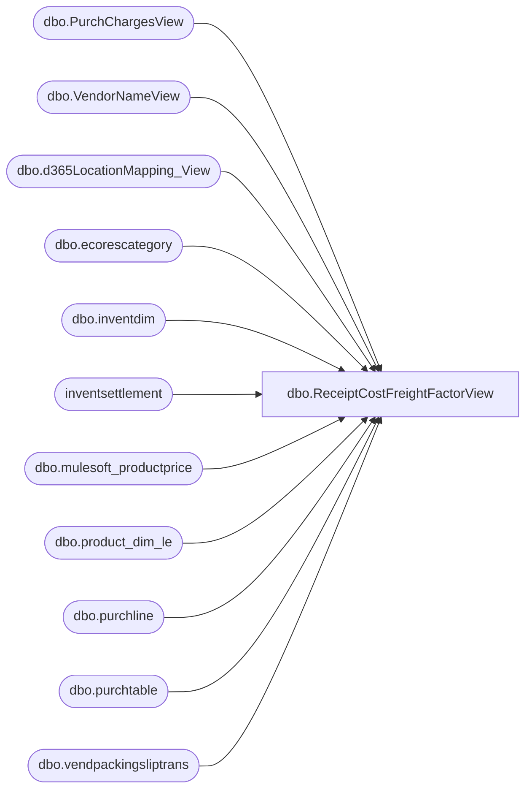

# dbo.ReceiptCostFreightFactorView

**Database:** LH_D365  
**Server:** 4db76rlxaxcuvmuh5kw37wbnqq-ovsykae43znuhlmnflcdwm4ohu.datawarehouse.fabric.microsoft.com  

## Architecture Diagram



## Table Dependencies

| Referenced Table |
|---|
| dbo.PurchChargesView |
| dbo.VendorNameView |
| dbo.d365LocationMapping_View |
| dbo.ecorescategory |
| dbo.inventdim |
| inventsettlement |
| dbo.mulesoft_productprice |
| dbo.product_dim_le |
| dbo.purchline |
| dbo.purchtable |
| dbo.vendpackingsliptrans |

## View Code

```sql
/****** Object:  View [dbo].[ReceiptCostFreightFactorView]    Script Date: 2/20/2026 9:35:13 AM ******/    CREATE   VIEW [dbo].[ReceiptCostFreightFactorView] AS /*  Purpose       Aggregate by Style + Receipt Year (YEAR(vendpackingsliptrans.deliverydate)).       Allocate each PO line’s Cost Factor (pc.TotalCharge) evenly across its receipts.       Include Vendor number & name joined via purchtable.invoiceaccount.      Output columns:       -- [PO number]                        -- [Receipt number]                   -- [PurchLine RecId]                     [Style]          [Product_Key]          [Receipt Year]          [Vendor Number]          [Vendor Name]          [Net Receipt Cost]          = [Receipt Cost without charges] + [Cost Factor]          --[Receipt Cost without charges]            [Cost Factors Total Cost]          [Net Receipts Units]          [Net Receipts Retail TE] */ WITH base AS (     SELECT         pl.purchid                                        AS [PO number],         pl.recid                                          AS [PurchLine RecId],         ps.packingslipid                                  AS [Receipt number],         ISNULL(pl.itemid, ec.name)                        AS [Style],         pd.product_key                                    AS [Product_Key],         YEAR(ps.deliverydate)                             AS [Receipt Year],         ps.deliverydate                                   AS [Receipt Date],          ISNULL(ps.lineamount_w,0)                         AS rc_wo,         ISNULL(ps.qty, 0)                                 AS units,         ISNULL(pd.current_selling_retail_home * ISNULL(ps.qty, 0), 0) AS retail,          pt.invoiceaccount                                 AS [Vendor Number],         vnv.name                                          AS [Vendor Name],         vnv.vendgroup                                     AS [Vendor Group],         ps.costledgervoucher                              AS voucher,         CONCAT(idm.inventlocationid, '-', pl.dataareaid)  AS location_key,         CASE WHEN ps.packingslipid IS NOT NULL              THEN CONCAT(pl.recid, '-', ps.packingslipid)              ELSE NULL         END AS PurchChargeview_Key,         pl.dataareaid,          -- kept for reference/output         CAST(pt.createdon AS datetime2(0))                AS PO_CreateDate,          -- Jurisdiction used for price lookup         lm.JurisidictionCode                              AS JurisdictionCode     FROM LH_D365.dbo.purchline AS pl     INNER JOIN dbo.inventdim AS idm             ON pl.inventdimid = idm.inventdimid            AND pl.dataareaid  = idm.dataareaid     INNER JOIN LH_D365.dbo.purchtable AS pt             ON pt.purchid    = pl.purchid            AND pt.dataareaid = pl.dataareaid     LEFT  JOIN dbo.d365LocationMapping_View AS lm             ON idm.inventlocationid = lm.inventlocationid            AND lm.legalentity       = pl.dataareaid     LEFT  JOIN LH_D365.dbo.product_dim_le AS pd             ON pd.style_code        = pl.itemid            AND pd.jurisdiction_code = lm.JurisidictionCode            AND lm.legalentity       = pd.LegalEntity     LEFT  JOIN LH_D365.dbo.vendpackingsliptrans AS ps             ON pl.inventtransid = ps.inventtransid            AND pl.dataareaid    = ps.dataareaid            AND ps.qty <> 0     LEFT  JOIN LH_D365.dbo.ecorescategory AS ec             ON pl.procurementcategory = ec.recid     LEFT  JOIN LH_D365.dbo.VendorNameView AS vnv             ON vnv.accountnum = pt.invoiceaccount            AND vnv.dataareaid = pt.dataareaid     WHERE         pl.purchstatus <> 4         AND vnv.vendgroup <> '80'         AND ps.deliverydate >= DATEADD(MONTH, -36, GETDATE())         AND pt.intercompanyorder = 0   -- exclude intercompany POs (0/1) ),  charges AS (     SELECT         pc.PurchChargeview_Key,         pc.PurchLineRecId,         pc.dataareaid,         pc.packingslipid AS [Receipt number],         SUM(ISNULL(pc.ChargeAmount, 0)) AS receipt_charge_amount     FROM LH_D365.dbo.PurchChargesView pc     WHERE pc.accountingdate >= DATEADD(MONTH, -36, GETDATE())     GROUP BY         pc.PurchChargeview_Key,         pc.PurchLineRecId,         pc.dataareaid,         pc.packingslipid ),  -- 1) Aggregate base rows receipt_agg_pre AS (     SELECT         b.[PO number],         b.[PurchLine RecId],         b.[Receipt number],         b.[Style],         b.[Product_Key],         b.[Receipt Year],         b.[Receipt Date],         b.[Vendor Number],         b.[Vendor Name],         b.[Vendor Group],         b.voucher,         b.location_key,         b.PurchChargeview_Key,         b.dataareaid,          MAX(b.PO_CreateDate)       AS PO_CreateDate,         MAX(b.JurisdictionCode)    AS JurisdictionCode,          SUM(b.rc_wo)   AS rc_wo_r,         SUM(b.units)   AS units_r,         -- keep the old aggregated retail if you want to compare; will not be used for final retail calculation         SUM(b.retail)  AS retail_r_old,         MAX(ISNULL(c.receipt_charge_amount, 0)) AS receipt_charge_r     FROM base b     LEFT JOIN charges c         ON c.PurchChargeview_Key = b.PurchChargeview_Key        AND c.dataareaid          = b.dataareaid        AND c.[Receipt number]    = b.[Receipt number]     GROUP BY         b.[PO number],         b.[PurchLine RecId],         b.[Receipt number],         b.[Style],         b.[Product_Key],         b.[Receipt Year],         b.[Receipt Date],         b.[Vendor Number],         b.[Vendor Name],         b.[Vendor Group],         b.voucher,         b.location_key,         b.PurchChargeview_Key,         b.dataareaid ),  -- 2) For each aggregated row, look up price and compute retail using CurrentRetailDecimal receipt_agg AS (     SELECT         p.*,          -- price lookups pulled into local aliases         pp_active.CurrentRetailDecimal AS Active_CurrentRetailDecimal,         pp_oldest.CurrentRetailDecimal AS Oldest_CurrentRetailDecimal,          -- protect against NULLs by defaulting to 0         COALESCE(pp_active.CurrentRetailDecimal, pp_oldest.CurrentRetailDecimal, 0) AS CurrentRetailDecimal,          -- computed retail based on units_r * protected CurrentRetailDecimal         p.units_r * COALESCE(pp_active.CurrentRetailDecimal, pp_oldest.CurrentRetailDecimal, 0) AS retail_r     FROM receipt_agg_pre p      -- Active price as of RECEIPT DATE     OUTER APPLY (         SELECT TOP (1) p2.CurrentRetailDecimal         FROM LH_Source.dbo.mulesoft_productprice p2         WHERE             p2.StyleCode = p.[Style]             AND p2.Jurisdiction = p.JurisdictionCode             AND CAST(p2.StartDate AS datetime2(0)) <= CAST(p.[Receipt Date] AS datetime2(0))             AND (                 p2.StopDate IS NULL                 OR CAST(p2.StopDate AS datetime2(0)) > CAST(p.[Receipt Date] AS datetime2(0))             )         ORDER BY             p2.StartDate DESC,             p2.CreateDate DESC     ) pp_active      -- Fallback: oldest Style + Jurisdiction (ordered by CreateDate then StartDate)     OUTER APPLY (         SELECT TOP (1) p3.CurrentRetailDecimal         FROM LH_Source.dbo.mulesoft_productprice p3         WHERE             p3.StyleCode = p.[Style]             AND p3.Jurisdiction = p.JurisdictionCode         ORDER BY             p3.CreateDate ASC,             p3.StartDate ASC     ) pp_oldest )  SELECT     r.[PO number],     r.[Receipt number],     r.[PurchLine RecId],     r.[Style],     r.[Product_Key],     r.[Receipt Year],     r.[Receipt Date],     r.[PO_CreateDate],     r.[Vendor Number],     r.[Vendor Name],     r.[Vendor Group],     r.voucher,     r.location_key,     r.PurchChargeview_Key,      r.rc_wo_r                          AS [Net Receipt Cost W/O Charge],     r.rc_wo_r + r.receipt_charge_r     AS [Net Receipt Cost],     r.receipt_charge_r                 AS [Cost Factors Total Cost],     r.units_r                          AS [Net Receipts Units],      -- retail now computed in receipt_agg, protected against NULL retail price     ISNULL(r.retail_r, 0)              AS [Net Receipts Retail TE],      ISNULL(s.costamountadjustment, 0)  AS costamountadjustment,      -- protected CurrentRetailDecimal (never NULL)     r.CurrentRetailDecimal             AS CurrentRetailDecimal FROM receipt_agg r  LEFT JOIN (     SELECT         s.itemid,         s.voucher,         s.dataareaid,         SUM(s.costamountadjustment) AS costamountadjustment     FROM inventsettlement s     GROUP BY s.itemid, s.voucher, s.dataareaid ) s     ON s.itemid     = r.[Style]    AND s.voucher    = r.voucher    AND s.dataareaid = r.dataareaid;
```

