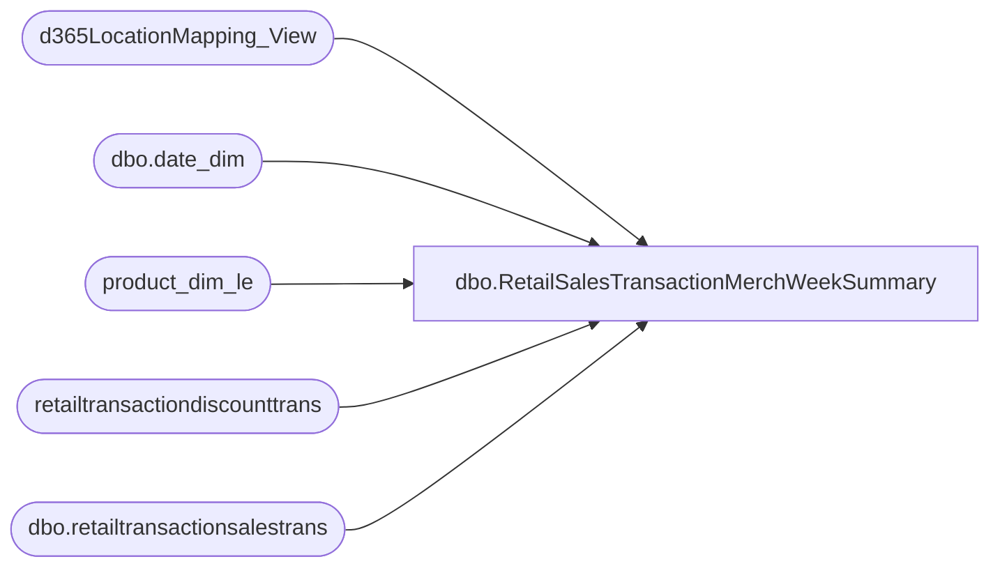

# dbo.RetailSalesTransactionMerchWeekSummary

**Database:** LH_D365  
**Server:** 4db76rlxaxcuvmuh5kw37wbnqq-ovsykae43znuhlmnflcdwm4ohu.datawarehouse.fabric.microsoft.com  

## Architecture Diagram



## Table Dependencies

| Referenced Table |
|---|
| d365LocationMapping_View |
| dbo.date_dim |
| product_dim_le |
| retailtransactiondiscounttrans |
| dbo.retailtransactionsalestrans |

## View Code

```sql
-- ============================================================================= -- View: dbo.RetailSalesTransactionMerchWeekSummary -- -- Purpose: Aggregates retail sales transaction data by product dimensions, --          location, item, fiscal year/period/week, and inventory transaction type --          for the last 6 months. -- -- Sources: --   dbo.retailtransactionsalestrans   - Base transaction line items --   LH_Mart.dbo.date_dim             - Fiscal year and period lookup --   dbo.d365LocationMapping_View      - Maps inventlocationid to jurisdiction --   dbo.product_dim_le                - Product dimension (subclass, etc.) --   dbo.retailtransactiondiscounttrans - Periodic discount offer info -- -- InventoryTransTypeCode logic (priority order): --   1. 'Discount' - periodicdiscountofferid exists on the line --   2. 'Sale'     - qty < 0 --   3. 'Return'   - qty > 0 --   4. NULL       - none of the above -- -- Aggregated measures: qty, totaldiscamount, netamount, taxamount -- Grain: product_key, jurisdiction, subclass, dataareaid, inventlocationid, --         itemid, fiscal_year, fiscal_period, currency, InventoryTransTypeCode -- =============================================================================  CREATE   VIEW [dbo].[RetailSalesTransactionMerchWeekSummary] AS SELECT     rt.dataareaid,     pd.jurisdiction_code,     rt.inventlocationid,         pd.product_key,     rt.itemid,     pd.subclass,     dd.fiscal_year,     dd.fiscal_period,     dd.fiscal_week,     rt.currency,     CASE         WHEN disc.periodicdiscountofferid IS NOT NULL          AND disc.periodicdiscountofferid <> ''             THEN 'Discount'         WHEN rt.qty < 0             THEN 'Sale'         WHEN rt.qty > 0             THEN 'Return'         ELSE NULL     END AS InventoryTransTypeCode,     SUM(rt.qty)              AS total_qty,     SUM(rt.totaldiscamount)  AS total_discamount,     SUM(rt.netamount)        AS total_netamount,     SUM(rt.taxamount)        AS total_taxamount FROM dbo.retailtransactionsalestrans rt INNER JOIN LH_Mart.dbo.date_dim dd     ON dd.actual_date = CAST(rt.businessdate AS DATE) LEFT JOIN d365LocationMapping_View lm     ON  lm.inventlocationid = rt.inventlocationid     AND lm.legalentity      = rt.dataareaid LEFT JOIN product_dim_le pd     ON  pd.style_code        = rt.itemid     AND pd.LegalEntity       = rt.dataareaid     AND pd.jurisdiction_code = lm.JurisidictionCode LEFT JOIN (     SELECT         transactionid,         salelinenum,         periodicdiscountofferid,         SUM(discountamount) AS discountamount     FROM         [retailtransactiondiscounttrans]     GROUP BY         transactionid,         salelinenum,         periodicdiscountofferid ) AS disc     ON  disc.transactionid = rt.transactionid     AND disc.salelinenum   = rt.linenum WHERE rt.businessdate >= DATEADD(MONTH, -6, GETDATE())   AND (rt.IsDelete IS NULL OR rt.IsDelete = 0) GROUP BY     rt.dataareaid,     pd.jurisdiction_code,     rt.inventlocationid,         pd.product_key,     rt.itemid,     pd.subclass,     dd.fiscal_year,     dd.fiscal_period,     dd.fiscal_week,     rt.currency,     CASE         WHEN disc.periodicdiscountofferid IS NOT NULL          AND disc.periodicdiscountofferid <> ''             THEN 'Discount'         WHEN rt.qty < 0             THEN 'Sale'         WHEN rt.qty > 0             THEN 'Return'         ELSE NULL     END;
```

