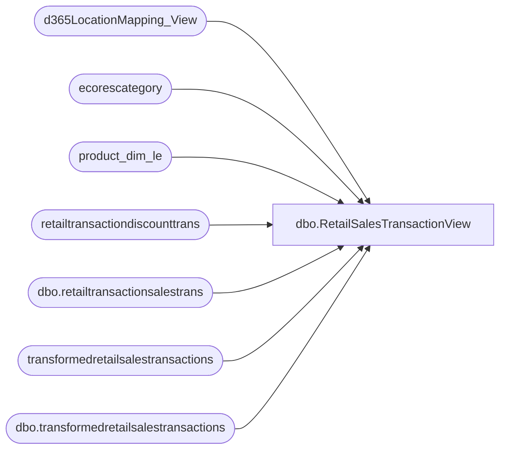

# dbo.RetailSalesTransactionView

**Database:** LH_D365  
**Server:** 4db76rlxaxcuvmuh5kw37wbnqq-ovsykae43znuhlmnflcdwm4ohu.datawarehouse.fabric.microsoft.com  

## Architecture Diagram



## Table Dependencies

| Referenced Table |
|---|
| d365LocationMapping_View |
| ecorescategory |
| product_dim_le |
| retailtransactiondiscounttrans |
| dbo.retailtransactionsalestrans |
| transformedretailsalestransactions |
| dbo.transformedretailsalestransactions |

## View Code

```sql
/****** Object:  View [dbo].[RetailSalesTransactionView]    Script Date: 4/1/2026 1:25:22 PM ******/  CREATE   VIEW [dbo].[RetailSalesTransactionView] AS WITH retailtransactionsalestrans AS (     SELECT --        pd.product_key, 		rt.transactionid,         rt.itemid,         rt.dataareaid,         rt.store, 		rt.inventlocationid, --        pd.jurisdiction_code,         rt.currency, --        l.accountingcurrency,         --CONCAT(DATEPART(YEAR, rt.businessdate), '', RIGHT('0' + CAST(DATEPART(WEEK, rt.businessdate) AS VARCHAR(2)), 2)) AS merch_year_wk, 		rt.businessdate, 		rt.qty, 		rt.netamountincltax, 		rt.netamount, 		rt.costamount, 		rt.discamount, 		rt.discamountwithouttax, 		rt.transdate, 		rt.custaccount, 		rt.netprice, 		rt.originalprice, 		rt.price, 		rt.taxamount, 		rt.totaldiscamount, 		rt.totaldiscpct, 		rt.linenum     FROM dbo.retailtransactionsalestrans AS rt     WHERE rt.businessdate >= DATEADD(MONTH, -12, GETDATE())	 	AND (rt.[IsDelete] IS NULL OR rt.[IsDelete] = 0) 	AND NOT EXISTS  	(Select 1 from transformedretailsalestransactions tr  		where  		tr.transactionid = rt.transactionid  		--and tr.itemid = rt.itemid 		and tr.store = rt.store 		and tr.dataareaid = rt.dataareaid)      Union all     SELECT         rt.transactionid, 		rt.itemid,         rt.dataareaid,         rt.store, 		rt.inventlocationid,         rt.currency, 		rt.businessdate , 		rt.qty, 		rt.netamountincltax, 		rt.netamount, 		rt.costamount, 		rt.discamount, 		rt.discamountwithouttax, 		rtst.transdate, 		rtst.custaccount, 		rt.netprice, 		--rtst.netprice, 		rtst.originalprice, 		--rtst.price, 		rt.price, 		--rtst.taxamount, 		rt.taxamount, 		rtst.totaldiscamount, 		rtst.totaldiscpct, 		rt.linenum     FROM dbo.transformedretailsalestransactions AS rt -- using this table to bring in digital blank sales consolidate in 02750 item     INNER JOIN dbo.retailtransactionsalestrans rtst 		ON rtst.transactionid = rt.transactionid 		AND rtst.itemid = rt.itemid 		AND rtst.linenum = rt.linenum 	WHERE rt.businessdate >= DATEADD(MONTH, -12, GETDATE())      )  SELECT DISTINCT     [product_dim_le].product_key,     [product_dim_le].jurisdiction_code,     [product_dim_le].style_desc,     [product_dim_le].department_code,     [product_dim_le].department,     [product_dim_le].class_code,     [product_dim_le].class,     [product_dim_le].subclass_code,     [product_dim_le].subclass, 	[product_dim_le].color_code, 	[product_dim_le].color_desc,     consumer_group.code AS consumergroup_code,     consumer_group.name AS consumergroup,     retailtransactionsalestrans.[store],     retailtransactionsalestrans.[businessdate],     retailtransactionsalestrans.transdate,     [retailtransactionsalestrans].[itemid],     retailtransactionsalestrans.transactionid,     [retailtransactionsalestrans].[inventlocationid] + '-' + [retailtransactionsalestrans].[dataareaid] AS LocationKey,     SUM([retailtransactionsalestrans].[costamount]) AS [costamount],     MIN([retailtransactionsalestrans].[currency]) AS [currency],     MIN([retailtransactionsalestrans].[custaccount]) AS [custaccount],     SUM([retailtransactionsalestrans].[discamount]) AS [discamount],     SUM([retailtransactionsalestrans].[discamountwithouttax]) AS [discamountwithouttax],     MIN([retailtransactiondiscounttrans].[periodicdiscountofferid]) AS [periodicdiscountofferid],     SUM([retailtransactionsalestrans].[netamount]) AS [netamount],     SUM([retailtransactionsalestrans].[netamountincltax]) AS [netamountincltax],     AVG([retailtransactionsalestrans].[netprice]) AS [netprice],     AVG([retailtransactionsalestrans].[originalprice]) AS [originalprice],     AVG([retailtransactionsalestrans].[price]) AS [price],     SUM([retailtransactionsalestrans].[qty]) AS [qty],     SUM([retailtransactionsalestrans].[taxamount]) AS [taxamount],     SUM([retailtransactionsalestrans].[totaldiscamount]) AS [totaldiscamount],     SUM([retailtransactionsalestrans].[totaldiscpct]) AS [totaldiscpct],     MIN([retailtransactionsalestrans].[dataareaid]) AS [dataareaid] FROM     [retailtransactionsalestrans]     LEFT JOIN d365LocationMapping_View lm         ON lm.inventlocationid = [retailtransactionsalestrans].inventlocationid         AND lm.legalentity = [retailtransactionsalestrans].dataareaid     LEFT JOIN [product_dim_le]         ON [product_dim_le].style_code = [retailtransactionsalestrans].itemid          AND [product_dim_le].LegalEntity = [retailtransactionsalestrans].dataareaid         AND product_dim_le.jurisdiction_code = lm.JurisidictionCode     LEFT JOIN     (         SELECT             transactionid,             salelinenum,             periodicdiscountofferid,             SUM(discountamount) AS discountamount         FROM             [retailtransactiondiscounttrans]         GROUP BY             transactionid,             salelinenum,             periodicdiscountofferid     ) AS [retailtransactiondiscounttrans]         ON [retailtransactionsalestrans].transactionid = [retailtransactiondiscounttrans].transactionid  		AND [retailtransactionsalestrans].linenum = [retailtransactiondiscounttrans].salelinenum     LEFT JOIN [ecorescategory] AS consumer_group         ON consumer_group.code = LEFT([product_dim_le].department_code, 1) AND consumer_group.[level] = 2 WHERE     retailtransactionsalestrans.businessdate >= DATEADD(MONTH, -12, GETDATE()) 	--transdate between '11/02/2025' and '11/08/2025'     --AND (retailtransactionsalestrans.[IsDelete] IS NULL OR retailtransactionsalestrans.[IsDelete] = 0) 	--AND retailtransactionsalestrans.transactionid = '1164-1164Int-20260107-513869104_1' 	--AND product_dim_le.subclass like 'Digital Blanks%' 	--and retailtransactionsalestrans.itemid = '023314' 	--and retailtransactionsalestrans.store = '1001' GROUP BY     businessdate,     retailtransactionsalestrans.transdate,     itemid,     store,     [retailtransactionsalestrans].inventlocationid,     [retailtransactionsalestrans].dataareaid,     [retailtransactionsalestrans].transactionid,     [product_dim_le].product_key,     [product_dim_le].jurisdiction_code,     [product_dim_le].style_desc,     [product_dim_le].department_code,     [product_dim_le].department,     [product_dim_le].class_code,     [product_dim_le].class,     consumer_group.code,     consumer_group.name,     [product_dim_le].subclass_code,     [product_dim_le].subclass,     [product_dim_le].color_code, 	[product_dim_le].color_desc;
```

