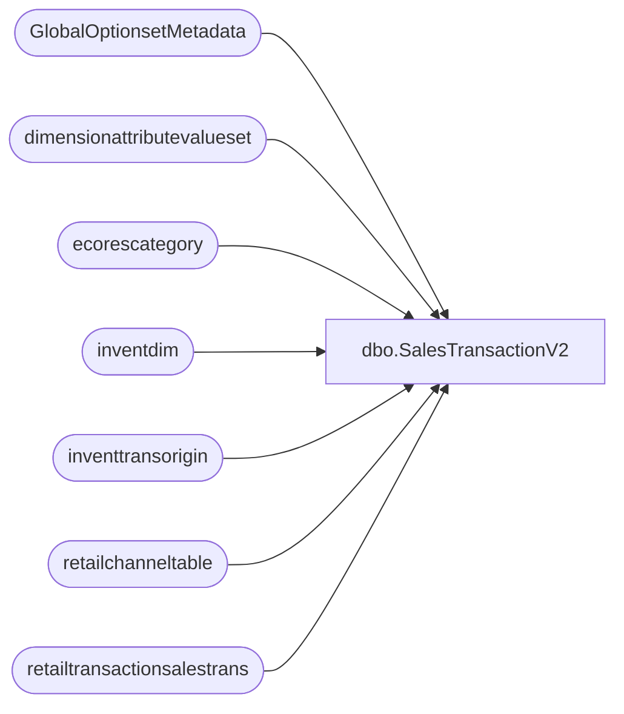

# dbo.SalesTransactionV2

**Database:** LH_D365  
**Server:** 4db76rlxaxcuvmuh5kw37wbnqq-ovsykae43znuhlmnflcdwm4ohu.datawarehouse.fabric.microsoft.com  

## Architecture Diagram



## Table Dependencies

| Referenced Table |
|---|
| GlobalOptionsetMetadata |
| dimensionattributevalueset |
| ecorescategory |
| inventdim |
| inventtransorigin |
| retailchanneltable |
| retailtransactionsalestrans |

## View Code

```sql
CREATE VIEW [dbo].[SalesTransactionV2] AS (  SELECT   --TOP (1000)			 				 	-------------------------------------------------------------------------------- 	--	PRIMARY	TABLE	|	[RetailTransactionSalesTrans]						  -- 	--------------------------------------------------------------------------------   							 retailtransactionsalestrans.[Id] AS [retailtransactionsalestrans_Id] 							 							,retailtransactionsalestrans.[returnnosale] AS [retailtransactionsalestrans_returnnosale] 							,retailtransactionsalestrans.[taxgroup] AS [retailtransactionsalestrans_taxgroup] 							,retailtransactionsalestrans.[taxitemgroup] AS [retailtransactionsalestrans_taxitemgroup] 							,retailtransactionsalestrans.[terminalid] AS [retailtransactionsalestrans_terminalid] 							,retailtransactionsalestrans.[transactionid] AS [retailtransactionsalestrans_transactionid] 							,retailtransactionsalestrans.[store] AS [retailtransactionsalestrans_store] 							,retailtransactionsalestrans.[businessdate] AS [retailtransactionsalestrans_businessdate] 							,retailtransactionsalestrans.[costamount] AS [retailtransactionsalestrans_costamount] 							,retailtransactionsalestrans.[currency] AS [retailtransactionsalestrans_currency] 							,retailtransactionsalestrans.[custaccount] AS [retailtransactionsalestrans_custaccount] 							,retailtransactionsalestrans.[discamount] AS [retailtransactionsalestrans_discamount] 							,retailtransactionsalestrans.[discamountwithouttax] AS [retailtransactionsalestrans_discamountwithouttax] 							,retailtransactionsalestrans.[inventdimid] AS [retailtransactionsalestrans_inventdimid] 							,retailtransactionsalestrans.[inventlocationid] AS [retailtransactionsalestrans_inventlocationid] 							,retailtransactionsalestrans.[inventtransid] AS [retailtransactionsalestrans_inventtransid] 							,retailtransactionsalestrans.[itemid] AS [retailtransactionsalestrans_itemid] 							,retailtransactionsalestrans.[linedscamount] AS [retailtransactionsalestrans_linedscamount] 							,retailtransactionsalestrans.[linemanualdiscountamount] AS [retailtransactionsalestrans_linemanualdiscountamount] 							,retailtransactionsalestrans.[linemanualdiscountpercentage] AS [retailtransactionsalestrans_linemanualdiscountpercentage] 							,retailtransactionsalestrans.[linenum] AS [retailtransactionsalestrans_linenum] 							,retailtransactionsalestrans.[listingid] AS [retailtransactionsalestrans_listingid] 							,retailtransactionsalestrans.[netamount] AS [retailtransactionsalestrans_netamount] 							,retailtransactionsalestrans.[netamountincltax] AS [retailtransactionsalestrans_netamountincltax] 							,retailtransactionsalestrans.[netprice] AS [retailtransactionsalestrans_netprice] 							,retailtransactionsalestrans.[originalprice] AS [retailtransactionsalestrans_originalprice] 							,retailtransactionsalestrans.[originaltaxgroup] AS [retailtransactionsalestrans_originaltaxgroup] 							,retailtransactionsalestrans.[originaltaxitemgroup] AS [retailtransactionsalestrans_originaltaxitemgroup] 							,retailtransactionsalestrans.[periodicdiscamount] AS [retailtransactionsalestrans_periodicdiscamount] 							,retailtransactionsalestrans.[periodicpercentagediscount] AS [retailtransactionsalestrans_periodicpercentagediscount] 							,retailtransactionsalestrans.[price] AS [retailtransactionsalestrans_price] 							,retailtransactionsalestrans.[qty] AS [retailtransactionsalestrans_qty] 							,retailtransactionsalestrans.[receiptdaterequested] AS [retailtransactionsalestrans_receiptdaterequested] 							,retailtransactionsalestrans.[receiptid] AS [retailtransactionsalestrans_receiptid] 							,retailtransactionsalestrans.[returnstore] AS [retailtransactionsalestrans_returnstore] 							,retailtransactionsalestrans.[shippingdaterequested] AS [retailtransactionsalestrans_shippingdaterequested] 							,retailtransactionsalestrans.[staffid] AS [retailtransactionsalestrans_staffid] 							,retailtransactionsalestrans.[statementid] AS [retailtransactionsalestrans_statementid] 							,retailtransactionsalestrans.[taxamount] AS [retailtransactionsalestrans_taxamount] 							,retailtransactionsalestrans.[totaldiscamount] AS [retailtransactionsalestrans_totaldiscamount] 							,retailtransactionsalestrans.[totaldiscpct] AS [retailtransactionsalestrans_totaldiscpct] 							,retailtransactionsalestrans.[transdate] AS [retailtransactionsalestrans_transdate] 							,retailtransactionsalestrans.[postingcalculatedwmslocationid] AS [retailtransactionsalestrans_postingcalculatedwmslocationid] 							,retailtransactionsalestrans.[modifieddatetime] AS [retailtransactionsalestrans_modifieddatetime] 							,retailtransactionsalestrans.[modifiedby] AS [retailtransactionsalestrans_modifiedby] 							,retailtransactionsalestrans.[modifiedtransactionid] AS [retailtransactionsalestrans_modifiedtransactionid] 							,retailtransactionsalestrans.[createddatetime] AS [retailtransactionsalestrans_createddatetime] 							,retailtransactionsalestrans.[createdby] AS [retailtransactionsalestrans_createdby] 							,retailtransactionsalestrans.[createdtransactionid] AS [retailtransactionsalestrans_createdtransactionid] 							,retailtransactionsalestrans.[dataareaid] AS [retailtransactionsalestrans_dataareaid] 							,retailtransactionsalestrans.[babextshipmentnumber] AS [retailtransactionsalestrans_babextshipmentnumber]   	-------------------------------------------------------------------------------- 	--			TABLE	|	[GlobalOptionsetMetadata]							  -- 	--------------------------------------------------------------------------------   							--,retailtransactionsalestrans_transactionstatus_GlobalOptionsetMetadata.[Option]			AS [retailtransactionsalestrans_transactionstatus_Option] 							,retailtransactionsalestrans_transactionstatus_GlobalOptionsetMetadata.[LocalizedLabel]		AS [retailtransactionsalestrans_transactionstatus_LocalizedLabel]  							--,retailtransactionsalestrans_inventstatussales_GlobalOptionsetMetadata.[Option]			AS [retailtransactionsalestrans_inventstatussales_Option] 							,retailtransactionsalestrans_inventstatussales_GlobalOptionsetMetadata.[LocalizedLabel]		AS [retailtransactionsalestrans_inventstatussales_LocalizedLabel]  							--,retailtransactionsalestrans_giftcardoperation_GlobalOptionsetMetadata.[Option]			AS [retailtransactionsalestrans_giftcardoperation_Option] 							,retailtransactionsalestrans_giftcardoperation_GlobalOptionsetMetadata.[LocalizedLabel]		AS [retailtransactionsalestrans_giftcardoperation_LocalizedLabel]  							--,retailtransactionsalestrans_linetype_GlobalOptionsetMetadata.[Option]					AS [retailtransactionsalestrans_linetype_Option] 							,retailtransactionsalestrans_linetype_GlobalOptionsetMetadata.[LocalizedLabel]				AS [retailtransactionsalestrans_linetype_LocalizedLabel]  							--,retailtransactionsalestrans_periodicdisctype_GlobalOptionsetMetadata.[Option]			AS [retailtransactionsalestrans_periodicdisctype_Option] 							,retailtransactionsalestrans_periodicdisctype_GlobalOptionsetMetadata.[LocalizedLabel]		AS [retailtransactionsalestrans_periodicdisctype_LocalizedLabel] 								 							--,retailtransactionsalestrans_giftcardtype_GlobalOptionsetMetadata.[Option]				AS [retailtransactionsalestrans_giftcardtype_Option] 							,retailtransactionsalestrans_giftcardtype_GlobalOptionsetMetadata.[LocalizedLabel]			AS [retailtransactionsalestrans_giftcardtype_LocalizedLabel]  							--,retailtransactionsalestrans_returntrackingstatus_GlobalOptionsetMetadata.[Option]		AS [retailtransactionsalestrans_returntrackingstatus_Option] 							,retailtransactionsalestrans_returntrackingstatus_GlobalOptionsetMetadata.[LocalizedLabel]	AS [retailtransactionsalestrans_returntrackingstatus_ExternalValue]  							--,retailtransactionsalestrans_upsellorigin_GlobalOptionsetMetadata.[Option]				AS [retailtransactionsalestrans_upsellorigin_Option] 							,retailtransactionsalestrans_upsellorigin_GlobalOptionsetMetadata.[LocalizedLabel]			AS [retailtransactionsalestrans_upsellorigin_LocalizedLabel]  							--,retailtransactionsalestrans_transactioncode_GlobalOptionsetMetadata.[Option]				AS [retailtransactionsalestrans_transactioncode_Option] 							,retailtransactionsalestrans_transactioncode_GlobalOptionsetMetadata.[LocalizedLabel]		AS [retailtransactionsalestrans_transactioncode_LocalizedLabel]  										 	-------------------------------------------------------------------------------- 	--			TABLE	|	[InventDim]											  -- 	--------------------------------------------------------------------------------   							,inventdim.[inventsiteid] AS [inventdim_inventsiteid] 							--,inventdim.[inventsizeid] AS [inventdim_inventsizeid] 							,inventdim.[inventstatusid] AS [inventdim_inventstatusid] 							,inventdim.[inventstyleid] AS [inventdim_inventstyleid] 							--,inventdim.[inventversionid] AS [inventdim_inventversionid] 							,inventdim.[licenseplateid] AS [inventdim_licenseplateid] 							,inventdim.[wmslocationid] AS [inventdim_wmslocationid] 	-------------------------------------------------------------------------------- 	--			TABLE	|	[EcoResCategory]									  -- 	--------------------------------------------------------------------------------  							,ecorescategory.[isactive] AS [ecorescategory_isactive] 							,ecorescategory.[iscategoryattributesinherited] AS [ecorescategory_iscategoryattributesinherited] 							,ecorescategory.[istangible] AS [ecorescategory_istangible] 							,ecorescategory.[categoryhierarchy] AS [ecorescategory_categoryhierarchy] 							,ecorescategory.[code] AS [ecorescategory_code] 							,ecorescategory.[level] AS [ecorescategory_level] 							,ecorescategory.[name] AS [ecorescategory_name] 							,ecorescategory.[nestedsetleft] AS [ecorescategory_nestedsetleft] 							,ecorescategory.[nestedsetright] AS [ecorescategory_nestedsetright] 							,ecorescategory.[parentcategory] AS [ecorescategory_parentcategory] 							,ecorescategory.[recid] AS [ecorescategory_recid] 							,ecorescategory.[tableid] AS [ecorescategory_tableid] 	-------------------------------------------------------------------------------- 	--			TABLE	|	[GlobalOptionsetMetadata]							  -- 	--------------------------------------------------------------------------------  	 							,ecorescategory_changestatus_GlobalOptionsetMetadata.[LocalizedLabel]	AS [ecorescategory_changestatus_LocalizedLabel]									 	-------------------------------------------------------------------------------- 	--			TABLE	|	[RetailChannelTable]								  -- 	--------------------------------------------------------------------------------   							,retailchanneltable.[channeltimezoneinfoid] AS [retailchanneltable_channeltimezoneinfoid] 							 							,retailchanneltable.[defaultcustaccount] AS [retailchanneltable_defaultcustaccount] 							,retailchanneltable.[defaultcustdataareaid] AS [retailchanneltable_defaultcustdataareaid] 							 							,retailchanneltable.[inventlocation] AS [retailchanneltable_inventlocation] 							,retailchanneltable.[inventlocationdataareaid] AS [retailchanneltable_inventlocationdataareaid] 							,retailchanneltable.[omoperatingunitid] AS [retailchanneltable_omoperatingunitid] 							 							,retailchanneltable.[transactionserviceprofile] AS [retailchanneltable_transactionserviceprofile] 							,retailchanneltable.[retailchannelid] AS [retailchanneltable_retailchannelid]  							,retailchanneltable.[sunecommsalesoriginid] AS [retailchanneltable_sunecommsalesoriginid] 	-------------------------------------------------------------------------------- 	--			TABLE	|	[GlobalOptionsetMetadata]							  -- 	--------------------------------------------------------------------------------  							,retailchanneltable_sunecommintegrationtype_GlobalOptionsetMetadata.[LocalizedLabel]	AS [retailchanneltable_sunecommintegrationtype_LocalizedLabel] 							,retailchanneltable_channeltimezone_GlobalOptionsetMetadata.[LocalizedLabel]			AS [retailchanneltable_channeltimezone_LocalizedLabel] 							,retailchanneltable_channeltype_GlobalOptionsetMetadata.[LocalizedLabel]				AS [retailchanneltable_channeltype_LocalizedLabel] 							,inventtransorigin.[isexcludedfrominventoryvalue] AS [inventtransorigin_isexcludedfrominventoryvalue] 							,inventtransorigin.[iteminventdimid] AS [inventtransorigin_iteminventdimid] 							,inventtransorigin.[party] AS [inventtransorigin_party] 							,inventtransorigin.[referenceid] AS [inventtransorigin_referenceid] 							,inventtransorigin.[dataareaid] AS [inventtransorigin_dataareaid] 							,inventtransorigin_referencecategory_GlobalOptionsetMetadata.[LocalizedLabel]	AS [inventtransorigin_referencecategory_LocalizedLabel] 							,dimensionattributevalueset.[mainaccountvalue] AS [dimensionattributevalueset_mainaccountvalue] 							,dimensionattributevalueset.[costcentervalue] AS [dimensionattributevalueset_costcentervalue] 							,dimensionattributevalueset.[storevalue] AS [dimensionattributevalueset_storevalue] 							,dimensionattributevalueset.[businessstreamvalue] AS [dimensionattributevalueset_businessstreamvalue] 							,dimensionattributevalueset.[projectidvalue] AS [dimensionattributevalueset_projectidvalue] 							,dimensionattributevalueset.[projectcategoryvalue] AS [dimensionattributevalueset_projectcategoryvalue] 							,dimensionattributevalueset.[legalentityvalue] AS [dimensionattributevalueset_legalentityvalue] 							,dimensionattributevalueset.[countryvalue] AS [dimensionattributevalueset_countryvalue] 							,dimensionattributevalueset.[fundvalue] AS [dimensionattributevalueset_fundvalue]    FROM						[retailtransactionsalestrans]    LEFT JOIN					[inventdim]   ON						retailtransactionsalestrans.[inventdimid] 	=	inventdim.[inventdimid]   AND						retailtransactionsalestrans.[dataareaid] 	=	inventdim.[dataareaid]    LEFT JOIN					[ecorescategory]   ON						retailtransactionsalestrans.[categoryid] 	=	ecorescategory.[recid]    LEFT JOIN					[retailchanneltable]   ON						retailtransactionsalestrans.[channel] 		=	retailchanneltable.[recid]    LEFT JOIN					[inventtransorigin]   ON						retailtransactionsalestrans.[inventtransid]	=	inventtransorigin.[inventtransid]   AND						retailtransactionsalestrans.[itemid]		=	inventtransorigin.[itemid]    LEFT JOIN					[dimensionattributevalueset]   ON						retailtransactionsalestrans.[defaultdimension] = dimensionattributevalueset.[recid]      	-------------------------------------------------------------------------------- 	--			JOINS	|	[GlobalOptionsetMetadata]							  -- 	--------------------------------------------------------------------------------     LEFT JOIN ( 				SELECT 		/*		TABLE	|	[GlobalOptionsetMetadata]		*/  							 [OptionSetName] 							,[Option] 							--,[IsUserLocalizedLabel] 							--,[LocalizedLabelLanguageCode] 							,[LocalizedLabel] 							--,[GlobalOptionSetName] 							,[EntityName] 							--,[ExternalValue] 							--,[createdonpartition]  				FROM		[GlobalOptionsetMetadata] 				WHERE		GlobalOptionsetMetadata.[EntityName] =		'retailtransactionsalestrans' 				AND			GlobalOptionsetMetadata.[OptionSetName] =	'transactionstatus'  				)			retailtransactionsalestrans_transactionstatus_GlobalOptionsetMetadata    ON						retailtransactionsalestrans.[transactionstatus] = retailtransactionsalestrans_transactionstatus_GlobalOptionsetMetadata.[Option]     LEFT JOIN ( 				SELECT 		/*		TABLE	|	[GlobalOptionsetMetadata]		*/  							 [OptionSetName] 							,[Option] 							--,[IsUserLocalizedLabel] 							--,[LocalizedLabelLanguageCode] 							,[LocalizedLabel] 							--,[GlobalOptionSetName] 							,[EntityName] 							--,[ExternalValue] 							--,[createdonpartition]  				FROM		[GlobalOptionsetMetadata] 				WHERE		GlobalOptionsetMetadata.[EntityName] =		'retailtransactionsalestrans' 				AND			GlobalOptionsetMetadata.[OptionSetName] =	'inventstatussales'  				)			retailtransactionsalestrans_inventstatussales_GlobalOptionsetMetadata    ON						retailtransactionsalestrans.[inventstatussales] = retailtransactionsalestrans_inventstatussales_GlobalOptionsetMetadata.[Option]     LEFT JOIN ( 				SELECT 		/*		TABLE	|	[GlobalOptionsetMetadata]		*/  							 [OptionSetName] 							,[Option] 							--,[IsUserLocalizedLabel] 							--,[LocalizedLabelLanguageCode] 							,[LocalizedLabel] 							--,[GlobalOptionSetName] 							,[EntityName] 							--,[ExternalValue] 							--,[createdonpartition]  				FROM		[GlobalOptionsetMetadata] 				WHERE		GlobalOptionsetMetadata.[EntityName] =		'retailtransactionsalestrans' 				AND			GlobalOptionsetMetadata.[OptionSetName] =	'giftcardoperation'  				)			retailtransactionsalestrans_giftcardoperation_GlobalOptionsetMetadata    ON						retailtransactionsalestrans.[giftcardoperation] = retailtransactionsalestrans_giftcardoperation_GlobalOptionsetMetadata.[Option]     LEFT JOIN ( 				SELECT 		/*		TABLE	|	[GlobalOptionsetMetadata]		*/  							 [OptionSetName] 							,[Option] 							--,[IsUserLocalizedLabel] 							--,[LocalizedLabelLanguageCode] 							,[LocalizedLabel] 							--,[GlobalOptionSetName] 							,[EntityName] 							--,[ExternalValue] 							--,[createdonpartition]  				FROM		[GlobalOptionsetMetadata] 				WHERE		GlobalOptionsetMetadata.[EntityName] =		'retailtransactionsalestrans' 				AND			GlobalOptionsetMetadata.[OptionSetName] =	'linetype'  				)			retailtransactionsalestrans_linetype_GlobalOptionsetMetadata    ON						retailtransactionsalestrans.[linetype] = retailtransactionsalestrans_linetype_GlobalOptionsetMetadata.[Option]     LEFT JOIN ( 				SELECT 		/*		TABLE	|	[GlobalOptionsetMetadata]		*/  							 [OptionSetName] 							,[Option] 							--,[IsUserLocalizedLabel] 							--,[LocalizedLabelLanguageCode] 							,[LocalizedLabel] 							--,[GlobalOptionSetName] 							,[EntityName] 							--,[ExternalValue] 							--,[createdonpartition]  				FROM		[GlobalOptionsetMetadata] 				WHERE		GlobalOptionsetMetadata.[EntityName] =		'retailtransactionsalestrans' 				AND			GlobalOptionsetMetadata.[OptionSetName] =	'periodicdisctype'  				)			retailtransactionsalestrans_periodicdisctype_GlobalOptionsetMetadata    ON						retailtransactionsalestrans.[periodicdisctype] = retailtransactionsalestrans_periodicdisctype_GlobalOptionsetMetadata.[Option]     LEFT JOIN ( 				SELECT 		/*		TABLE	|	[GlobalOptionsetMetadata]		*/  							 [OptionSetName] 							,[Option] 							--,[IsUserLocalizedLabel] 							--,[LocalizedLabelLanguageCode] 							,[LocalizedLabel] 							--,[GlobalOptionSetName] 							,[EntityName] 							--,[ExternalValue] 							--,[createdonpartition]  				FROM		[GlobalOptionsetMetadata] 				WHERE		GlobalOptionsetMetadata.[EntityName] =		'retailtransactionsalestrans' 				AND			GlobalOptionsetMetadata.[OptionSetName] =	'giftcardtype'  				)			retailtransactionsalestrans_giftcardtype_GlobalOptionsetMetadata    ON						retailtransactionsalestrans.[giftcardtype] = retailtransactionsalestrans_giftcardtype_GlobalOptionsetMetadata.[Option]     LEFT JOIN ( 				SELECT 		/*		TABLE	|	[GlobalOptionsetMetadata]		*/  							 [OptionSetName] 							,[Option] 							--,[IsUserLocalizedLabel] 							--,[LocalizedLabelLanguageCode] 							,[LocalizedLabel] 							--,[GlobalOptionSetName] 							,[EntityName] 							--,[ExternalValue] 							--,[createdonpartition]  				FROM		[GlobalOptionsetMetadata] 				WHERE		GlobalOptionsetMetadata.[EntityName] =		'retailtransactionsalestrans' 				AND			GlobalOptionsetMetadata.[OptionSetName] =	'returntrackingstatus'  				)			retailtransactionsalestrans_returntrackingstatus_GlobalOptionsetMetadata    ON						retailtransactionsalestrans.[returntrackingstatus] = retailtransactionsalestrans_returntrackingstatus_GlobalOptionsetMetadata.[Option]     LEFT JOIN ( 				SELECT 		/*		TABLE	|	[GlobalOptionsetMetadata]		*/  							 [OptionSetName] 							,[Option] 							--,[IsUserLocalizedLabel] 							--,[LocalizedLabelLanguageCode] 							,[LocalizedLabel] 							--,[GlobalOptionSetName] 							,[EntityName] 							--,[ExternalValue] 							--,[createdonpartition]  				FROM		[GlobalOptionsetMetadata] 				WHERE		GlobalOptionsetMetadata.[EntityName] =		'retailtransactionsalestrans' 				AND			GlobalOptionsetMetadata.[OptionSetName] =	'upsellorigin'  				)			retailtransactionsalestrans_upsellorigin_GlobalOptionsetMetadata    ON						retailtransactionsalestrans.[upsellorigin] = retailtransactionsalestrans_upsellorigin_GlobalOptionsetMetadata.[Option]     LEFT JOIN ( 				SELECT 		/*		TABLE	|	[GlobalOptionsetMetadata]		*/  							 [OptionSetName] 							,[Option] 							--,[IsUserLocalizedLabel] 							--,[LocalizedLabelLanguageCode] 							,[LocalizedLabel] 							--,[GlobalOptionSetName] 							,[EntityName] 							--,[ExternalValue] 							--,[createdonpartition]  				FROM		[GlobalOptionsetMetadata] 				WHERE		GlobalOptionsetMetadata.[EntityName] =		'retailtransactionsalestrans' 				AND			GlobalOptionsetMetadata.[OptionSetName] =	'transactioncode'  				)			retailtransactionsalestrans_transactioncode_GlobalOptionsetMetadata    ON						retailtransactionsalestrans.[transactioncode] = retailtransactionsalestrans_transactioncode_GlobalOptionsetMetadata.[Option]     LEFT JOIN ( 				SELECT 		/*		TABLE	|	[GlobalOptionsetMetadata]		*/  							 [OptionSetName] 							,[Option] 							--,[IsUserLocalizedLabel] 							--,[LocalizedLabelLanguageCode] 							,[LocalizedLabel] 							--,[GlobalOptionSetName] 							,[EntityName] 							--,[ExternalValue] 							--,[createdonpartition]  				FROM		[GlobalOptionsetMetadata] 				WHERE		GlobalOptionsetMetadata.[EntityName] =		'ecorescategory' 				AND			GlobalOptionsetMetadata.[OptionSetName] =	'changestatus'  				)			ecorescategory_changestatus_GlobalOptionsetMetadata    ON						ecorescategory.[changestatus] = ecorescategory_changestatus_GlobalOptionsetMetadata.[Option]     LEFT JOIN ( 				SELECT 		/*		TABLE	|	[GlobalOptionsetMetadata]		*/  							 [OptionSetName] 							,[Option] 							--,[IsUserLocalizedLabel] 							--,[LocalizedLabelLanguageCode] 							,[LocalizedLabel] 							--,[GlobalOptionSetName] 							,[EntityName] 							--,[ExternalValue] 							--,[createdonpartition]  				FROM		[GlobalOptionsetMetadata] 				WHERE		GlobalOptionsetMetadata.[EntityName] =		'retailchanneltable' 				AND			GlobalOptionsetMetadata.[OptionSetName] =	'sunecommintegrationtype'  				)			retailchanneltable_sunecommintegrationtype_GlobalOptionsetMetadata    ON						retailchanneltable.[sunecommintegrationtype] = retailchanneltable_sunecommintegrationtype_GlobalOptionsetMetadata.[Option]       LEFT JOIN ( 				SELECT 		/*		TABLE	|	[GlobalOptionsetMetadata]		*/  							 [OptionSetName] 							,[Option] 							--,[IsUserLocalizedLabel] 							--,[LocalizedLabelLanguageCode] 							,[LocalizedLabel] 							--,[GlobalOptionSetName] 							,[EntityName] 							--,[ExternalValue] 							--,[createdonpartition]  				FROM		[GlobalOptionsetMetadata] 				WHERE		GlobalOptionsetMetadata.[EntityName] =		'retailchanneltable' 				AND			GlobalOptionsetMetadata.[OptionSetName] =	'channeltimezone'  				)			retailchanneltable_channeltimezone_GlobalOptionsetMetadata    ON						retailchanneltable.[channeltimezone] = retailchanneltable_channeltimezone_GlobalOptionsetMetadata.[Option]       LEFT JOIN ( 				SELECT 		/*		TABLE	|	[GlobalOptionsetMetadata]		*/  							 [OptionSetName] 							,[Option] 							--,[IsUserLocalizedLabel] 							--,[LocalizedLabelLanguageCode] 							,[LocalizedLabel] 							--,[GlobalOptionSetName] 							,[EntityName] 							--,[ExternalValue] 							--,[createdonpartition]  				FROM		[GlobalOptionsetMetadata] 				WHERE		GlobalOptionsetMetadata.[EntityName] =		'retailchanneltable' 				AND			GlobalOptionsetMetadata.[OptionSetName] =	'channeltype'  				)			retailchanneltable_channeltype_GlobalOptionsetMetadata    ON						retailchanneltable.[channeltype] = retailchanneltable_channeltype_GlobalOptionsetMetadata.[Option]     LEFT JOIN ( 				SELECT 		/*		TABLE	|	[GlobalOptionsetMetadata]		*/  							 [OptionSetName] 							,[Option] 							--,[IsUserLocalizedLabel] 							--,[LocalizedLabelLanguageCode] 							,[LocalizedLabel] 							--,[GlobalOptionSetName] 							,[EntityName] 							--,[ExternalValue] 							--,[createdonpartition]  				FROM		[GlobalOptionsetMetadata] 				WHERE		GlobalOptionsetMetadata.[EntityName]	=	'inventtransorigin' 				AND			GlobalOptionsetMetadata.[OptionSetName] =	'referencecategory'  				)			inventtransorigin_referencecategory_GlobalOptionsetMetadata    ON						inventtransorigin.[referencecategory] = inventtransorigin_referencecategory_GlobalOptionsetMetadata.[Option]    	-------------------------------------------------------------------------------- 	--	RECENCY FILTER	|	Performance optimization: FY2022 begins 2022-01-30	  -- 	--------------------------------------------------------------------------------     WHERE						retailtransactionsalestrans.transdate 	>=	DATEADD(YEAR, -3, GETDATE())    	-------------------------------------------------------------------------------- 	--			FILTER	|	Remove deleted lines								  -- 	--------------------------------------------------------------------------------     AND						(retailtransactionsalestrans.[IsDelete]	IS NULL	OR	retailtransactionsalestrans.[IsDelete]	= 0)   AND						(inventdim.[IsDelete]					IS NULL	OR	inventdim.[IsDelete]					= 0)   AND						(ecorescategory.[IsDelete]				IS NULL	OR	ecorescategory.[IsDelete]				= 0)   AND						(retailchanneltable.[IsDelete]			IS NULL	OR	retailchanneltable.[IsDelete]			= 0)   AND						(inventtransorigin.[IsDelete]			IS NULL	OR	inventtransorigin.[IsDelete]			= 0)   AND						(dimensionattributevalueset.[IsDelete]	IS NULL	OR	dimensionattributevalueset.[IsDelete]	= 0)      --ORDER BY					retailtransactionsalestrans.[modifieddatetime]	ASC   )
```

