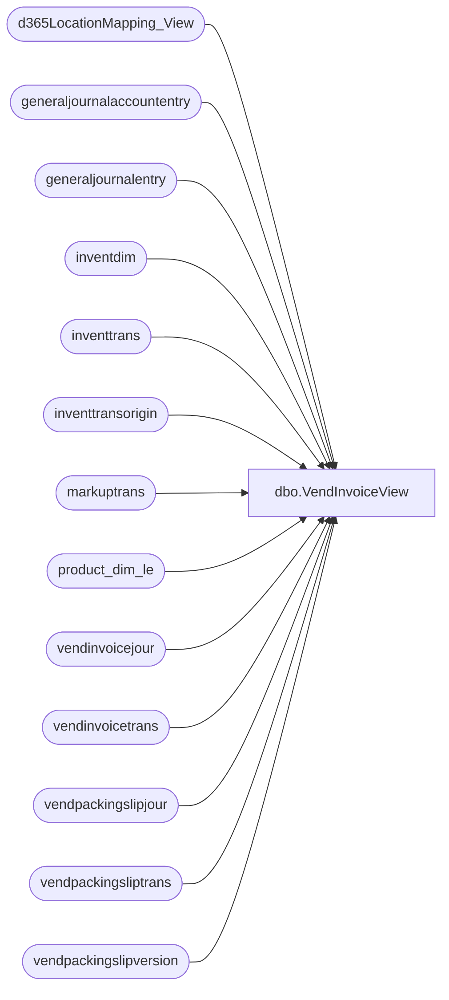

# dbo.VendInvoiceView

**Database:** LH_D365  
**Server:** 4db76rlxaxcuvmuh5kw37wbnqq-ovsykae43znuhlmnflcdwm4ohu.datawarehouse.fabric.microsoft.com  

## Architecture Diagram



## Table Dependencies

| Referenced Table |
|---|
| d365LocationMapping_View |
| generaljournalaccountentry |
| generaljournalentry |
| inventdim |
| inventtrans |
| inventtransorigin |
| markuptrans |
| product_dim_le |
| vendinvoicejour |
| vendinvoicetrans |
| vendpackingslipjour |
| vendpackingsliptrans |
| vendpackingslipversion |

## View Code

```sql
CREATE   VIEW  [dbo].[VendInvoiceView]  AS   WITH iprvouchers as ( SELECT     mt.voucher,     mt.transtableid,     mt.transrecid, 	mt.currencycode,     UPPER(REPLACE(mt.markupcode, ' ', '')) AS markupcode,     mt.calculatedamount, 	vp.origpurchid as purchid, 	vp.packingslipid as [documentid], 	vp.deliverydate as [documentdate], 	vp.dataareaid, 	vp.inventdimid, 	vp.qty, 	vp.itemid, 	vp.valuemst as lineamount, 	vp.lineamount_w as lineamountmst, 	mt.calculatedamount as ConvertedAmount FROM markuptrans mt  INNER JOIN vendpackingsliptrans vp     on vp.tableid = mt.transtableid       AND vp.recid   = mt.transrecid 	  AND vp.costledgervoucher = mt.voucher Where mt.calculatedamount <> 0	 )  , apivoucher AS ( SELECT     mt.voucher,     mt.transtableid,     mt.transrecid, 	mt.currencycode,     UPPER(REPLACE(mt.markupcode, ' ', '')) AS markupcode,     mt.calculatedamount, 	vt.purchid, 	vt.invoiceid as [documentid], 	vt.invoicedate as [documentdate], 	vt.dataareaid, 	vt.inventdimid, 	vt.qty, 	vt.itemid, 	vt.lineamount, 	vt.lineamountmst, 	--et.fxname 	CAST (mt.calculatedamount * round(vj.exchrate/100,5,1) AS DECIMAL(18, 2)) as ConvertedAmount FROM markuptrans mt     INNER JOIN vendinvoicetrans vt         ON vt.tableid = mt.transtableid        AND vt.recid   = mt.transrecid 		AND vt.itemid IS NOT NULL INNER JOIN vendinvoicejour vj 	on vj.invoiceid = vt.invoiceid 	AND vj.dataareaid = vt.dataareaid 	AND vj.invoicedate = vt.invoicedate 	AND vj.ledgervoucher = mt.voucher Where mt.calculatedamount <> 0  and NOT EXISTS(Select 1 from iprvouchers ipr  				where ipr.itemid = vt.itemid  					and ipr.purchid = vt.origpurchid  					and ipr.dataareaid = vt.dataareaid 					) UNION ALL SELECT      mt.voucher,     mt.transtableid,     mt.transrecid,     mt.currencycode,     UPPER(REPLACE(mt.markupcode, ' ', '')) AS markupcode,     CASE          WHEN mt.markupcode = 'VenFreight'          THEN mt.calculatedamount * -1          ELSE mt.calculatedamount      END AS calculatedamount,      vj.purchid,	     vj.invoiceid AS documentid,     vj.invoicedate AS documentdate,     vj.dataareaid,		      -- From vendinvoicetrans (only FIRST row)     vt.inventdimid,     0 as qty,--vt.qty,     vt.itemid,	 	0.00 as invoiceamount, 	0.00 as invoiceamountmst, 	CAST ( CASE WHEN mt.markupcode = 'VenFreight' THEN mt.calculatedamount * -1 ELSE mt.calculatedamount END * round(vj.exchrate/100,5,1) AS DECIMAL(18, 2)) as ConvertedAmount FROM markuptrans mt  INNER JOIN vendinvoicejour vj     ON vj.tableid = mt.transtableid     AND vj.recid = mt.transrecid      AND vj.ledgervoucher = mt.voucher     AND vj.dataareaid = mt.dataareaid   -- get only ONE row from vendinvoicetrans OUTER APPLY (     SELECT TOP 1 *     FROM vendinvoicetrans vt     WHERE vt.invoiceid = vj.invoiceid       AND vt.invoicedate = vj.invoicedate       AND vt.dataareaid = vj.dataareaid     ORDER BY vt.itemid   ) vt  WHERE mt.calculatedamount <> 0  ) ,CorrectionVouchers as ( 	select         vpsj.dataareaid,         vpsj.purchid,         vpsj.packingslipid, 		count(*) as correctioncount         ,Max(vpsv.ledgervoucher) as voucher     from vendpackingslipjour vpsj     join vendpackingslipversion vpsv       on vpsv.vendpackingslipjour = vpsj.recid     --where vpsj.dataareaid = '1200' 		--and vpsj.purchid    = 'PO120011428' 	--and vpsv.accountingdate > '2024-01-01' group by vpsj.purchid, vpsj.packingslipid, vpsj.dataareaid having count(*) > 1 ) , glvoucher as  ( Select c.voucher , ga.tableid as trantableid , ga.recid as transrecid , t.currencycode , CASE When ga.ledgeraccount = '200050' then 'OCEANFRT' WHEN ga.ledgeraccount = '200570' THEN 'FOBROY' WHEN ga.ledgeraccount = '200055' THEN 'TARIFFS' END as markupcode ,ga.accountingcurrencyamount  * -1 as ChargeAmount  ,t.referenceid as purchid ,ge.documentnumber as documentid ,ge.documentdate as documentdate ,t.dataareaid ,t.inventdimid ,t.qty , t.itemid ,t.costamountphysical as lineamount ,t.costamountphysical as lineamountmst ,ga.accountingcurrencyamount as ConvertedAmount --,CONCAT(t.inventlocationid, '-', t.dataareaid ) --,t.voucherphysical --,t.costamountphysical  --,t.costamountadjustment --,t.inventlocationid from CorrectionVouchers c inner join generaljournalentry ge  	on ge.subledgervoucher = c.voucher 	and ge.subledgervoucherdataareaid = c.dataareaid inner join generaljournalaccountentry ga 	on ga.generaljournalentry = ge.recid	 outer apply ( 	Select top 1 it.*, id.inventlocationid, o.referenceid 	from inventtrans it  	inner join inventdim id  		on id.inventdimid = it.inventdimid 	inner join inventtransorigin o 		on o.recid = it.inventtransorigin 	where it.voucherphysical = ge.subledgervoucher 		and it.dataareaid = ge.subledgervoucherdataareaid 	) as t  where --c.ledgervoucher = 'IPRR000015620'and  ga.ledgeraccount in ('200050','200055', '200570') ) , src as ( 	Select * from apivoucher 	union 	Select * from iprvouchers 	union 	select * from glvoucher )  Select  CONCAT (ch.voucher,'-', ch.itemid,'-',ch.transrecid) as VoucherItemKey, ch.itemid, CASE WHEN ch.dataareaid = '2110' THEN  	ch.ConvertedAmount * -1 ELSE  	ch.calculatedamount * -1 END as ChargeAmount, ch.markupcode,  m.LocationKey,   pd.product_key, pd.Licensor, id.inventlocationid, ch.dataareaid,  ch.[documentid],  ch.purchid, CASE WHEN m.JurisidictionCode = 'US' THEN ch.lineamount ELSE ch.lineamountmst END as lineamount ,  ch.qty, ch.[documentdate], ch.voucher as ledgervoucher  from src ch INNER JOIN inventdim id     ON id.inventdimid = ch.inventdimid     AND id.dataareaid = ch.dataareaid INNER JOIN d365LocationMapping_View as m     ON m.inventlocationid = id.inventlocationid     AND m.legalentity = id.dataareaid INNER JOIN product_dim_le pd     ON pd.style_code = ch.itemid     AND pd.LegalEntity = ch.dataareaid     AND pd.jurisdiction_code = m.JurisidictionCode --Where  --purchid = 'PO120011428' --and itemid = '932451' --'API000009136'--in ('IPRR000015279', 'API000017675')  ----'API000009207' -- --'API000047239' --'API000046671' --ch.dataareaid = '1200' --and markupcode = 'FOBROY' ----and documentdate between '8/3/2025' and '8/30/2025' --UNION ALL --SELECT --	CONCAT (mt.voucher,'-Null-',mt.transrecid) as VoucherItemKey, --    NULL as itemid, --	CASE when mt.markupcode = 'VenFreight' THEN mt.calculatedamount * -1 ELSE mt.calculatedamount END as ChargeAmount, --	mt.markupcode, --	mt.voucher, --    mt.transtableid, --    mt.transrecid, --	mt.currencycode, --    UPPER(REPLACE(mt.markupcode, ' ', '')) AS markupcode, --	vj.purchid,	 --	vj.invoiceid as [documentid], --	vj.invoicedate as [documentdate], --	vj.dataareaid,		 --	NULL as inventdimid, --	0 as qty, --	0.00 as invoiceamount, --	0.00 as invoiceamountmst, --	CAST ( CASE WHEN mt.markupcode = 'VenFreight' THEN mt.calculatedamount * -1 ELSE mt.calculatedamount END * round(vj.exchrate/100,5,1) AS DECIMAL(18, 2)) as ConvertedAmount --FROM markuptrans mt --INNER JOIN vendinvoicejour vj --    ON vj.tableid = mt.transtableid --    AND vj.recid   = mt.transrecid  --	AND vj.ledgervoucher = mt.voucher --	AND vj.dataareaid = mt.dataareaid --Where mt.calculatedamount <> 0  --AND --voucher = 'API000047282' --'API000009136'--in ('IPRR000015279', 'API000017675')
```

