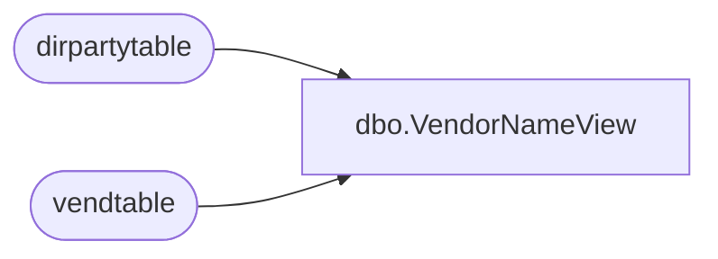

# dbo.VendorNameView

**Database:** LH_D365  
**Server:** 4db76rlxaxcuvmuh5kw37wbnqq-ovsykae43znuhlmnflcdwm4ohu.datawarehouse.fabric.microsoft.com  

## Architecture Diagram



## Table Dependencies

| Referenced Table |
|---|
| dirpartytable |
| vendtable |

## View Code

```sql
CREATE   VIEW [dbo].[VendorNameView] AS (     SELECT         accountnum,         name, 		vendtable.vendgroup,         vendtable.dataareaid,         vendtable.babfactorycode,         vendtable.babfobport,         vendtable.babvendorcode,         accountnum + '-' + vendtable.dataareaid AS VendorKey     FROM         vendtable         INNER JOIN dirpartytable             ON vendtable.party = dirpartytable.recid );
```

