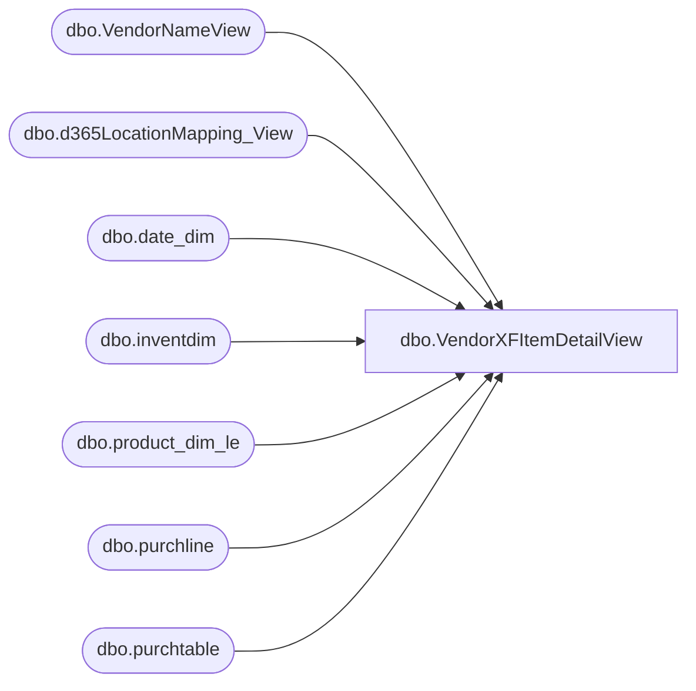

# dbo.VendorXFItemDetailView

**Database:** LH_D365  
**Server:** 4db76rlxaxcuvmuh5kw37wbnqq-ovsykae43znuhlmnflcdwm4ohu.datawarehouse.fabric.microsoft.com  

## Architecture Diagram



## Table Dependencies

| Referenced Table |
|---|
| dbo.VendorNameView |
| dbo.d365LocationMapping_View |
| dbo.date_dim |
| dbo.inventdim |
| dbo.product_dim_le |
| dbo.purchline |
| dbo.purchtable |

## View Code

```sql
/****** Object:  View [dbo].[VendorXFItemDetailView]    Script Date: 2/12/2026 3:36:08 PM ******/   CREATE   VIEW [dbo].[VendorXFItemDetailView] AS  select  SUM(CASE WHEN YEAR(purchline.babshipdate) = YEAR(GETDATE()) - 3 THEN purchline.purchqty ELSE 0 END) AS CurrentYearMinus3, 		SUM(CASE WHEN YEAR(purchline.babshipdate) = YEAR(GETDATE()) - 2 THEN purchline.purchqty ELSE 0 END) AS CurrentYearMinus2, 		SUM(CASE WHEN YEAR(purchline.babshipdate) = YEAR(GETDATE()) - 1 THEN purchline.purchqty ELSE 0 END) AS CurrentYearMinus1, 		SUM(CASE WHEN YEAR(purchline.babshipdate) = YEAR(GETDATE())     THEN purchline.purchqty ELSE 0 END) AS CurrentYear, 		case when vendorName.babvendorcode = 'INNOFLW' then 'IFKDSCN'  			 when vendorName.babvendorcode = 'INNOVIN' then 'IFKDSHP' 			 when vendorName.babvendorcode = 'INNONTR' then 'IFKDSHM' 			 when vendorName.babvendorcode = 'DREAMVT' then 'JYINTVT' 			 else vendorName.babvendorcode end as 'Vendor', 		case when vendorName.babvendorcode = 'INNOFLW' and vendorName.babfactorycode = 'INFEVE' then 'IFKIDS CO., LTD' 			 when vendorName.babvendorcode = 'INNOVIN' and vendorName.babfactorycode = 'INFVIN' then 'IFKIDS CO., LTD' 			 when vendorName.babvendorcode = 'INNONTR' and vendorName.babfactorycode = 'INFNTR' then 'IFKIDS CO., LTD' 			 when vendorName.babvendorcode = 'DREAMVT' and vendorName.babfactorycode in ('DREJY2','DREPLA') then 'J.Y. INTERNATIONAL COMPANY LIMITED' 			 when vendorName.name = 'IFKIDS CO.,LTD' then 'IFKIDS CO., LTD' 				else vendorName.name end as 'VendorName', 		case when vendorName.babvendorcode = 'INNOFLW' and vendorName.babfactorycode = 'INFEVE' then 'IFKEVE' 			 when vendorName.babvendorcode = 'INNOVIN' and vendorName.babfactorycode = 'INFVIN' then 'IFKVIN' 			 when vendorName.babvendorcode = 'INNONTR' and vendorName.babfactorycode = 'INFNTR' then 'IFKNTR' 			 when vendorName.babvendorcode = 'DREAMVT' and vendorName.babfactorycode = 'DREJY2' then 'JYIJY2' 			 when vendorName.babvendorcode = 'DREAMVT' and vendorName.babfactorycode = 'DREPLA' then 'JYIPLA' 				else vendorName.babfactorycode end + ' ' + isnull(vendorName.babfobport,'NONE') as 'Factory', 		LEFT(pd.department, CHARINDEX('(', pd.department) - 2) as 'DepartmentName',   -- get ''Name of Department'' 			'Dept - ' + SUBSTRING(REVERSE(pd.department),2,2) as 'DepartmentNumber', -- Get number of Department 		pd.style_code as 'Style', 		pd.style_desc as 'Description'      FROM         LH_D365.dbo.purchline purchline         INNER JOIN LH_D365.dbo.purchtable purchtable ON purchtable.purchid = purchline.purchid AND purchtable.dataareaid = purchline.dataareaid 		INNER JOIN LH_MART.dbo.date_dim  dd on dd.actual_date = purchline.babshipdate         INNER JOIN dbo.inventdim idm ON purchline.inventdimid = idm.inventdimid And purchline.dataareaid = idm.dataareaid         INNER JOIN LH_D365.dbo.VendorNameView vendorName ON vendorName.accountnum = purchline.vendaccount AND vendorName.dataareaid = purchline.dataareaid         LEFT JOIN dbo.d365LocationMapping_View locationMapping ON idm.inventlocationid = locationMapping.inventlocationid AND locationMapping.legalentity = purchline.dataareaid         LEFT JOIN LH_D365.dbo.product_dim_le pd ON pd.style_code = purchline.itemid AND pd.jurisdiction_code = locationMapping.JurisidictionCode And purchline.dataareaid = pd.LegalEntity      WHERE         purchline.createddatetime >= DATEADD(MONTH, -48, GETDATE())  		and pd.department is not null 		and purchline.babshipdate is not null 		and purchline.babshipdate != '1900-01-01 00:00:00.000000' 		and purchline.babshipdate >= DATEADD(MONTH, -48, GETDATE()) 		and dd.date_key != '0' 		and dd.date_key != '-99'	 		--and purchtable.babfactorycode is not null 		and purchline.purchstatus <> 4 -- exclude cancelled POs 		and purchtable.intercompanyorder = 0 -- only non-intercompany orders 		group by vendorName.babvendorcode, vendorName.name,vendorName.babfactorycode,isnull(vendorName.babfobport,'NONE'),pd.style_code,pd.style_desc, 		LEFT(pd.department, CHARINDEX('(', pd.department) - 2), 		'Dept - ' + SUBSTRING(REVERSE(pd.department),2,2)
```

