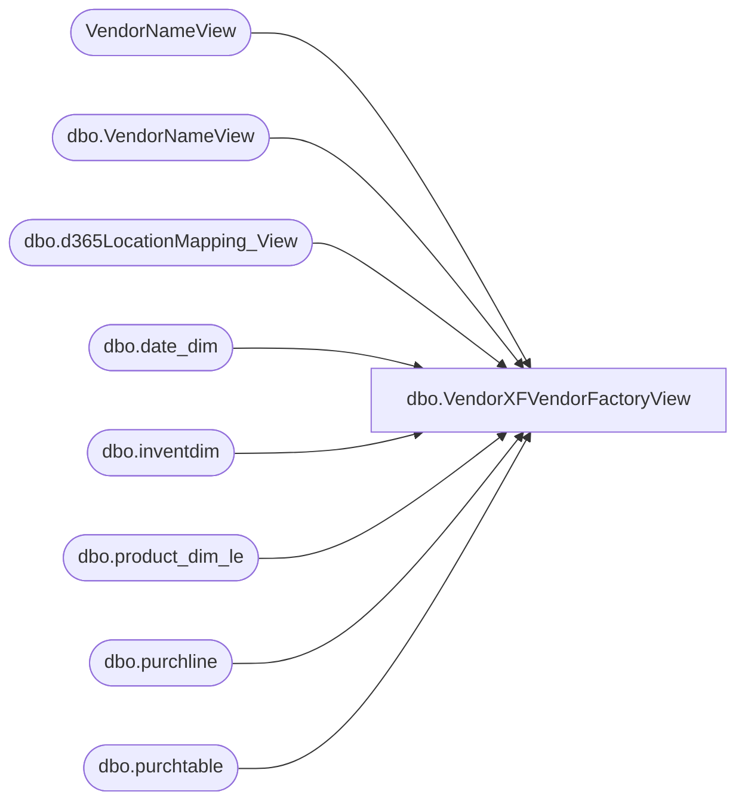

# dbo.VendorXFVendorFactoryView

**Database:** LH_D365  
**Server:** 4db76rlxaxcuvmuh5kw37wbnqq-ovsykae43znuhlmnflcdwm4ohu.datawarehouse.fabric.microsoft.com  

## Architecture Diagram



## Table Dependencies

| Referenced Table |
|---|
| VendorNameView |
| dbo.VendorNameView |
| dbo.d365LocationMapping_View |
| dbo.date_dim |
| dbo.inventdim |
| dbo.product_dim_le |
| dbo.purchline |
| dbo.purchtable |

## View Code

```sql
/****** Object:  View [dbo].[VendorXFVendorFactoryView]    Script Date: 2/27/2026 2:48:28 PM ******/ /****** Object:  View [dbo].[VendorXFVendorFactoryView]    Script Date: 2/25/2026 10:54:54 PM ******/   CREATE   VIEW [dbo].[VendorXFVendorFactoryView] AS with src as ( select YEAR(purchline.babshipdate) as 'Year', 		vendorName.accountnum as 'VendorAccount', 		vendorName.dataareaid as 'LegalEntity', 		vName.vendgroup as 'VendorInvoiceGroup', 		case when vendorName.babvendorcode = 'INNOFLW' then 'IFKDSCN'  			 when vendorName.babvendorcode = 'INNOVIN' then 'IFKDSHP' 			 when vendorName.babvendorcode = 'INNONTR' then 'IFKDSHM' 			 when vendorName.babvendorcode = 'DREAMVT' then 'JYINTVT' 				else vendorName.babvendorcode end as 'Vendor',         		case              when vName.name = 'INNOFLOW KOREA COMPANY LIMITED' then 'IFKIDS CO., LTD'             when vName.name = 'DREAM INTERNATIONAL USA INC'  then 'J.Y. INTERNATIONAL COMPANY LIMITED' 			when vName.name = 'IFKIDS CO.,LTD' then 'IFKIDS CO., LTD'             else vName.name         end as InvoiceAccountName, 		case when vendorName.babvendorcode = 'INNOFLW' and vendorName.babfactorycode = 'INFEVE' then 'IFKEVE' 			 when vendorName.babvendorcode = 'INNOVIN' and vendorName.babfactorycode = 'INFVIN' then 'IFKVIN' 			 when vendorName.babvendorcode = 'INNONTR' and vendorName.babfactorycode = 'INFNTR' then 'IFKNTR' 			 when vendorName.babvendorcode = 'DREAMVT' and vendorName.babfactorycode = 'DREJY2' then 'JYIJY2' 			 when vendorName.babvendorcode = 'DREAMVT' and vendorName.babfactorycode = 'DREPLA' then 'JYIPLA'  				else vendorName.babfactorycode end as 'Factory', 		isnull(vendorName.babfobport,'NONE') as 'Port', 		MONTH(purchline.babshipdate) as 'Month', 		purchline.purchqty as 'PurchQty', 		purchline.lineamount as 'TotalCost', 		pd.current_retail * purchline.purchqty as 'TotalRetail'     FROM         LH_D365.dbo.purchline purchline         INNER JOIN LH_D365.dbo.purchtable purchtable ON purchtable.purchid = purchline.purchid AND purchtable.dataareaid = purchline.dataareaid 		INNER JOIN LH_MART.dbo.date_dim  dd on dd.actual_date = purchline.babshipdate         INNER JOIN dbo.inventdim idm ON purchline.inventdimid = idm.inventdimid And purchline.dataareaid = idm.dataareaid         INNER JOIN LH_D365.dbo.VendorNameView vendorName ON vendorName.accountnum = purchline.vendaccount AND vendorName.dataareaid = purchline.dataareaid         LEFT JOIN dbo.d365LocationMapping_View locationMapping ON idm.inventlocationid = locationMapping.inventlocationid AND locationMapping.legalentity = purchline.dataareaid         LEFT JOIN LH_D365.dbo.product_dim_le pd ON pd.style_code = purchline.itemid AND pd.jurisdiction_code = locationMapping.JurisidictionCode And purchline.dataareaid = pd.LegalEntity 		LEFT JOIN (select name,accountnum,dataareaid,vendgroup from VendorNameView v) vName on vName.accountnum = purchtable.invoiceaccount and vName.dataareaid = purchline.dataareaid      WHERE         purchline.createddatetime >= DATEADD(MONTH, -48, GETDATE())  		and purchline.babshipdate is not null 		and purchline.babshipdate != '1900-01-01 00:00:00.000000' 		and purchline.babshipdate >= DATEADD(MONTH, -48, GETDATE())  		and dd.date_key != '0' 		and dd.date_key != '-99'	 		and purchline.purchstatus <> 4 -- exclude cancelled POs 		and purchtable.intercompanyorder = 0 -- only non-intercompany orders 		) 		--Top summary: All Vendors / All Factories / per Year SELECT     s.[Year],  	 CAST(NULL AS varchar(10)) AS VendorInvoiceGroupLabel,     'All Factories'       AS FactoryLabel,     'All Vendors'         AS VendorLabel,     CAST(0 AS INT)        AS FactorySortKey,     CAST(0 AS INT)        AS VendorSortKey,      FLOOR(SUM(CASE WHEN s.[Month]=1  THEN s.PurchQty ELSE 0 END)) AS Jan,     FLOOR(SUM(CASE WHEN s.[Month]=2  THEN s.PurchQty ELSE 0 END)) AS Feb,     FLOOR(SUM(CASE WHEN s.[Month]=3  THEN s.PurchQty ELSE 0 END)) AS Mar,     FLOOR(SUM(CASE WHEN s.[Month]=4  THEN s.PurchQty ELSE 0 END)) AS Apr,     FLOOR(SUM(CASE WHEN s.[Month]=5  THEN s.PurchQty ELSE 0 END)) AS May,     FLOOR(SUM(CASE WHEN s.[Month]=6  THEN s.PurchQty ELSE 0 END)) AS Jun,     FLOOR(SUM(CASE WHEN s.[Month]=7  THEN s.PurchQty ELSE 0 END)) AS Jul,     FLOOR(SUM(CASE WHEN s.[Month]=8  THEN s.PurchQty ELSE 0 END)) AS Aug,     FLOOR(SUM(CASE WHEN s.[Month]=9  THEN s.PurchQty ELSE 0 END)) AS Sep,     FLOOR(SUM(CASE WHEN s.[Month]=10 THEN s.PurchQty ELSE 0 END)) AS Oct,     FLOOR(SUM(CASE WHEN s.[Month]=11 THEN s.PurchQty ELSE 0 END)) AS Nov,     FLOOR(SUM(CASE WHEN s.[Month]=12 THEN s.PurchQty ELSE 0 END)) AS [Dec],     FLOOR(SUM(CASE WHEN s.[Month] IN (1,2,3)    THEN s.PurchQty ELSE 0 END)) AS QTR1,     FLOOR(SUM(CASE WHEN s.[Month] IN (4,5,6)    THEN s.PurchQty ELSE 0 END)) AS QTR2,     FLOOR(SUM(CASE WHEN s.[Month] IN (7,8,9)    THEN s.PurchQty ELSE 0 END)) AS QTR3,     FLOOR(SUM(CASE WHEN s.[Month] IN (10,11,12) THEN s.PurchQty ELSE 0 END)) AS QTR4,     FLOOR(SUM(s.PurchQty))   AS [Total Year],     FLOOR(SUM(s.TotalCost))  AS [Total Cost],     FLOOR(SUM(s.TotalRetail)) AS [Total Retail],     CASE WHEN NULLIF(SUM(s.TotalRetail),0) IS NULL           THEN 0 ELSE (FLOOR(SUM(s.TotalRetail))-FLOOR(SUM(s.TotalCost)))/FLOOR(SUM(s.TotalRetail)) END AS MU FROM src s GROUP BY s.[Year] UNION ALL 		select [Year], 		CAST(MIN(VendorInvoiceGroup) AS varchar(10)) AS VendorInvoiceGroupLabel, 			case when grouping(Factory) = 1 then 'All Factories' else Factory +' '+ Port end as 'FactoryLabel',--when grouping(Port) = 1 then Factory else Factory +' '+Port end as 'FactoryLabel', 			case when grouping(InvoiceAccountName) = 1 then 'All Vendors'  else InvoiceAccountName end as 'VendorLabel', 			cast(case when grouping (Factory) = 1 then 0 else 1 end as int) as 'FactorySortKey', 			cast(case when grouping (InvoiceAccountName) = 1 then 0 else 1 end as int) as 'VendorSortKey', 			FLOOR(sum(case when [Month] = 1 then PurchQty else 0 end)) as 'Jan', 			FLOOR(sum(case when [Month] = 2 then PurchQty else 0 end)) as 'Feb', 			FLOOR(sum(case when [Month] = 3 then PurchQty else 0 end)) as 'Mar', 			FLOOR(sum(case when [Month] = 4 then PurchQty else 0 end))  as 'Apr', 			FLOOR(sum(case when [Month] = 5 then PurchQty else 0 end))  as 'May', 			FLOOR(sum(case when [Month] = 6 then PurchQty else 0 end))  as 'Jun', 			FLOOR(sum(case when [Month] = 7 then PurchQty else 0 end))  as 'Jul', 			FLOOR(sum(case when [Month] = 8 then PurchQty else 0 end)) as 'Aug', 			FLOOR(sum(case when [Month] = 9 then PurchQty else 0 end))  as 'Sep', 			FLOOR(sum(case when [Month] = 10 then PurchQty else 0 end)) as 'Oct', 			FLOOR(sum(case when [Month] = 11 then PurchQty else 0 end)) as 'Nov', 			FLOOR(sum(case when [Month] = 12 then PurchQty else 0 end))  as 'Dec', 			FLOOR(sum(case when [Month] in (1,2,3) then PurchQty else 0 end))  as 'QTR1', 			FLOOR(sum(case when [Month] in (4,5,6) then PurchQty else 0 end))  as 'QTR2', 			FLOOR(sum(case when [Month] in (7,8,9) then PurchQty else 0 end)) as 'QTR3', 			FLOOR(sum(case when [Month] in (10,11,12) then PurchQty else 0 end))  as 'QTR4', 			FLOOR(sum(PurchQty))  as 'Total Year', 			FLOOR(sum(TotalCost)) as 'Total Cost', 			FLOOR(sum(TotalRetail)) as 'Total Retail', 			case when nullif(sum(TotalRetail),0) IS NULL THEN 0 ELSE (FLOOR(SUM(TotalRetail)) - FLOOR(SUM(TotalCost))) / FLOOR(SUM(TotalRetail)) end as 'MU'     FROM         src 	--LEFT JOIN VendorNameView v on v.babvendorcode = Vendor and v.dataareaid = LegalEntity 	GROUP BY [Year], InvoiceAccountName, Factory, Port
```

