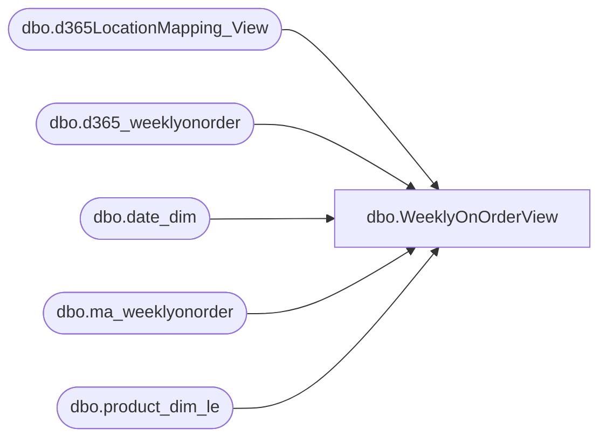

# dbo.WeeklyOnOrderView

**Database:** LH_D365  
**Server:** 4db76rlxaxcuvmuh5kw37wbnqq-ovsykae43znuhlmnflcdwm4ohu.datawarehouse.fabric.microsoft.com  

## Architecture Diagram



## Table Dependencies

| Referenced Table |
|---|
| dbo.d365LocationMapping_View |
| dbo.d365_weeklyonorder |
| dbo.date_dim |
| dbo.ma_weeklyonorder |
| dbo.product_dim_le |

## View Code

```sql
CREATE   VIEW [dbo].[WeeklyOnOrderView] AS WITH weeklyonorder AS (        SELECT         dd1.actual_date AS actual_date,         CAST(CONCAT(weeklyonorder.style_code,weeklyonorder.LegalEntity,weeklyonorder.jurisdiction_code) as varchar(50)) AS [product_key],         weeklyonorder.[store_key],         weeklyonorder.[date_key],         [merch_year_wk],         [on_order_units],         [on_order_retail],         [on_order_retail_old],         weeklyonorder.[style_id],         [allocation_units],         [on_order_retail_us_te],         [on_order_retail_us_te_OOUnitsCalc],         [on_order_cost]     FROM         [LH_Source].[dbo].[ma_weeklyonorder] weeklyonorder         INNER JOIN LH_Mart.dbo.date_dim AS dd1             ON dd1.date_key = weeklyonorder.date_key  			where  			dd1.actual_date >= DATEADD(MONTH, -36, GETDATE()) 		    and weeklyonorder.[merch_year_wk] < '202539' 			AND weeklyonorder.INS_DT = (SELECT MAX(INS_DT) FROM [LH_Source].[dbo].[ma_weeklyonorder])     UNION ALL     SELECT         dd1.actual_date AS actual_date,         wh.[product_key],             wh.[store_key],         wh.[date_key],         [merch_year_wk],         [on_order_units],         [on_order_retail],         [on_order_retail_old],         wh.[style_id],         [allocation_units],         [on_order_retail_us_te],         [on_order_retail_us_te_oounitscalc],         [on_order_cost_native] AS [on_order_cost]     FROM         [LH_Mart].[dbo].[d365_weeklyonorder] wh         INNER JOIN LH_Mart.dbo.date_dim AS dd1             ON dd1.date_key = wh.date_key   			where 			dd1.actual_date >= DATEADD(MONTH, -36, GETDATE()) 		    and wh.[merch_year_wk] >= '202539' 			AND wh.INS_DT = (SELECT MAX(INS_DT) FROM [LH_Mart].[dbo].[d365_weeklyonorder]) ) SELECT     weeklyonorder.*,     locationmapping.LocationKey, 	le.style_code FROM     weeklyonorder weeklyonorder     INNER JOIN LH_D365.dbo.product_dim_le le         ON le.product_key = weeklyonorder.product_key     INNER JOIN LH_D365.dbo.d365LocationMapping_View locationmapping         ON locationmapping.legalentity = le.LegalEntity AND locationmapping.store_key = weeklyonorder.store_key;
```

