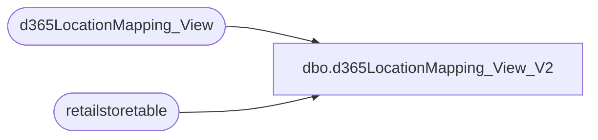

# dbo.d365LocationMapping_View_V2

**Database:** LH_D365  
**Server:** 4db76rlxaxcuvmuh5kw37wbnqq-ovsykae43znuhlmnflcdwm4ohu.datawarehouse.fabric.microsoft.com  

## Architecture Diagram



## Table Dependencies

| Referenced Table |
|---|
| d365LocationMapping_View |
| retailstoretable |

## View Code

```sql
CREATE VIEW [dbo].[d365LocationMapping_View_V2] AS select     [inventsiteid],     [inventlocationid],     [legalentity],     [LocationKey],     [JurisidictionCode],     [LocationCode],     [store_key],     [LocationCodeKey],     [name],     [IsDC],     [dc_source],     store.storenumber,     store.babconcept from     d365LocationMapping_View loc     join retailstoretable store         on store.storenumber = loc.inventlocationid where     store.babconcept != 'CLOSED';
```

