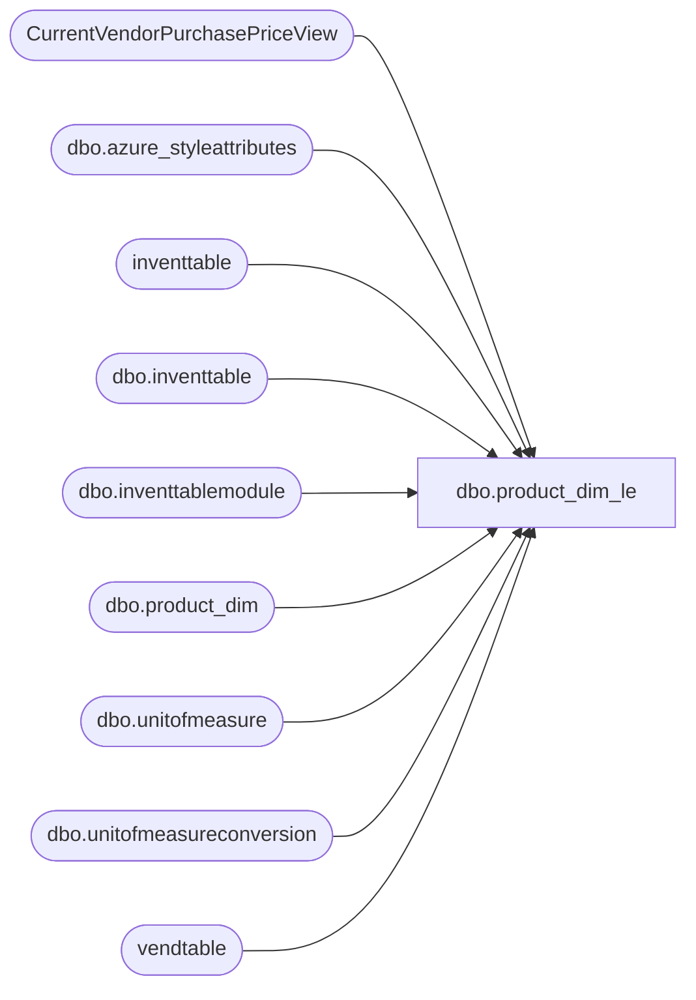

# dbo.product_dim_le

**Database:** LH_D365  
**Server:** 4db76rlxaxcuvmuh5kw37wbnqq-ovsykae43znuhlmnflcdwm4ohu.datawarehouse.fabric.microsoft.com  

## Architecture Diagram



## Table Dependencies

| Referenced Table |
|---|
| CurrentVendorPurchasePriceView |
| dbo.azure_styleattributes |
| inventtable |
| dbo.inventtable |
| dbo.inventtablemodule |
| dbo.product_dim |
| dbo.unitofmeasure |
| dbo.unitofmeasureconversion |
| vendtable |

## View Code

```sql
/****** Object:  View [dbo].[product_dim_le]    Script Date: 2/6/2026 12:00:24 PM ******/ CREATE   VIEW [dbo].[product_dim_le] AS --101,801 rows with just product_dim, 100,798 with where clause WITH UnitConversions AS (     -- 2. Consolidate the two unit conversion subqueries into one     SELECT         it.itemid,         it.dataareaid,         MAX(CASE WHEN umfrom.symbol = 'ip' THEN uc.factor END) AS innerpack,         MAX(CASE WHEN umfrom.symbol = 'cs' THEN uc.factor END) AS masterpack     FROM         dbo.unitofmeasureconversion uc         INNER JOIN dbo.inventtable it             ON it.product = uc.product         INNER JOIN dbo.unitofmeasure umfrom             ON umfrom.recid = uc.fromunitofmeasure         INNER JOIN dbo.unitofmeasure umto             ON umto.recid = uc.tounitofmeasure     WHERE         umfrom.symbol IN ('ip', 'cs') AND umto.symbol = 'ea'     GROUP BY         it.itemid,         it.dataareaid ), JurisdictionMapping AS (     SELECT         jurisdiction_code,         LegalEntity     FROM     (         VALUES             ('US', '1100'),             ('US', '1200'),             --('US', '1700'), -- removing US 1700 b/c it's not needed             ('CA', '1700'),             ('UK', '2110'),             ('IE', '2110'), -- The IN ('UK', 'IE') becomes two separate rows             ('CN', '3001')     ) AS v (jurisdiction_code, LegalEntity) ) , ProductDimData AS (     SELECT *      FROM LH_Mart.[dbo].[product_dim]     WHERE style_code IS NOT NULL ) , ProductDimDataSingleJurisdiction AS (     SELECT      it.itemid as 'style_code'     ,jm.LegalEntity     ,jm.jurisdiction_code         ,pd.[sku]       ,pd.[activation_date]             ,pd.[style_desc]       ,pd.[color_code]       ,pd.[color_desc]       ,pd.[product_desc]       ,pd.[subclass]       ,pd.[class]       ,pd.[department]       ,pd.[department_code]       ,pd.[division]       ,pd.[chain]       ,pd.[concept]	         ,pd.[priceline_code]       ,pd.[subclass_code]       ,pd.[class_code]       ,pd.[primary_vendor_code]       ,pd.[primary_vendor_name]       ,pd.[alt_primary_vendor_code]       ,pd.[current_retail]       ,pd.[original_retail]       ,pd.[price_with_vat]       ,pd.[reorder_flag]       ,pd.[euro_value]       ,pd.[merch_status]       ,pd.[wss_reportable]             ,pd.[color_id]       ,pd.[current_selling_retail_home]             ,pd.[jurisdiction_id]       ,pd.[cdn_value]             ,pd.[GENDER]       ,pd.[CORE_FASH_CD]       ,pd.[INLINE_CD]       ,pd.[ScorecardCategory]       ,pd.[BaseID]       ,pd.[UPC]       ,pd.[ItemType]       ,pd.[KeyStory]       ,pd.[RoyaltyType]       ,pd.[RoyaltyAmount]       ,pd.[RoyaltyPercent]       ,pd.[TotalFOB]       ,pd.[CNDescription]       ,pd.[SellingStatus]       ,pd.[giftCardType]       ,pd.[AccessoryType]       ,pd.[LicensedCollection]       ,pd.[LICEN]       ,pd.[LICEN2]       ,pd.[Licensor]       ,pd.[DepartmentSortOrder]       ,pd.[PlushEyeColor]       ,pd.[PlushFurColor]       ,pd.[PlushHeight]       ,pd.[PlushWeight]       ,pd.[WebExclusive]       ,pd.[Silhouette]       ,pd.[Outfits]       ,pd.[ItemGroupID]       ,pd.[Category1]       ,pd.[Category2]       ,pd.[ProductCategory]       ,pd.[FloorSet]       ,pd.[COO]       ,pd.[COO_Desc]       ,pd.[InDate]       ,pd.[OutDate]       ,pd.[WarningHangtag]       ,pd.[SportsTeams]       ,pd.[ModelGroupID]       ,pd.[BarcodeType]       ,pd.[isEndlessAisleEligible]       ,pd.[HTSCode]       ,pd.[HTSCodeDesc]       ,pd.[US_HTS_Code]       ,pd.[CAN_HTS_Code]       ,pd.[UK_HTS_Code]       ,pd.[TaxItemGroupCode]       ,pd.[availb]       ,pd.[InDateComment]       ,pd.[OutDateComment]       ,pd.[babDistribMultiple]           ,it.primaryvendorid       ,it.propertyid 	  ,[division_code]       ,[chain_code]       ,[concept_code]	 	  ,pd.[babOrderMultiple]     FROM inventtable it      INNER JOIN JurisdictionMapping AS jm         ON  it.dataareaid = jm.LegalEntity     LEFT JOIN ProductDimData AS pd         ON pd.style_code = it.itemid                  WHERE style_code IN (         SELECT             style_code             FROM ProductDimData         GROUP BY style_code         HAVING COUNT(DISTINCT jurisdiction_code) = 1     )    ) , ProductDimDataHydrated AS (     SELECT * FROM ProductDimDataSingleJurisdiction     UNION ALL     SELECT        pd.style_code       ,jm.LegalEntity       ,jm.jurisdiction_code       ,pd.[sku]       ,pd.[activation_date]             ,pd.[style_desc]       ,pd.[color_code]       ,pd.[color_desc]       ,pd.[product_desc]       ,pd.[subclass]       ,pd.[class]       ,pd.[department]       ,pd.[department_code]       ,pd.[division]       ,pd.[chain]       ,pd.[concept]       ,pd.[priceline_code]       ,pd.[subclass_code]       ,pd.[class_code]       ,pd.[primary_vendor_code]       ,pd.[primary_vendor_name]       ,pd.[alt_primary_vendor_code]       ,pd.[current_retail]       ,pd.[original_retail]       ,pd.[price_with_vat]       ,pd.[reorder_flag]       ,pd.[euro_value]       ,pd.[merch_status]       ,pd.[wss_reportable]             ,pd.[color_id]       ,pd.[current_selling_retail_home]             ,pd.[jurisdiction_id]       ,pd.[cdn_value]             ,pd.[GENDER]       ,pd.[CORE_FASH_CD]       ,pd.[INLINE_CD]       ,pd.[ScorecardCategory]       ,pd.[BaseID]       ,pd.[UPC]       ,pd.[ItemType]       ,pd.[KeyStory]       ,pd.[RoyaltyType]       ,pd.[RoyaltyAmount]       ,pd.[RoyaltyPercent]       ,pd.[TotalFOB]       ,pd.[CNDescription]       ,pd.[SellingStatus]       ,pd.[giftCardType]       ,pd.[AccessoryType]       ,pd.[LicensedCollection]       ,pd.[LICEN]       ,pd.[LICEN2]       ,pd.[Licensor]       ,pd.[DepartmentSortOrder]       ,pd.[PlushEyeColor]       ,pd.[PlushFurColor]       ,pd.[PlushHeight]       ,pd.[PlushWeight]       ,pd.[WebExclusive]       ,pd.[Silhouette]       ,pd.[Outfits]       ,pd.[ItemGroupID]       ,pd.[Category1]       ,pd.[Category2]       ,pd.[ProductCategory]       ,pd.[FloorSet]       ,pd.[COO]       ,pd.[COO_Desc]       ,pd.[InDate]       ,pd.[OutDate]       ,pd.[WarningHangtag]       ,pd.[SportsTeams]       ,pd.[ModelGroupID]       ,pd.[BarcodeType]       ,pd.[isEndlessAisleEligible]       ,pd.[HTSCode]       ,pd.[HTSCodeDesc]       ,pd.[US_HTS_Code]       ,pd.[CAN_HTS_Code]       ,pd.[UK_HTS_Code]       ,pd.[TaxItemGroupCode]       ,pd.[availb]       ,pd.[InDateComment]       ,pd.[OutDateComment]       ,pd.[babDistribMultiple]        ,it.primaryvendorid       ,it.propertyid 	  ,[division_code]       ,[chain_code]       ,[concept_code] 	  ,pd.[babOrderMultiple]     FROM inventtable it     INNER JOIN JurisdictionMapping AS jm         ON it.dataareaid = jm.LegalEntity     INNER JOIN ProductDimData AS pd         ON pd.style_code = it.itemid         AND pd.jurisdiction_code = jm.jurisdiction_code     WHERE pd.style_code IN (         SELECT             style_code             FROM ProductDimData         GROUP BY style_code         HAVING COUNT(DISTINCT jurisdiction_code) > 1     )  ) ,  myMostRecentTradeAgreementPrice AS  ( SELECT DISTINCT 	 CVPPV.[product_key] 	,MAX(CVPPV.[PurchasePrice]) AS [PurchasePrice] 	,VT.[babvendorcode] AS [VendorCode] 	,CVPPV.fromdate 	 ,   ROW_NUMBER() OVER (       PARTITION BY CVPPV.[product_key],VT.[babvendorcode]       ORDER BY CVPPV.fromdate DESC     ) AS rn 	FROM CurrentVendorPurchasePriceView AS CVPPV 	LEFT JOIN vendtable AS VT  		ON CVPPV.VendorAccount = VT.accountnum 		AND CVPPV.dataareaid = VT.dataareaid 	WHERE 	GETDATE() BETWEEN CVPPV.[fromdate] AND CVPPV.[todate] 	--AND CVPPV.[product_key] = '0324191100US' 	GROUP BY  CVPPV.[product_key],VT.[babvendorcode] ,CVPPV.fromdate ), tradeAgreements AS  ( SELECT  [product_key] ,[PurchasePrice] ,[VendorCode] FROM myMostRecentTradeAgreementPrice WHERE rn = 1 	 ) , maxPrice AS ( 	SELECT  	itm.itemid, 	itm.dataareaid, 	MAX(itm.price) AS price 	FROM dbo.inventtablemodule itm 	 WHERE  itm.moduletype = '1' 	 GROUP BY  	itm.itemid, itm.dataareaid ) SELECT DISTINCT     --pd.[product_key], -- replaced by below     CONCAT(pd.style_code,pd.LegalEntity,pd.jurisdiction_code) as product_key,         [sku],     [activation_date],     --style_id,     pd.[style_code],     --ch.level_2_code AS concept_code, 	pd.concept_code,     --ch.level_2_name AS concept_name, 	pd.concept as concept_name,     --ch.level_3_code AS consumer_group_code, 	pd.chain_code AS consumer_group_code, 	--pd.chain_code,     --ch.level_3_name AS consumer_group, 	pd.chain AS consumer_group, 	--pd.chain, 	--ch.level_4_code AS division_code, 	pd.division_code, 	--ch.level_4_name AS division_label, 	pd.division AS division_label,     [style_desc],     [color_code],     [color_desc],     [product_desc],     CONCAT([subclass], ' (', [subclass_code], ')') AS subclass,     --ch.level_6_name AS class, 	pd.class,     CONCAT([department], ' (', department_code, ')') AS department,     pd.department as departmentLabel,     CASE WHEN RIGHT(department_code, 2) = '60' THEN 'Supply' ELSE 'MDSE' END AS 'MDSE\Supply',     [department_code],     [division],     [chain],     [concept],     [priceline_code],     [subclass_code],     pd.class_code AS [class_code],     [primary_vendor_code],     [primary_vendor_name],     [alt_primary_vendor_code],     [current_retail],     [original_retail],     [price_with_vat],     [reorder_flag],     [euro_value],     [merch_status],     [wss_reportable],     -- [style_id],     -- [color_id],     [current_selling_retail_home],     pd.[jurisdiction_code],     --[jurisdiction_id],     [cdn_value],     [GENDER],     [CORE_FASH_CD],     [INLINE_CD],     [ScorecardCategory],     [UPC],     [ItemType],     [KeyStory],     [LicensedCollection],     [Licensor],     [InDate],     [OutDate],     pd.primaryvendorid AS primaryvendorid,     pd.primaryvendorid + '-' + pd.LegalEntity AS vendorkey,     ISNULL(itm.price, 0.00) AS costprice,     pd.LegalEntity,     --ISNULL(setup.multipleqty, 0) AS 'Style Order Multiple', 	ISNULL(pd.[babOrderMultiple], 0) AS 'Style Order Multiple',     uc.masterpack AS masterpack,     uc.innerpack AS innerpack,     styleattributes.RoyaltyStyle,     styleattributes.WebStatus,     styleattributes.WholeSaleStatus,     pd.propertyid, 	pd.babDistribMultiple 	,COALESCE(primaryVendorTradeAgreement.PurchasePrice,ISNULL(itm.price, 0.00)) AS [Primary Current Cost] 	,pd.RoyaltyType     ,pd.RoyaltyAmount     ,pd.RoyaltyPercent     ,pd.TotalFOB 	,pd.[InDateComment]     ,pd.[OutDateComment] 	,pd.[COO]     ,pd.[COO_Desc] 	,pd.WebExclusive FROM        ProductDimDataHydrated pd             LEFT JOIN LH_Mart.dbo.azure_styleattributes styleattributes         ON styleattributes.StyleCode = pd.style_code         --LEFT JOIN ProductCategoryHierarchyPivotView ch     --    ON ch.itemid = pd.style_code     --LEFT JOIN dbo.inventitempurchsetup setup     --    ON setup.itemid = pd.style_code AND setup.dataareaid = pd.LegalEntity 	-- removed inventitempurchsetup join, order multiple is now located on product_dim populated from PLM     LEFT JOIN maxPrice itm         ON itm.itemid = pd.style_code 		AND itm.dataareaid = pd.LegalEntity     LEFT JOIN UnitConversions AS uc         ON uc.itemid = pd.style_code AND uc.dataareaid = pd.LegalEntity 	LEFT JOIN tradeAgreements AS primaryVendorTradeAgreement 	ON CONCAT(pd.style_code,pd.LegalEntity,pd.jurisdiction_code) = primaryVendorTradeAgreement.product_key 	AND [primary_vendor_code] = primaryVendorTradeAgreement.VendorCode WHERE     pd.jurisdiction_code IN ('US', 'CA', 'UK', 'IE', 'CN') AND pd.style_code IS NOT NULL
```

