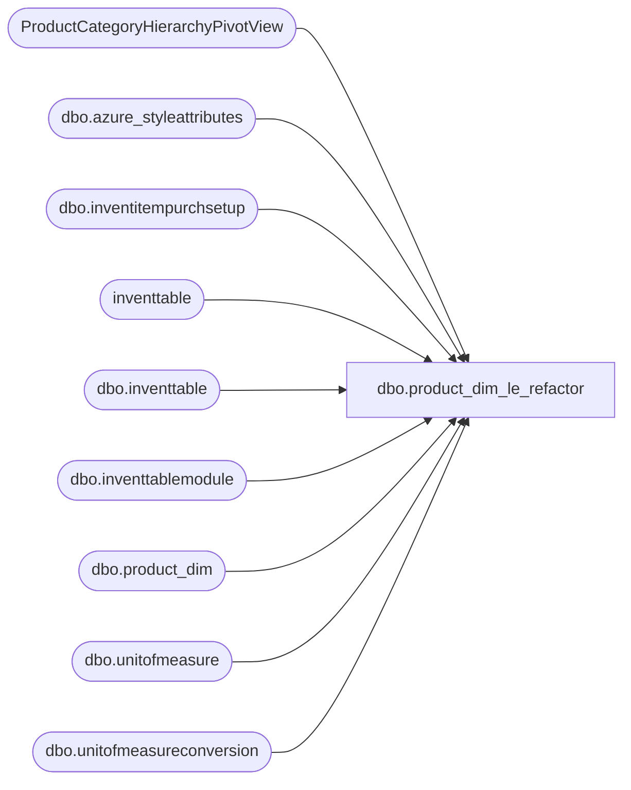

# dbo.product_dim_le_refactor

**Database:** LH_D365  
**Server:** 4db76rlxaxcuvmuh5kw37wbnqq-ovsykae43znuhlmnflcdwm4ohu.datawarehouse.fabric.microsoft.com  

## Architecture Diagram



## Table Dependencies

| Referenced Table |
|---|
| ProductCategoryHierarchyPivotView |
| dbo.azure_styleattributes |
| dbo.inventitempurchsetup |
| inventtable |
| dbo.inventtable |
| dbo.inventtablemodule |
| dbo.product_dim |
| dbo.unitofmeasure |
| dbo.unitofmeasureconversion |

## View Code

```sql
CREATE   VIEW [dbo].[product_dim_le_refactor] AS --101,801 rows with just product_dim, 100,798 with where clause WITH JurisdictionMapping AS (     SELECT         jurisdiction_code,         LegalEntity     FROM     (         VALUES             ('US', '1100'),             ('US', '1200'),             ('US', '1700'),             ('CA', '1700'),             ('UK', '2110'),             ('IE', '2110'), -- The IN ('UK', 'IE') becomes two separate rows             ('CN', '3001')     ) AS v (jurisdiction_code, LegalEntity) ), UnitConversions AS (     -- 2. Consolidate the two unit conversion subqueries into one     SELECT         it.itemid,         it.dataareaid,         MAX(CASE WHEN umfrom.symbol = 'ip' THEN uc.factor END) AS innerpack,         MAX(CASE WHEN umfrom.symbol = 'cs' THEN uc.factor END) AS masterpack     FROM         dbo.unitofmeasureconversion uc         INNER JOIN dbo.inventtable it             ON it.product = uc.product         INNER JOIN dbo.unitofmeasure umfrom             ON umfrom.recid = uc.fromunitofmeasure         INNER JOIN dbo.unitofmeasure umto             ON umto.recid = uc.tounitofmeasure     WHERE         umfrom.symbol IN ('ip', 'cs') AND umto.symbol = 'ea'     GROUP BY         it.itemid,         it.dataareaid ) SELECT DISTINCT     pd.[product_key],     [sku],     [activation_date],     --style_id,     [style_code],     ch.level_2_code AS concept_code,     ch.level_2_name AS concept_name,     ch.level_3_code AS consumer_group_code,     ch.level_3_name AS consumer_group,     [style_desc],     [color_code],     [color_desc],     [product_desc],     CONCAT([subclass], ' (', [subclass_code], ')') AS subclass,     ch.level_6_name AS class,     CONCAT([department], ' (', department_code, ')') AS department,     pd.department as departmentLabel,     CASE WHEN RIGHT(department_code, 2) = '60' THEN 'Supply' ELSE 'MDSE' END AS 'MDSE\Supply',     [department_code],     [division],     [chain],     [concept],     [priceline_code],     [subclass_code],     ch.level_6_code AS [class_code],     [primary_vendor_code],     [primary_vendor_name],     [alt_primary_vendor_code],     [current_retail],     [original_retail],     [price_with_vat],     [reorder_flag],     [euro_value],     [merch_status],     [wss_reportable],     -- [style_id],     -- [color_id],     [current_selling_retail_home],     pd.[jurisdiction_code],     --[jurisdiction_id],     [cdn_value],     [GENDER],     [CORE_FASH_CD],     [INLINE_CD],     [ScorecardCategory],     [UPC],     [ItemType],     [KeyStory],     [LicensedCollection],     [Licensor],     [InDate],     [OutDate],     it.primaryvendorid AS primaryvendorid,     it.primaryvendorid + '-' + jm.LegalEntity AS vendorkey,     ISNULL(itm.price, 0.00) AS costprice,     jm.LegalEntity,     ISNULL(setup.multipleqty, 0) AS 'Style Order Multiple',     uc.masterpack AS masterpack,     uc.innerpack AS innerpack,     styleattributes.RoyaltyStyle,     styleattributes.WebStatus,     styleattributes.WholeSaleStatus,     it.propertyid, 	pd.babDistribMultiple  FROM     inventtable it     INNER JOIN LH_Mart.[dbo].[product_dim] pd         ON pd.style_code = it.itemid --AND it.dataareaid = jm.LegalEntity     INNER JOIN JurisdictionMapping AS jm         ON pd.jurisdiction_code = jm.jurisdiction_code  AND it.dataareaid = jm.LegalEntity     LEFT JOIN LH_Mart.dbo.azure_styleattributes styleattributes         ON styleattributes.StyleCode = pd.style_code     --LEFT JOIN inventtable it     --    ON pd.style_code = it.itemid AND it.dataareaid = jm.LegalEntity     LEFT JOIN ProductCategoryHierarchyPivotView ch         ON ch.itemid = pd.style_code     LEFT JOIN dbo.inventitempurchsetup setup         ON setup.itemid = pd.style_code AND setup.dataareaid = jm.LegalEntity     LEFT JOIN dbo.inventtablemodule itm         ON itm.itemid = pd.style_code AND itm.dataareaid = jm.LegalEntity AND itm.moduletype = '1'     LEFT JOIN UnitConversions AS uc         ON uc.itemid = pd.style_code AND uc.dataareaid = jm.LegalEntity WHERE     pd.jurisdiction_code IN ('US', 'CA', 'UK', 'IE', 'CN') AND pd.style_code IS NOT NULL;
```

