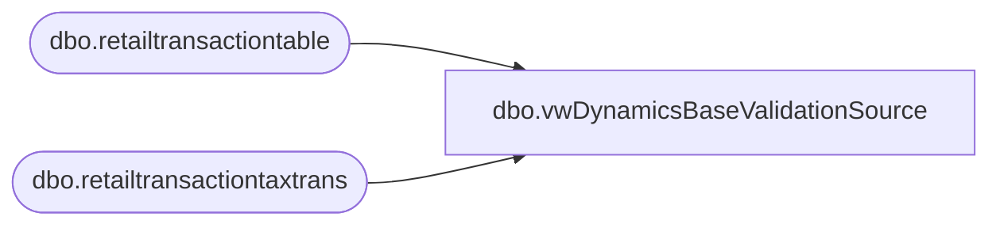

# dbo.vwDynamicsBaseValidationSource

**Database:** LH_D365  
**Server:** 4db76rlxaxcuvmuh5kw37wbnqq-ovsykae43znuhlmnflcdwm4ohu.datawarehouse.fabric.microsoft.com  

## Architecture Diagram



## Table Dependencies

| Referenced Table |
|---|
| dbo.retailtransactiontable |
| dbo.retailtransactiontaxtrans |

## View Code

```sql
CREATE VIEW [dbo].[vwDynamicsBaseValidationSource]  AS  select   rt.store ,cast (rt.transdate as date) as TransDate ,rt.receiptid as sequence_number  ,rt.transactionid as RetailTransactionId ,rt.salesorderid as SalesOrderNumber ,rt.invoiceid as InvoiceId ,rt.babcustref as BabCustRef ,rt.discamount  as discount_total ,rt.netamount*-1 as SubTotal ,sum (tt.amount) as SumTaxAmount ,rt.paymentamount as Total  from [dbo].[retailtransactiontable] rt left join [dbo].[retailtransactiontaxtrans] tt on tt.transactionid = rt.transactionid where 1=1 --and rt.businessdate = '2025-06-23' --and rt.store <> '2013' --and rt.transactionid = '1001-1001Int-20250623-505829074_1' group by  rt.store ,cast (rt.transdate as date)  ,rt.receiptid  ,rt.transactionid ,rt.salesorderid ,rt.invoiceid  ,rt.babcustref ,rt.discamount --,rt.netamount*-1 ,rt.netamount , rt.paymentamount --order by rt.store, cast (rt.transdate as date) , rt.receiptid
```

