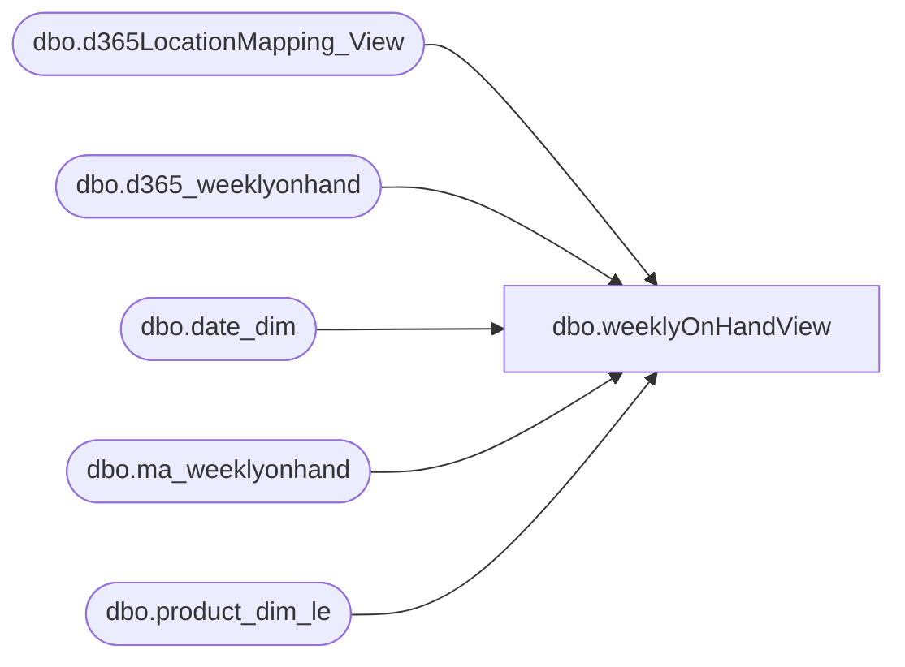

# dbo.weeklyOnHandView

**Database:** LH_D365  
**Server:** 4db76rlxaxcuvmuh5kw37wbnqq-ovsykae43znuhlmnflcdwm4ohu.datawarehouse.fabric.microsoft.com  

## Architecture Diagram



## Table Dependencies

| Referenced Table |
|---|
| dbo.d365LocationMapping_View |
| dbo.d365_weeklyonhand |
| dbo.date_dim |
| dbo.ma_weeklyonhand |
| dbo.product_dim_le |

## View Code

```sql
/****** Object:  View [dbo].[weeklyOnHandView]    Script Date: 3/19/2026 9:22:35 AM ******/ /****** Object:  View [dbo].[weeklyOnHandView]    Script Date: 3/9/2026 3:43:11 PM ******/ /****** Object:  View [dbo].[weeklyOnHandView]    Script Date: 3/6/2026 2:10:44 PM ******/ /****** Object:  View [dbo].[weeklyOnHandView]    Script Date: 2/23/2026 4:03:42 PM ******/ /****** Object:  View [dbo].[weeklyOnHandView]    Script Date: 1/16/2026 10:56:35 AM ******/ /****** Object:  View [dbo].[weeklyOnHandView]    Script Date: 1/15/2026 8:52:43 AM ******/ /****** Object:  View [dbo].[weeklyOnHandView]    Script Date: 1/9/2026 12:15:06 PM ******/  CREATE   VIEW [dbo].[weeklyOnHandView] AS  WITH d365weekly_onhand AS ( 	SELECT 		wh.*,         ROW_NUMBER() OVER         (             PARTITION BY 				wh.createdon,		                 wh.style_id,                 wh.location_id,                 wh.inventory_status_id,                 wh.dataareaid,                 wh.jurisdiction_code             ORDER BY                 wh.INS_DT DESC                 --wh.createdon DESC,                 --wh.date_key DESC         ) AS rn     FROM LH_Mart.dbo.d365_weeklyonhand AS wh     WHERE         wh.createdon >= DATEADD(MONTH, -6, GETDATE()) ) , weeklyonhand AS (     SELECT         dd1.actual_date AS actual_date,         pd.jurisdiction_code,         wh.date_key, 		CONCAT(dd1.fiscal_year, RIGHT('0' + CAST(dd1.fiscal_week AS VARCHAR(2)),2)) AS merch_year_wk,         CAST(pd.[product_key] as varchar(50)) AS product_key,         wh.store_key,         pd.style_code,         wh.location_id,         CAST(wh.inventory_status_id AS VARCHAR(50)) AS inventory_status_id,         wh.on_hand_units,         wh.on_hand_cost AS on_hand_unit_cost,         wh.allocation_units,         wh.on_hand_retail,         wh.on_hand_retail_native,         wh.current_retail,         locationmapping.LocationKey 		,wh.LegalEntity as LegalEntity     FROM         LH_Source.dbo.ma_weeklyonhand AS wh 		INNER JOIN LH_Mart.dbo.date_dim AS dd1             ON dd1.date_key = wh.date_key         INNER JOIN dbo.product_dim_le AS pd              ON pd.style_code = wh.style_code 			AND pd.jurisdiction_code = wh.[jurisdiction_code] 			AND pd.LegalEntity = wh.LegalEntity         INNER JOIN LH_D365.dbo.d365LocationMapping_View locationmapping             ON locationmapping.legalentity = wh.LegalEntity 			AND locationmapping.JurisidictionCode = wh.jurisdiction_code 			AND locationmapping.store_key = wh.store_key     WHERE         dd1.actual_date >= DATEADD(MONTH, -36, GETDATE()) 		and wh.merch_year_wk < '202550' 		AND wh.INS_DT = (SELECT MAX(INS_DT) FROM LH_Source.dbo.ma_weeklyonhand)     UNION ALL     SELECT          CAST(wh.createdon AS DATE) AS actual_date,         wh.jurisdiction_code,         dd.date_key, 		CONCAT(dd.fiscal_year, RIGHT('0' + CAST(dd.fiscal_week AS VARCHAR(2)),2)) AS merch_year_wk,         CONCAT(pd.style_code,locationmapping.legalentity,locationmapping.JurisidictionCode) as product_key,           wh.store_key,         wh.style_id,         wh.location_id,         CAST(UPPER(wh.inventory_status_id) AS VARCHAR(50)) AS inventory_status_id,         wh.on_hand_units,         CASE When createdon > '2026-02-07'  			THEN IsNull(wh.on_hand_unit_cost,0)  			ELSE IsNull(wh.on_hand_units,0) * IsNull(wh.on_hand_unit_cost,0)  			END as on_hand_unit_cost, -- the d365 snapshot now calculates the onhandcost like legacy instead of onhandunitcost 		--IsNull(wh.on_hand_unit_cost,0) as on_hand_unit_cost,         wh.allocation_units,         wh.current_retail AS on_hand_retail,         wh.original_retail AS on_hand_retail_native,         wh.onorder_retail AS current_retail,         locationmapping.LocationKey 		,wh.dataareaid as LegalEntity     FROM         d365weekly_onhand AS wh         INNER JOIN LH_Mart.dbo.date_dim AS dd 			ON wh.date_key = dd.date_key             --ON CAST(wh.createdon AS DATE) = CAST(dd.actual_date AS DATE)         --INNER JOIN [LH_Mart].dbo.product_dim AS le         --    ON le.product_key = wh.product_key 		INNER JOIN dbo.product_dim_le AS pd             ON pd.style_code = wh.style_id 			AND pd.LegalEntity = wh.dataareaid  			AND pd.jurisdiction_code = wh.jurisdiction_code         INNER JOIN LH_D365.dbo.d365LocationMapping_View locationmapping             ON locationmapping.legalentity = pd.LegalEntity  			AND locationmapping.store_key = wh.store_key 			AND locationmapping.JurisidictionCode = wh.jurisdiction_code     WHERE         --wh.createdon >= DATEADD(MONTH, -36, GETDATE()) 		wh.rn = 1 		and CONCAT(dd.fiscal_year, RIGHT('0' + CAST(dd.fiscal_week AS VARCHAR(2)),2)) >= '202550' 		--AND wh.INS_DT = (SELECT MAX(INS_DT) FROM LH_Mart.dbo.d365_weeklyonhand) ) SELECT      weeklyonhand.* FROM     weeklyonhand weeklyonhand --where style_code = '133639' --  and location_id = '9980' --  --and LocationKey = '9980-1100' --  and merch_year_wk = '202603'
```

