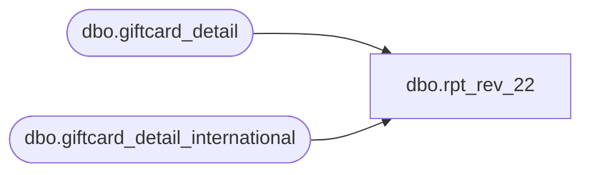

# dbo.rpt_rev_22

**Database:** LH_Mart  
**Server:** 4db76rlxaxcuvmuh5kw37wbnqq-ovsykae43znuhlmnflcdwm4ohu.datawarehouse.fabric.microsoft.com  

## Architecture Diagram



## Table Dependencies

| Referenced Table |
|---|
| dbo.giftcard_detail |
| dbo.giftcard_detail_international |

## View Code

```sql
/* =============================================================================    rpt_rev_22.sql — Rev 22 Gift Card Liability / Search Report    =============================================================================    Domain:    Gift Card (Rev Rec / SOX subledger)    Audience:  Accounting / Sales Audit    Consumer:  SmartLook "Gift Card / Liability / Search"               workspace/BBW_SmartLook_SQL_Reports-main/.../#19 REV 22 - Gift Card               Testing - Q1 2026 Feb, Mar, April - KAI (20260515).xlsx     Linda's 12-column shape (from xlsx "Selections for Linda"):        Account #, Consortium, Consortium Name, Promotion, Promotion Name,        Activation Date, Activation Location, Activation MID,        Activation Amount, Redemption Amount, Balance, Last Positive Transaction Date     Source:    LH_Mart.dbo.giftcard_detail               (US/CA ValueLink master)               LH_Mart.dbo.giftcard_detail_international (UK/EU/Intl ValueLink)     Replaces the prior BLOCKED placeholder which assumed giftcard_detail was    unavailable; the table is in fact in this Fabric lakehouse (≈103M rows).    ============================================================================= */  CREATE   VIEW dbo.rpt_rev_22 AS WITH gc_master AS (     -- ValueLink master combines US/CA + intl shards into one stream.     SELECT account_number, balance, consortium_code, merchant_id,            alternate_merchant_number, promotion_code, request_code,            transaction_amount, FDMS_local_timestamp, terminal_local_timestamp,            processed_date       FROM LH_Mart.dbo.giftcard_detail     UNION ALL     SELECT account_number, balance, consortium_code, merchant_id,            alternate_merchant_number, promotion_code, request_code,            transaction_amount, FDMS_local_timestamp, terminal_local_timestamp,            processed_date       FROM LH_Mart.dbo.giftcard_detail_international ),  -- Activation row.  ValueLink uses different activation codes per region: --   US/CA:   request_code ending in '100' (100, 1100, 2100, 3100, 7100, ...) --   UK/Intl: request_codes '2102' (secondary activation) and '2104' (BDAY/HUGS) -- We exclude '6100' (response variant) per SmartLook canonical filter. -- Linda's xlsx shows FDMS_local_timestamp (venue local clock). activation_pick AS (     SELECT account_number,            consortium_code,            promotion_code,            merchant_id,            alternate_merchant_number,            FDMS_local_timestamp                                                 AS activation_dt,            CAST(transaction_amount AS decimal(18,2))                            AS activation_amount,            ROW_NUMBER() OVER (PARTITION BY account_number                               ORDER BY FDMS_local_timestamp,                                        terminal_local_timestamp)                AS rn       FROM gc_master      WHERE (request_code LIKE '%100' OR request_code IN ('2102','2104'))        AND request_code <> '6100' ),  -- Lifetime redemption total.  Region variants: --   US/CA:   request_code ending '200' (200, 1200, 2200, 6200, 7200, ...) --   UK/Intl: request_codes '202' / '2202' / similar (ending '02'). -- transaction_amount is negative for redemption; Linda's xlsx preserves -- the sign (e.g. card 6323161003736370 shows -8.00, not 8.00), so the -- view emits the SIGNED sum directly without ABS(). redemption_total AS (     SELECT account_number,            SUM(CAST(transaction_amount AS decimal(18,2))) AS redemption_amount       FROM gc_master      WHERE request_code LIKE '%200'         OR request_code LIKE '%202'      GROUP BY account_number ),  -- Latest known balance per card (taking max FDMS timestamp wins). balance_pick AS (     SELECT account_number,            CAST(balance AS decimal(18,2)) AS balance,            ROW_NUMBER() OVER (PARTITION BY account_number                               ORDER BY FDMS_local_timestamp DESC,                                        terminal_local_timestamp DESC)           AS rn       FROM gc_master ),  -- Last POSITIVE-amount transaction date per card (Linda column). -- ValueLink positive-amount = activation, reload, or other crediting events. last_pos_txn AS (     SELECT account_number,            MAX(FDMS_local_timestamp) AS last_pos_dt       FROM gc_master      WHERE CAST(transaction_amount AS decimal(18,2)) > 0      GROUP BY account_number ),  -- ValueLink promotion master decode.  The vendor (FDMS / ValueLink) does -- not mirror its promotion dimension into Fabric, so we seed the known -- (code → name) pairs from Linda's authoritative xlsx as a VALUES CTE. -- Extend this list when new gift-card promotion codes are added; cells -- with no entry fall back to NULL (preserving honest gap signal). promotion_decode AS (     SELECT * FROM (VALUES         (7163597, 'BUILD-A-BEAR $15-250'),         (7205606, 'UK BDAY HUGS GC23'),         (7986052, 'US BAB GC 24 HERO'),         (7986152, 'US BAB GC 24 PROMO 10'),         (7986187, 'CA BAB GC 24 HERO'),         (7986252, 'UK BAB GC 24 PROMO 10')     ) AS pd (promotion_code, promotion_name) ),  -- Consortium name decode mirrors the SmartLook canonical CASE. consortium_decode AS (     SELECT consortium_code,            CASE consortium_code                WHEN 192  THEN 'Build a Bear Intl'                WHEN 5901 THEN 'BAB Walgreens'                WHEN 8409 THEN 'Build a Bear UK'                WHEN 8410 THEN 'Build a Bear Denmark'                WHEN 8411 THEN 'Sweden'                WHEN 8478 THEN 'Build A Bear Incomm'                WHEN 8615 THEN 'BAB Blackhawk Cross'                WHEN 8760 THEN 'Build A Bear Blackhawk Canada'                WHEN 8826 THEN 'UK Blackhawk'                WHEN 9151 THEN 'Mexico Blackhawk'                WHEN 9342 THEN 'Build a Bear Ireland'                WHEN 9707 THEN 'US Promo'                ELSE 'Unknown Consortium'            END AS consortium_name       FROM (SELECT DISTINCT consortium_code FROM gc_master) c )  SELECT     a.account_number                                                  AS [Account #],     CAST(a.consortium_code AS varchar(16))                            AS [Consortium],     cd.consortium_name                                                AS [Consortium Name],     CAST(a.promotion_code AS varchar(32))                             AS [Promotion],     CAST(pd.promotion_name AS varchar(128))                           AS [Promotion Name],     a.activation_dt                                                   AS [Activation Date],     CAST(a.alternate_merchant_number AS varchar(32))                  AS [Activation Location],     CAST(a.merchant_id AS varchar(32))                                AS [Activation MID],     a.activation_amount                                               AS [Activation Amount],     ISNULL(r.redemption_amount, 0)                                    AS [Redemption Amount],     b.balance                                                         AS [Balance],     lp.last_pos_dt                                                    AS [Last Positive Transaction Date]   FROM activation_pick a   LEFT JOIN consortium_decode cd ON cd.consortium_code = a.consortium_code   LEFT JOIN promotion_decode  pd ON pd.promotion_code  = a.promotion_code   LEFT JOIN redemption_total r   ON r.account_number   = a.account_number   LEFT JOIN balance_pick     b   ON b.account_number   = a.account_number AND b.rn = 1   LEFT JOIN last_pos_txn     lp  ON lp.account_number  = a.account_number  WHERE a.rn = 1;
```

