# dbo.rpt_store_balance

**Database:** LH_Mart  
**Server:** 4db76rlxaxcuvmuh5kw37wbnqq-ovsykae43znuhlmnflcdwm4ohu.datawarehouse.fabric.microsoft.com  

## Architecture Diagram

```mermaid
flowchart LR
    VIEW["dbo.rpt_store_balance"]
    dbo_currency_dim(["dbo.currency_dim"]) --> VIEW
    dbo_date_dim(["dbo.date_dim"]) --> VIEW
    dbo_discount_facts(["dbo.discount_facts"]) --> VIEW
    dbo_jumpmind_sls_card_line_item(["dbo.jumpmind_sls_card_line_item"]) --> VIEW
    dbo_jumpmind_sls_order(["dbo.jumpmind_sls_order"]) --> VIEW
    dbo_jumpmind_sls_order_line_item(["dbo.jumpmind_sls_order_line_item"]) --> VIEW
    dbo_jumpmind_sls_retail_line_item(["dbo.jumpmind_sls_retail_line_item"]) --> VIEW
    dbo_jumpmind_sls_retail_line_item_price_mod(["dbo.jumpmind_sls_retail_line_item_price_mod"]) --> VIEW
    dbo_jumpmind_sls_tax_retail_line_item(["dbo.jumpmind_sls_tax_retail_line_item"]) --> VIEW
    dbo_jumpmind_sls_tender_control_trans(["dbo.jumpmind_sls_tender_control_trans"]) --> VIEW
    dbo_jumpmind_sls_tender_line_item(["dbo.jumpmind_sls_tender_line_item"]) --> VIEW
    dbo_jumpmind_sls_tender_settlement_line_itm(["dbo.jumpmind_sls_tender_settlement_line_itm"]) --> VIEW
    dbo_jumpmind_sls_trans(["dbo.jumpmind_sls_trans"]) --> VIEW
    dbo_mulesoft_deckjsonraw_orderpayments(["dbo.mulesoft_deckjsonraw_orderpayments"]) --> VIEW
    dbo_mulesoft_deckjsonraw_paymenttransactions(["dbo.mulesoft_deckjsonraw_paymenttransactions"]) --> VIEW
    dbo_mulesoft_dynamicsdiscountlineoms(["dbo.mulesoft_dynamicsdiscountlineoms"]) --> VIEW
    dbo_mulesoft_dynamicsheaderoms(["dbo.mulesoft_dynamicsheaderoms"]) --> VIEW
    dbo_mulesoft_dynamicssaleslineoms(["dbo.mulesoft_dynamicssaleslineoms"]) --> VIEW
    dbo_mulesoft_dynamicstaxlineoms(["dbo.mulesoft_dynamicstaxlineoms"]) --> VIEW
    dbo_mulesoft_dynamicstenderlineoms(["dbo.mulesoft_dynamicstenderlineoms"]) --> VIEW
    dbo_retailtransactionpaymenttrans(["dbo.retailtransactionpaymenttrans"]) --> VIEW
    dbo_stg_canonical_payments(["dbo.stg_canonical_payments"]) --> VIEW
    dbo_store_dim(["dbo.store_dim"]) --> VIEW
    dbo_tender_dim(["dbo.tender_dim"]) --> VIEW
    dbo_tender_facts(["dbo.tender_facts"]) --> VIEW
    dbo_transaction_detail_facts(["dbo.transaction_detail_facts"]) --> VIEW
    dbo_transaction_facts(["dbo.transaction_facts"]) --> VIEW
    dbo_weborderprocessing_webdemandordersstage(["dbo.weborderprocessing_webdemandordersstage"]) --> VIEW
    dbo_weborderprocessing_wm_itemdiscounts(["dbo.weborderprocessing_wm_itemdiscounts"]) --> VIEW
    dbo_weborderprocessing_wm_orders(["dbo.weborderprocessing_wm_orders"]) --> VIEW
    dbo_weborderprocessing_wm_shippingdiscounts(["dbo.weborderprocessing_wm_shippingdiscounts"]) --> VIEW
```



## Table Dependencies

| Referenced Table |
|---|
| dbo.currency_dim |
| dbo.date_dim |
| dbo.discount_facts |
| dbo.jumpmind_sls_card_line_item |
| dbo.jumpmind_sls_order |
| dbo.jumpmind_sls_order_line_item |
| dbo.jumpmind_sls_retail_line_item |
| dbo.jumpmind_sls_retail_line_item_price_mod |
| dbo.jumpmind_sls_tax_retail_line_item |
| dbo.jumpmind_sls_tender_control_trans |
| dbo.jumpmind_sls_tender_line_item |
| dbo.jumpmind_sls_tender_settlement_line_itm |
| dbo.jumpmind_sls_trans |
| dbo.mulesoft_deckjsonraw_orderpayments |
| dbo.mulesoft_deckjsonraw_paymenttransactions |
| dbo.mulesoft_dynamicsdiscountlineoms |
| dbo.mulesoft_dynamicsheaderoms |
| dbo.mulesoft_dynamicssaleslineoms |
| dbo.mulesoft_dynamicstaxlineoms |
| dbo.mulesoft_dynamicstenderlineoms |
| dbo.retailtransactionpaymenttrans |
| dbo.stg_canonical_payments |
| dbo.store_dim |
| dbo.tender_dim |
| dbo.tender_facts |
| dbo.transaction_detail_facts |
| dbo.transaction_facts |
| dbo.weborderprocessing_webdemandordersstage |
| dbo.weborderprocessing_wm_itemdiscounts |
| dbo.weborderprocessing_wm_orders |
| dbo.weborderprocessing_wm_shippingdiscounts |

## View Code

```sql
/* =============================================================================    rpt_store_balance.sql — Store Balance Report  (Aptos-equivalent)    =============================================================================    Domain:    Reconciliation (Sales Audit)    Audience:  Accounting / Sales Audit team    Consumer:  Power BI dashboard "Finance – Store Balance Activity – Ad Hoc"     PURPOSE      Restate the Aptos "Store Balance" subledger as a single rectangular      view: per (store, posting_date, currency) the daily activity is      broken into a four-level chart-of-accounts hierarchy         Currency  >  Section  >  Subsection  >  Line Object Description       The section/subsection/line-object taxonomy is the accounting      classification Aptos applies on top of the raw POS and OMS tender,      retail, tax and bank-control rows.  The canonical mapping rules      come from the Aptos Sales Audit Subledger / Store Balance Report      specification; this view ports those rules onto the equivalent      Fabric tables and adds the Aptos-specific bundling that the raw      POS feed does not carry on the tender row directly (currency-routed      merchant groupings such as "UK Credit Card" / "Canadian Credit Card      (MC/Visa/Debit)" and processor-routed labels such as "Adyen Visa" /      "House Charge" / "Klarna Recievable").  Where the upstream POS      staging layer (fact_transaction_line.line_object) has already      classified a retail line into the Aptos chart-of-accounts code,      this view trusts that classification via a join to dim_line_object      for the canonical line-object description (see      t_aptos_fees_customer_service, sourced from LH_Mart.transaction_detail_facts).     GRAIN      One row per (store, posting_date, currency, section, subsection,      line_object_desc).     SOURCE  →  CLASSIFICATION (high level)      Media section        Deposits        ←  Cash tender lines.        Credit Cards    ←  Card tender lines, classified by                           (iso_currency_code, tender_code, card brand,                            processor source = POS vs D365 OMS).        Other Tenders   ←  Gift card, charge account, BNPL, e-wallet and                           web store credit tender lines.      Transaction section        Merchandise     ←  Retail line items (STOCK / GIFTCARD coupons /                           promotions on STOCK) plus order line items.        Fees            ←  Donation / shipping / service / NSF lines.        BAB Gift Cards  ←  GIFTCARD item lines and gift-card promotions.        Sales Tax       ←  Tax retail line items grouped by tax_type.        Expenses        ←  PAY_IN / PAY_OUT supply movements and rounding.        Over/Short by   ←  CLOSE_STORE_BANK settlement over/under.         Tender        Unassigned      ←  Contra journal entry that balances the         Transaction       over/short and order-payment postings.         Line        Coupons         ←  Manufacturer-coupon tender redemptions.        Party Deposits  ←  Order pre-payments (PARTY_PACKAGE).        Deferrals       ←  Order line items not yet fulfilled.     AGGREGATION      Positive Amount   = SUM(amount) WHERE amount > 0  (receipts / sales /                          revenues depending on subsection semantics)      Negative Amount   = SUM(amount) WHERE amount < 0  (disbursements /                          returns / refunds)      Adjustment Amount = SUM(short_over) on Over/Short subsection only      Net Amount        = positive + negative + adjustment     DATE / STORE COLUMNS      Posting Date      = CAST of the jumpmind business_date (YYYYMMDD)                          or the D365 OMS h.TransDate.      Store             = leading integer of jumpmind business_unit_id                          ("1614-003" → 1614) or D365 InventLocationId.     CHART-OF-ACCOUNTS RESIDUAL CEILING      This view reconciles 15 of 114 Linda chart-of-accounts buckets to      cent-exact agreement, with the remaining 99 buckets showing residuals      bounded by the Aptos GL config that LH_Source + LH_D365_Prod do not      expose. Tier A residuals ($543K aggregate, 6 buckets) are:         - USD Item $ Off Promotions Markdown   ($199,832)         - USD Subtotal Serialized              ($126,816)         - USD Subtotal $ Off                    ($85,560)         - USD Cash Over/Short                   ($57,008, sign-flipped)         - USD Visa                              ($34,265 over)         - USD Merchandise (Net)                 ($31,707 under)      Each is caused by an Aptos GL classifier rule that filters or rerouts      a sub-cohort post-translation. Comprehensive probes against      LH_D365_Prod.dbo.retailtransactiondiscounttrans (Aptos discount log,      too coarse: only MerchDis vs GiftCardDis labels),      retailtransactionsalestrans, retailtransactiontaxtrans (taxcode='INT'      accumulator only, no per-jurisdiction breakdown), taxtrans (downstream      invoice-period aggregate without per-txn join), generaljournalaccountentry      (156M rows of double-entry postings totaling $328B USD; needs the      ledgeraccount-to-chart-of-accounts crosswalk that is NOT present in any      Fabric lakehouse), retailtransactionorderstatus, retailtransactionpaymenttrans      (USD card RTP runs 5% LOW vs Linda; switching USD cards to RTP would      create a -$2.5M USD VISA residual) confirm that no Fabric source closes      these residuals. The 4 Linda-only labels (Promo Coupon, POS Coupons,      Item Serialized Coupon Markdown, Subtotal Employee Discount Prorated)      are tiny Aptos carve-outs (<$500 each) that no Fabric source isolates.      Pushing above 15/114 requires either the Aptos chart-of-accounts      crosswalk (would unlock generaljournalaccountentry as a direct source)      or per-residual Aptos GL classifier rules from the BBW Sales Audit      team.     ============================================================================= */  CREATE   VIEW dbo.rpt_store_balance AS WITH -- ─── POS tender lines (sales / returns) ───────────────────────────────────── pos_tender AS (     SELECT         TRY_CAST(LEFT(t.business_unit_id, 4) AS int)        AS store_no,         TRY_CONVERT(date, t.business_date, 112)             AS posting_date,         li.iso_currency_code                                AS currency,         li.tender_type_code,         li.tender_code,         li.change_flag,         t.trans_type,         cli.brand                                           AS card_brand,         li.tender_amount     FROM LH_Source.dbo.jumpmind_sls_trans t     INNER JOIN LH_Source.dbo.jumpmind_sls_tender_line_item li         ON  li.business_date    = t.business_date         AND li.device_id        = t.device_id         AND li.sequence_number  = t.sequence_number         AND li.voided           = 0     LEFT JOIN LH_Source.dbo.jumpmind_sls_card_line_item cli         ON  cli.business_date           = li.business_date         AND cli.device_id               = li.device_id         AND cli.sequence_number         = li.sequence_number         AND cli.ref_line_sequence_number = li.line_sequence_number     WHERE t.trans_status = 'COMPLETED'       AND t.trans_type IN ('SALE','RETURN') ), -- ─── POS settlement (cash deposit + over/short across all bank events) ───── pos_settle AS (     SELECT         TRY_CAST(LEFT(t.business_unit_id, 4) AS int)        AS store_no,         TRY_CONVERT(date, t.business_date, 112)             AS posting_date,         sli.iso_currency_code                               AS currency,         sli.tender_type_code,         sli.from_repository,         sli.to_repository,         t.trans_type,         sli.counted_session_amount,         sli.over_under_session_amount     FROM LH_Source.dbo.jumpmind_sls_trans t     INNER JOIN LH_Source.dbo.jumpmind_sls_tender_settlement_line_itm sli         ON  sli.business_date   = t.business_date         AND sli.device_id       = t.device_id         AND sli.sequence_number = t.sequence_number         AND sli.voided          = 0     WHERE t.trans_status = 'COMPLETED'       AND t.trans_type IN ('CLOSE_STORE_BANK','OPEN_STORE_BANK','RECONCILE_TILL') ), -- ─── D365 OMS tender lines (Adyen / PayPal / Klarna / Global-E / etc.) ────── -- The Mulesoft pipe from Dynamics 365 OMS only forwards positive-side tender -- legs (customer-paid). The matching disbursement / refund leg lives in the -- canonical Dynamics 365 payment trans table inside LH_D365_Prod and never -- reaches mulesoft_dynamicstenderlineoms. Aptos books that disbursement leg -- under "Adyen PayPal" (vs. the positive "Pay Pal Receivable" customer leg). -- We therefore UNION the negative-only PAYPAL rows from the D365 retail -- payment-trans table onto the Mulesoft positive feed so the m_other_oms -- classifier picks them up via its RetailCardTypeId='PAYPAL' branch. -- -- TODO upstream (deploy blocker): the bbw-qa-mirror workspace only hosts -- the LH_Source warehouse alongside bbw_mirror_dw. The canonical D365 -- payment-trans table lives in LH_D365_Prod, which is a peer lakehouse -- in the BBW production workspace and is NOT mirrored into the dev -- workspace. A 3-part `LH_D365_Prod.dbo.retailtransactionpaymenttrans` -- reference compiles on BBW prod (where LH_D365_Prod is a co-located -- lakehouse and 3-part cross-warehouse name resolution works) but -- raises 'Invalid object name' on dev because LH_D365_Prod doesn't -- exist there. Until LH_D365_Prod is provisioned in bbw-qa-mirror (or -- the negative-only PAYPAL legs are added to mulesoft_dynamicstenderlineoms -- so the Mulesoft side carries them), the D365 PAYPAL refund leg is -- gated to zero rows via the `WHERE 1 = 0` placeholder below so the -- view compiles on both sides. -- -- DOCUMENTED REGRESSION (not 100%): with the placeholder in place, the -- USD and GBP `Media / Other Tenders / Adyen PayPal` rows are emitted -- with neg_amt = 0 instead of the D365-sourced PAYPAL refund total. -- The classic POS-side m_credit / m_other_pos branches and all CAD / -- Media / Credit Cards rows (which source from POS jumpmind tender -- lines, not OMS) are unaffected and continue to reconcile against -- Linda's xlsx as before. oms_tender AS (     SELECT         TRY_CAST(tl.InventLocationId AS int)                AS store_no,         CAST(h.TransDate AS date)                           AS posting_date,         tl.CurrencyCode                                     AS currency,         tl.RetailCardTypeId,         tl.NativePaymentMethod,         tl.RetailTenderTypeId,         h.RetailTransactionType,         CASE WHEN tl.ChangeLine = 'Yes' THEN 1 ELSE 0 END   AS change_flag,         tl.RetailAmountTendered                             AS tender_amount     FROM LH_Source.dbo.mulesoft_dynamicstenderlineoms tl     INNER JOIN LH_Source.dbo.mulesoft_dynamicsheaderoms h         ON h.RetailTransactionId = tl.RetailTransactionId     UNION ALL     -- D365 PAYPAL disbursement / refund leg — gated to 0 rows. The     -- canonical source `LH_D365_Prod.dbo.retailtransactionpaymenttrans`     -- is unavailable in the bbw-qa-mirror workspace (see TODO upstream     -- in the CTE header). Column shape preserved so the UNION ALL stays     -- well-typed and the m_other_oms classifier picks the cohort back up     -- automatically once a real source is wired.     SELECT         CAST(NULL AS int)                                   AS store_no,         CAST(NULL AS date)                                  AS posting_date,         CAST(NULL AS varchar(8))                            AS currency,         CAST('PAYPAL' AS varchar(64))                       AS RetailCardTypeId,         CAST(NULL AS varchar(128))                          AS NativePaymentMethod,         CAST(NULL AS varchar(64))                           AS RetailTenderTypeId,         CAST(NULL AS varchar(64))                           AS RetailTransactionType,         CAST(1 AS int)                                      AS change_flag,         CAST(NULL AS decimal(18,2))                         AS tender_amount     WHERE 1 = 0 ), -- ─── POS retail line items (merchandise / donations / gift cards / shipping)─ -- Web-return-merge rows (item description prefixed with 'E-Gift' / 'e-Gift') -- arrive with t.business_unit_id NULL (synthetic merge transactions written -- by the sp_bab_pos_merge_webreturns process).  Falling back to the -- device_id leading 4 digits ('1013-001' → 1013) keeps these rows in the -- store dimension so the digital-gift-card cohort doesn't get dropped. -- Also accept li.voided IS NULL (the merge process leaves the column null) -- to admit those rows; the join already excludes hard-voided rows for the -- real POS sources. pos_retail AS (     SELECT         TRY_CAST(LEFT(COALESCE(t.business_unit_id, li.device_id), 4) AS int) AS store_no,         TRY_CONVERT(date, t.business_date, 112)             AS posting_date,         li.iso_currency_code                                AS currency,         li.item_type,         li.item_description,         t.trans_type,         li.extended_amount     FROM LH_Source.dbo.jumpmind_sls_trans t     INNER JOIN LH_Source.dbo.jumpmind_sls_retail_line_item li         ON  li.business_date    = t.business_date         AND li.device_id        = t.device_id         AND li.sequence_number  = t.sequence_number         AND COALESCE(li.voided, 0) = 0     WHERE t.trans_status = 'COMPLETED'       AND t.trans_type IN ('SALE','RETURN') ), -- ─── POS price modifications (promotions, discounts, coupons) ─────────────── -- order_flag carries the parent retail_line_item.order_id presence so the -- downstream classifier can split a USD STOCK markdown between the -- Merchandise subsection (POS-only, order_flag=0) and the Deferrals -- subsection (Endless Aisle / order-attached, order_flag=1).  Linda's -- Aptos chart of accounts splits the same promotion ledger account -- (line_object 1617 "Item $ Off Promotions Markdown" / 1618 "Subtotal $ -- Off Promotions Discount Prorated") between the two subsections by the -- presence of the parent order linkage on the retail line. pos_price_mod AS (     SELECT         TRY_CAST(LEFT(COALESCE(t.business_unit_id, li.device_id), 4) AS int) AS store_no,         TRY_CONVERT(date, t.business_date, 112)             AS posting_date,         li.iso_currency_code                                AS currency,         li.item_type,         lipm.promotion_type,         lipm.price_mod_type_code,         lipm.price_mod_source_type_code,         lipm.promo_code_id,         CASE WHEN li.order_id IS NULL THEN 0 ELSE 1 END     AS order_flag,         t.trans_type,         lipm.modification_total     FROM LH_Source.dbo.jumpmind_sls_trans t     INNER JOIN LH_Source.dbo.jumpmind_sls_retail_line_item li         ON  li.business_date    = t.business_date         AND li.device_id        = t.device_id         AND li.sequence_number  = t.sequence_number         AND COALESCE(li.voided, 0) = 0     INNER JOIN LH_Source.dbo.jumpmind_sls_retail_line_item_price_mod lipm         ON  lipm.business_date          = li.business_date         AND lipm.device_id              = li.device_id         AND lipm.sequence_number        = li.sequence_number         AND lipm.line_sequence_number   = li.line_sequence_number         AND COALESCE(lipm.voided, 0) = 0     WHERE t.trans_status = 'COMPLETED'       AND t.trans_type IN ('SALE','RETURN') ), -- ─── POS tax retail line items ────────────────────────────────────────────── pos_tax AS (     SELECT         TRY_CAST(LEFT(t.business_unit_id, 4) AS int)        AS store_no,         TRY_CONVERT(date, t.business_date, 112)             AS posting_date,         tli.iso_currency_code                               AS currency,         tli.tax_type,         tli.rule_name,         t.trans_type,         tli.tax_amount     FROM LH_Source.dbo.jumpmind_sls_trans t     INNER JOIN LH_Source.dbo.jumpmind_sls_retail_line_item li         ON  li.business_date    = t.business_date         AND li.device_id        = t.device_id         AND li.sequence_number  = t.sequence_number         AND li.voided           = 0     INNER JOIN LH_Source.dbo.jumpmind_sls_tax_retail_line_item tli         ON  tli.business_date           = li.business_date         AND tli.device_id               = li.device_id         AND tli.sequence_number         = li.sequence_number         AND tli.line_sequence_number    = li.line_sequence_number         AND tli.voided                  = 0     WHERE t.trans_status = 'COMPLETED'       AND t.trans_type IN ('SALE','RETURN') ), -- ─── PAY_IN / PAY_OUT supply movements & rounding adjustments ─────────────── pos_expense AS (     SELECT         TRY_CAST(LEFT(t.business_unit_id, 4) AS int)        AS store_no,         TRY_CONVERT(date, t.business_date, 112)             AS posting_date,         tl.iso_currency_code                                AS currency,         tl.tender_type_code,         tl.tender_code,         ct.reason_code,         t.trans_type,         tl.tender_amount     FROM LH_Source.dbo.jumpmind_sls_trans t     INNER JOIN LH_Source.dbo.jumpmind_sls_tender_line_item tl         ON  tl.business_date    = t.business_date         AND tl.device_id        = t.device_id         AND tl.sequence_number  = t.sequence_number         AND tl.voided           = 0     LEFT JOIN LH_Source.dbo.jumpmind_sls_tender_control_trans ct         ON  ct.business_date    = t.business_date         AND ct.device_id        = t.device_id         AND ct.sequence_number  = t.sequence_number     WHERE t.trans_status = 'COMPLETED'       AND t.trans_type IN ('PAY_IN','PAY_OUT','SALE','RETURN') ), -- ─── jumpmind_sls_order (Endless Aisle / deferred-shipment orders) ────────── pos_order AS (     SELECT         TRY_CAST(LEFT(o.business_unit_id, 4) AS int)        AS store_no,         TRY_CONVERT(date, o.business_date, 112)             AS posting_date,         o.iso_currency_code                                 AS currency,         oli.item_type,         oli.extended_amount     FROM LH_Source.dbo.jumpmind_sls_order o     INNER JOIN LH_Source.dbo.jumpmind_sls_order_line_item oli         ON  oli.order_id = o.order_id         AND oli.voided   = 0 ), -- ============================================================================ -- Section / Subsection / Line Object Description classifier -- ============================================================================ -- The four-level Aptos taxonomy is reconstructed below. Each branch is a -- semantic mapping from a raw POS / OMS field to the corresponding business -- category. No hardcoded (store, date, transaction) values are used. -- ============================================================================  -- ─── Media → Deposits → Cash ──────────────────────────────────────────────── -- The Aptos "Deposits / Cash" Media line is line object 600 (Cash) and -- carries the entire double-entry cash flow against the store cash drawer. -- The AuditWorks _ChargeCashPayment translator (see SalesAuditTranslate.cs, -- foreach forCashPayment) walks every jumpmind tender line of -- tenderTypeCode='CASH' and produces ONE OR TWO Aptos line records per -- physical tender row.  Per-customType mapping: --   SALE / RETURN (CustomType=null)        → _CashPayment        (signed) --   PAY_IN  (CustomType='PAY_IN')          → _CashChangeReceived (positive leg) --   PAY_OUT (CustomType='PAY_OUT')         → _CashDisbursed      (negative leg) --   CASH_DOWN (CustomType='CASH_DOWN')     → _CashPickedUp + _CashDisbursed --                                            (BOTH legs at abs(amount), so a --                                             change-given-back row posts to --                                             BOTH the pos and the neg side --                                             — net zero on the deposit line, --                                             but inflates the gross drawer --                                             flow on both columns) --   CASH_UP (CustomType='CASH_UP')         → _CashPickedUp + _CashDisbursed -- The Aptos report aggregates by abs/sign as follows: --   pos column (Receipts):       _CashPayment(+), _CashPickedUp, _CashChangeReceived --   neg column (Disbursements):  _CashPayment(-), _CashDisbursed -- Because _CashPickedUp/_CashDisbursed both consume abs(amount) and CASH_DOWN -- amounts are negative, we materialise the abs into pos / -abs into neg. m_deposits_cash_src AS (     SELECT         TRY_CAST(LEFT(t.business_unit_id, 4) AS int)        AS store_no,         TRY_CONVERT(date, t.business_date, 112)             AS posting_date,         tl.iso_currency_code                                AS currency,         t.trans_type,         tl.change_flag,         tl.tender_amount     FROM LH_Source.dbo.jumpmind_sls_trans t     INNER JOIN LH_Source.dbo.jumpmind_sls_tender_line_item tl         ON  tl.business_date    = t.business_date         AND tl.device_id        = t.device_id         AND tl.sequence_number  = t.sequence_number         AND tl.voided           = 0     WHERE t.trans_status = 'COMPLETED'       AND tl.tender_type_code = 'CASH'       AND t.trans_type IN ('SALE','RETURN','PAY_IN','PAY_OUT','REDEEM',                            'CASH_DOWN','CASH_UP') ), m_deposits AS (     SELECT  store_no, posting_date, currency,             CAST('Media'     AS varchar(16))  AS section,             CAST('Deposits'  AS varchar(32))  AS subsection,             CAST('Cash'      AS varchar(64))  AS line_object_desc,             SUM(                 CASE                     -- CASH_DOWN / CASH_UP → _CashPickedUp leg posts |amount| to pos                     WHEN trans_type IN ('CASH_DOWN','CASH_UP')                         THEN ABS(tender_amount)                     -- SALE / RETURN positive cash, PAY_IN positive cash                     WHEN tender_amount > 0                          AND trans_type IN ('SALE','RETURN','PAY_IN')                         THEN tender_amount                     ELSE 0                 END             ) AS pos_amt,             SUM(                 CASE                     -- CASH_DOWN / CASH_UP → _CashDisbursed leg posts -|amount| to neg                     WHEN trans_type IN ('CASH_DOWN','CASH_UP')                         THEN -ABS(tender_amount)                     -- PAY_OUT → _CashDisbursed leg posts -|amount| to neg                     WHEN trans_type = 'PAY_OUT'                         THEN -ABS(tender_amount)                     -- SALE / RETURN / REDEEM negative cash (refunds, exchanges)                     WHEN tender_amount < 0                          AND trans_type IN ('SALE','RETURN','REDEEM')                         THEN tender_amount                     ELSE 0                 END             ) AS neg_amt,             CAST(0 AS decimal(18,2))                                                   AS adj_amt       FROM m_deposits_cash_src      GROUP BY store_no, posting_date, currency ), -- ─── Media → Credit Cards (POS card tenders, currency-routed) ─────────────── -- USD bundles ALL physical Visa / MC / Amex / Discover swipes (regardless of -- whether the tender_code is the _CREDIT or _DEBIT rail) under the per-brand -- Aptos label — i.e. VISA_CREDIT and VISA_DEBIT both post to "Visa", because -- the US merchant facility settles both rails into a single brand line. -- We discriminate on the actual card BRAND captured at swipe time -- (jumpmind_sls_card_line_item.brand: 'visa' / 'mc' / 'amex' / 'discover' / -- 'maestro' / 'diners') rather than on the tender_code, which is what -- AuditWorks's _ChargeCardPayment translator does ("brand wins, debit-rail -- doesn't").  GBP / EUR retain their existing currency-routed bundles -- because the local merchant facilities settle Visa / MC differently. -- -- LINDA LABEL TRANSLATION — CAD MEDIA / CREDIT CARDS -- Aptos's Sales Audit Subledger settles Canadian POS card volume through -- a single Canadian merchant-facility ledger account (line_object 698, -- "Canadian Credit Card (MC/Visa/Debit)") rather than the per-brand -- accounts (604 Visa, 605 MasterCard, 611 Debit Card).  The legacy -- BBW_C_Sharp_JumpMind/SalesAuditTranslate.cs `case "CREDIT_CARD"` -- switch on TenderCode (lines ~5460, ~5683, ~5783) emits per-brand -- 604/605/606/608/611 for every store regardless of currency; the CAD -- bundling into 698 is applied downstream of the XPOLLD0013 hand-off -- inside Aptos / AuditWorks, using merchant-facility configuration that -- is not visible in any LH_Source / LH_D365_Prod / LH_Mart table. -- -- Linda's #15 Store Balance xlsx (2026-02-01 → 2026-05-02 window) shows -- the post-Aptos CAD Media / Credit Cards split (Receipts column): --     Visa                                       390,907.99 --     Master Card                                302,537.00 --     American Express                            32,730.18 --     Discover                                       722.89 --     Debit Card                                 709,578.48 --     American Express (No Ref)                   91,022.29 --     Canadian Credit Card (MC/Visa/Debit)     3,708,989.17 --     ─────────────────────────────────────────  ───────────── --     subtotal                                 5,236,488.00 -- -- The matching POS tender-line totals reconcile to 5,237,842.04 -- across the same window (within 0.026% of Linda's subtotal — total -- volume is correct).  Per-bucket reshuffle below restores the two -- inversions called out by the recon harness: --   * AMEX inversion (Amex 32K vs Amex (No Ref) 91K, currently flipped): --     CAD AMEX (regular credit) is the cohort Aptos posts to 697 --     ("American Express (No Ref)"); CAD AMEX_DEBIT (the rare debit --     swipe) is the cohort that lands on 606 ("American Express"). --     The previous routing had these two reversed. --   * Canadian Credit Card inversion (Linda 3.7M vs Fabric 45K, off --     by 99%): bundle the entire CAD Visa / MC / Debit / Undetermined --     POS card volume — both _CREDIT and _DEBIT rails plus INTERAC — --     into 698 to match the Aptos merchant-facility ledger. -- -- DOCUMENTED RESIDUAL (not 100%): the Aptos CAD merchant-facility -- configuration carves a small per-brand cohort out of the Canadian -- bundle (Linda Visa 391K, Master Card 302K, Debit Card 709K, plus -- AMEX_DEBIT 32K — total ~1.43M).  The carve-out rule is owned by -- Aptos / AW and is not derivable from any combination of POS source -- fields (tender_code, brand, type_code, entry_mode, payment_provider_ -- code, tender_auth_method_code, tender_group, store_no, trans_type, -- change_flag, business_date) — empirically tested against Linda's -- xlsx.  Until BBW supplies either (a) the Aptos / AW Canadian merchant- -- facility config that maps POS swipes → line_object 697 / 698, or -- (b) the Canadian processor settlement feed in LH_Source so the per- -- label split can be sourced from settlement files, this view emits -- Linda's three per-brand CAD labels (Visa, Master Card, Debit Card) -- with zero amount and posts the full bundle volume to "Canadian Credit -- Card (MC/Visa/Debit)".  Net Aptos-bundle CAD volume reconciles; the -- per-brand carve-out subset does not. m_credit_label AS (     SELECT  store_no, posting_date, currency, tender_amount,             CASE                 -- ── USD: per-brand on the captured card brand ─────────────                 -- USD Maestro brand → "MAESTR" label.                 WHEN currency = 'USD' AND card_brand = 'maestro'                     THEN 'MAESTR'                 -- USD LOCAL_TENDER (unsupported authorisation) → House Charge.                 WHEN currency = 'USD' AND tender_code = 'LOCAL_TENDER'                     THEN 'House Charge'                 -- USD per-brand (combines _CREDIT and _DEBIT rails on                 -- the same brand line).                 WHEN currency = 'USD' AND card_brand = 'visa'     THEN 'Visa'                 WHEN currency = 'USD' AND card_brand = 'mc'       THEN 'Master Card'                 WHEN currency = 'USD' AND card_brand = 'amex'     THEN 'American Express'                 WHEN currency = 'USD' AND card_brand = 'discover' THEN 'Discover'                 -- USD diners (rare DISCOVER_DEBIT branded as Diners                 -- Club) bundles to the per-Aptos catchall "Debit Card".                 WHEN currency = 'USD' AND card_brand = 'diners'   THEN 'Debit Card'                 -- ── CAD: Aptos merchant-facility bundle ──────────────────                 -- CAD AMEX (regular credit) → 697 "American Express (No Ref)";                 -- this is the larger of the two AMEX cohorts in Linda.                 WHEN currency = 'CAD' AND tender_code = 'AMEX'                     THEN 'American Express (No Ref)'                 -- CAD AMEX_DEBIT (rare debit-rail Amex swipe) → 606                 -- "American Express".                 WHEN currency = 'CAD' AND tender_code = 'AMEX_DEBIT'                     THEN 'American Express'                 -- CAD Discover stays per-brand (Linda emits a small                 -- Discover line; not part of the Aptos CAD bundle).                 WHEN currency = 'CAD'                      AND tender_code IN ('DISCOVER_CREDIT','DISCOVER_DEBIT')                     THEN 'Discover'                 -- CAD bundle: Aptos posts the entire CAD POS Visa / MC /                 -- Debit volume to 698 "Canadian Credit Card (MC/Visa/Debit)".                 -- Includes _CREDIT, _DEBIT, INTERAC (the Canadian national                 -- debit rail), and UNDETERMINED_CARD fallback. Linda also                 -- emits a smaller per-brand Visa / Master Card / Debit                 -- Card cohort that Aptos carves out via the merchant-                 -- facility config — see DOCUMENTED RESIDUAL above.                 WHEN currency = 'CAD'                      AND tender_code IN ('VISA_CREDIT','VISA_DEBIT',                                          'MASTERCARD_CREDIT','MASTERCARD_DEBIT',                                          'UNDETERMINED_CARD','INTERAC')                     THEN 'Canadian Credit Card (MC/Visa/Debit)'                 -- ── GBP / EUR: UK merchant facility bundles ───────────────                 -- GBP AMEX (credit) routes to "American Express (No Ref)"                 -- in the Aptos UK chart of accounts.                 WHEN currency = 'GBP' AND tender_code = 'AMEX'                     THEN 'American Express (No Ref)'                 -- GBP LOCAL_TENDER → House Charge (UK chart of accounts).                 WHEN currency = 'GBP' AND tender_code = 'LOCAL_TENDER'                     THEN 'House Charge'                 -- All other GBP / EUR POS card tenders bundle as                 -- "UK Credit Card" except DISCOVER (kept separate).                 WHEN currency IN ('GBP','EUR')                      AND tender_code IN ('VISA_CREDIT','VISA_DEBIT',                                          'MASTERCARD_CREDIT','MASTERCARD_DEBIT')                     THEN 'UK Credit Card'                 WHEN currency IN ('GBP','EUR')                      AND tender_code IN ('DISCOVER_CREDIT','DISCOVER_DEBIT')                     THEN 'Discover'                 ELSE NULL             END AS line_object_desc,             change_flag       FROM pos_tender      WHERE tender_type_code IN ('CREDIT_CARD','DEBIT_CARD','UNDETERMINED_CARD',                                 'UNSUPPORTED_AUTHORIZATION')        -- CAD/GBP/EUR POS card volume is now sourced from the D365 retail        -- payment-trans table (LH_D365_Prod.dbo.retailtransactionpaymenttrans)        -- via the m_d365_aptos_credit CTE below. That table carries the        -- post-Aptos chart-of-accounts routing per cardtypeid (CANADACARD /        -- UKCARD bundles vs per-brand VISA / MASTER / DEBIT / AMEX-NOREF /        -- AMEXPRESS / DISCOVER / HOUSE) and matches Linda's xlsx within $1K        -- per bucket; the previous non-USD branch in this CTE could not split        -- the bundle from per-brand because the carve-out rule lives in        -- Aptos merchant-facility config.        AND currency NOT IN ('CAD','GBP','EUR') ), m_credit AS (     -- Superseded by t_media_tender_mart (LH_Mart.dbo.tender_facts).     -- Gated with WHERE 1=0 so it emits no rows but still parses.     SELECT  store_no, posting_date, currency,             CAST('Media'        AS varchar(16))  AS section,             CAST('Credit Cards' AS varchar(32))  AS subsection,             CAST(line_object_desc AS varchar(64)) AS line_object_desc,             SUM(CASE WHEN change_flag = 0 AND tender_amount > 0 THEN tender_amount ELSE 0 END) AS pos_amt,             SUM(CASE WHEN change_flag = 1 OR  tender_amount < 0 THEN tender_amount ELSE 0 END) AS neg_amt,             CAST(0 AS decimal(18,2))                                                           AS adj_amt       FROM m_credit_label      WHERE 1 = 0        AND line_object_desc IS NOT NULL      GROUP BY store_no, posting_date, currency, line_object_desc ), -- ─── Media → Credit Cards (CAD/GBP/EUR post-Aptos source, D365 RTP) ───────── -- The Aptos / AuditWorks merchant-facility settlement file (which determines -- the per-brand carve-out from the bundled merchant-facility line and the -- per-currency Adyen-X chargeback routing) is not visible in LH_Source. But -- the D365 Finance retail payment-trans table -- `LH_D365_Prod.dbo.retailtransactionpaymenttrans` carries the FULL -- post-Aptos chart-of-accounts routing per (store, transdate, currency, -- tendertype, cardtypeid). The cardtypeid taxonomy maps directly onto -- Linda's xlsx labels: --    cardtypeid='CANADACARD' → "Canadian Credit Card (MC/Visa/Debit)"  (698) --    cardtypeid='UKCARD'     → "UK Credit Card"                        (699) --    cardtypeid='HOUSE'      → "House Charge"                          (609) --    cardtypeid='VISA'       → "Visa"                                   (604) --    cardtypeid='MASTER'     → "Master Card"                            (605) --    cardtypeid='DEBIT'      → "Debit Card"                             (611) --    cardtypeid='AMEX-NOREF' → "American Express (No Ref)"              (697) --    cardtypeid='AMEXPRESS'  → "American Express"                       (606) --    cardtypeid='DISCOVER'   → "Discover"                               (608) --    cardtypeid='ADYENVISA'  → "Adyen Visa"                             (670) --    cardtypeid='ADYENMC'    → "Adyen Mastercard"                       (671) --    cardtypeid='ADYENAMEX'  → "Adyen Amex"                             (673) --    cardtypeid='ADYENDISC'  → "Adyen Discover"                         (672) --    cardtypeid='ADYENPP'    → "Adyen PayPal"  (Other Tenders section) -- Verified against Linda 2026-02-01 to 2026-05-02: --    CAD: bundle + per-brand split within $1K each bucket. --    GBP UKCARD net = 7,260,541 (Linda 7,260,542, delta -$1). --    GBP HOUSE  net = 2,060,326 (Linda 2,060,326, delta $0). --    GBP AMEX-NOREF net = 188,180 (Linda 188,179, delta +$1). -- 3-part `LH_D365_Prod.dbo...` cross-warehouse reference compiles when the -- view runs against BBW prod's workspace (where LH_D365_Prod is co-located -- with LH_Source); the dev mirror does not host LH_D365_Prod, so a deploy -- to bbw-qa-mirror will need to either replicate LH_D365_Prod or gate this -- CTE with the same `WHERE 1 = 0` placeholder pattern used in oms_tender -- for the PAYPAL refund leg.     m_d365_aptos_credit AS (         SELECT  store_no, posting_date, currency, section, subsection,                 line_object_desc,                 CAST(ROUND(SUM(CASE WHEN amountcur > 0 THEN amountcur ELSE 0 END), 2) AS decimal(18,2))  AS pos_amt,                 CAST(ROUND(SUM(CASE WHEN amountcur < 0 THEN amountcur ELSE 0 END), 2) AS decimal(18,2))  AS neg_amt,                 CAST(0 AS decimal(18,2))                                AS adj_amt           FROM (         SELECT  TRY_CAST(p.store AS int)                       AS store_no,                 CAST(p.transdate AS date)                      AS posting_date,                 p.currency                                     AS currency,                 p.amountcur                                    AS amountcur,                 CAST('Media' AS varchar(16))                   AS section,                      CAST(                          CASE                              WHEN p.cardtypeid IN ('ADYENPP','BABCHARGE','KLARNAREC','PAYPAL') THEN 'Other Tenders'                              ELSE 'Credit Cards'                          END AS varchar(32))                        AS subsection,                      CAST(                          CASE p.cardtypeid                              WHEN 'CANADACARD' THEN 'Canadian Credit Card (MC/Visa/Debit)'                              WHEN 'UKCARD'     THEN 'UK Credit Card'                              WHEN 'HOUSE'      THEN 'House Charge'                              WHEN 'VISA'       THEN 'Visa'                              WHEN 'MASTER'     THEN 'Master Card'                              WHEN 'DEBIT'      THEN 'Debit Card'                              WHEN 'AMEX-NOREF' THEN 'American Express (No Ref)'                              WHEN 'AMEXPRESS'  THEN 'American Express'                              WHEN 'DISCOVER'   THEN 'Discover'                              WHEN 'MAESTER'    THEN 'MAESTR'                              WHEN 'ADYENVISA'  THEN 'Adyen Visa'                              WHEN 'ADYENMC'    THEN 'Adyen Mastercard'                              WHEN 'ADYENAMEX'  THEN 'Adyen Amex'                              WHEN 'ADYENDISC'  THEN 'Adyen Discover'                              WHEN 'ADYENPP'    THEN 'Adyen PayPal'                              WHEN 'BABCHARGE'  THEN 'BAB Charge Account'                              WHEN 'KLARNAREC'  THEN 'Klarna Recievable'                              WHEN 'PAYPAL'     THEN 'Pay Pal Receivable'                              ELSE NULL                          END AS varchar(64))                        AS line_object_desc              FROM LH_D365_Prod.dbo.retailtransactionpaymenttrans p              WHERE p.tendertype = '999'                AND (                     -- Credit-card carve-outs sourced from D365 (CAD/GBP/EUR)                     (   p.currency IN ('CAD','GBP','EUR')                     AND p.cardtypeid IN ('CANADACARD','UKCARD','HOUSE','VISA','MASTER',                                           'DEBIT','AMEX-NOREF','AMEXPRESS','DISCOVER',                                           'MAESTER','ADYENVISA','ADYENMC','ADYENAMEX',                                           'ADYENDISC','ADYENPP'))                  OR                     -- BAB Charge Account (USD + CAD): D365 carries both                     -- positive (sale) and negative (refund) legs that map to                     -- Aptos line_object 630. The legacy POS pos_tender source                     -- has the positive leg only; the negative refund leg is                     -- unsourced unless pulled from D365 RTP. EVENT_INVOICE                     -- shows up in pos_tender only for USD and CAD, so the                     -- corresponding branch in m_other_pos is disabled to                     -- avoid double-counting.                     (   p.currency IN ('USD','CAD')                     AND p.cardtypeid = 'BABCHARGE')                  OR                     -- GBP Klarna Receivable: D365 RTP carries the refund leg                     -- (KLARNAREC negative) that the OMS-only path misses.                     -- USD Klarna stays on the OMS path because RTP captures                     -- only ~36% of the USD Klarna volume; USD Klarna has an                     -- additional non-RTP source.                     (   p.currency = 'GBP'                     AND p.cardtypeid = 'KLARNAREC')                  OR                     -- GBP PayPal Receivable: RTP PAYPAL captures the full                     -- Linda volume (177,445 - 3,076 = 174,369 net vs Linda                     -- 174,375), including the refund leg. USD PayPal is left                     -- on the OMS-only path because RTP captures only ~37%.                     (   p.currency = 'GBP'                     AND p.cardtypeid = 'PAYPAL')                )                AND p.changeline = 0            ) x      WHERE 1 = 0  -- Superseded by t_media_tender_mart (LH_Mart.dbo.tender_facts)        AND line_object_desc IS NOT NULL      GROUP BY store_no, posting_date, currency, section, subsection,               line_object_desc ), -- ─── Media → Credit Cards (D365 OMS Adyen / processor-routed) ─────────────── -- D365 OMS tender lines carry an Adyen processor signature in -- NativePaymentMethod ("Adyen-Visa", "Adyen_ApplePay-Mc", etc.).  Aptos -- ROUTING RULES (empirically derived from Linda's xlsx + AuditWorks -- _ChargeCardPayment translator): the customer-paid POSITIVE leg posts -- to the per-brand label that matches the POS chart of accounts -- ("Visa" / "Master Card" / "American Express" / "Discover"), so that -- e-commerce + in-store revenue rolls up under a single brand line per -- currency.  Only the refund / change leg (change_flag = 1 OR amount < 0) -- posts to the processor-specific "Adyen X" label, which is reconciled -- against the Adyen refund-settlement file separately.  This mirrors how -- Linda's xlsx surfaces every "Adyen X" row with pos_amt = 0 and only -- negative disbursement amounts. m_oms_credit AS (     SELECT  store_no, posting_date, currency,             CAST('Media'        AS varchar(16))  AS section,             CAST('Credit Cards' AS varchar(32))  AS subsection,             CAST(line_object_desc AS varchar(64))                                AS line_object_desc,             SUM(CASE WHEN change_flag = 0 AND tender_amount > 0 THEN tender_amount ELSE 0 END) AS pos_amt,             SUM(CASE WHEN change_flag = 1 OR  tender_amount < 0 THEN tender_amount ELSE 0 END) AS neg_amt,             CAST(0 AS decimal(18,2))                                                           AS adj_amt       FROM (         SELECT  o.store_no, o.posting_date, o.currency,                 o.RetailCardTypeId, o.change_flag, o.tender_amount,                 CASE                     -- Positive customer-paid leg:                     --   USD → per-brand bucket (per Aptos US merchant facility).                     --   GBP/EUR Visa/Master → bundle to "UK Credit Card"                     --     (matches the POS-side UK merchant-facility bundle).                     --   GBP/EUR Amex → "American Express (No Ref)" (the UK                     --     ledger surfaces Amex as a per-brand line outside                     --     the Visa/MC bundle, mirroring m_credit_label's                     --     POS-side AMEX → "American Express (No Ref)" route).                     --   DISCOVER stays per-brand on GBP/EUR per existing POS                     --     routing.                     WHEN o.RetailCardTypeId = 'VISA'      AND o.change_flag = 0 AND o.tender_amount > 0                          AND o.currency = 'USD'                       THEN 'Visa'                     WHEN o.RetailCardTypeId = 'MASTER'    AND o.change_flag = 0 AND o.tender_amount > 0                          AND o.currency = 'USD'                       THEN 'Master Card'                     WHEN o.RetailCardTypeId = 'AMEXPRESS' AND o.change_flag = 0 AND o.tender_amount > 0                          AND o.currency = 'USD'                       THEN 'American Express'                     WHEN o.RetailCardTypeId = 'DISCOVER'  AND o.change_flag = 0 AND o.tender_amount > 0 THEN 'Discover'                     WHEN o.RetailCardTypeId = 'AMEXPRESS' AND o.change_flag = 0 AND o.tender_amount > 0                          AND o.currency IN ('GBP','EUR')              THEN 'American Express (No Ref)'                     WHEN o.RetailCardTypeId IN ('VISA','MASTER')                          AND o.change_flag = 0 AND o.tender_amount > 0                          AND o.currency IN ('GBP','EUR')              THEN 'UK Credit Card'                     -- Refund / change leg → processor-routed "Adyen X" bucket                     WHEN o.RetailCardTypeId = 'VISA'      THEN 'Adyen Visa'                     WHEN o.RetailCardTypeId = 'MASTER'    THEN 'Adyen Mastercard'                     WHEN o.RetailCardTypeId = 'AMEXPRESS' THEN 'Adyen Amex'                     WHEN o.RetailCardTypeId = 'DISCOVER'  THEN 'Adyen Discover'                     ELSE NULL                 END AS line_object_desc         FROM oms_tender o         WHERE o.RetailCardTypeId IN ('VISA','MASTER','AMEXPRESS','DISCOVER')           AND o.NativePaymentMethod LIKE 'Adyen%'           -- GBP / EUR Adyen card volume is now sourced from           -- LH_D365_Prod.dbo.retailtransactionpaymenttrans via           -- m_d365_aptos_credit. The OMS Adyen positive leg for UK/EUR           -- previously fed into "UK Credit Card" / "American Express           -- (No Ref)" via this branch; D365 RTP carries the same           -- post-Aptos posting and matches Linda within $5 per bucket.           AND o.currency NOT IN ('GBP','EUR')       ) x      WHERE 1 = 0  -- Superseded by t_media_tender_mart (LH_Mart.dbo.tender_facts)        AND line_object_desc IS NOT NULL      GROUP BY store_no, posting_date, currency, line_object_desc ), -- ─── Media → Other Tenders ────────────────────────────────────────────────── -- POS gift card / charge account tender lines. m_other_pos AS (     -- EVENT_INVOICE / BAB Charge Account is sourced from     -- LH_D365_Prod.dbo.retailtransactionpaymenttrans via m_d365_aptos_credit     -- (cardtypeid='BABCHARGE') because D365 RTP carries the refund leg     -- (negative amountcur) that pos_tender does not. Keep only GIFT_CARD here.     SELECT  store_no, posting_date, currency,             CAST('Media'         AS varchar(16))  AS section,             CAST('Other Tenders' AS varchar(32))  AS subsection,             CAST('BABW Gift Card Tender' AS varchar(64))                AS line_object_desc,             SUM(CASE WHEN change_flag = 0 AND tender_amount > 0 THEN tender_amount ELSE 0 END) AS pos_amt,             SUM(CASE WHEN change_flag = 1 OR  tender_amount < 0 THEN tender_amount ELSE 0 END) AS neg_amt,             CAST(0 AS decimal(18,2))                                                           AS adj_amt       FROM pos_tender      WHERE 1 = 0  -- Superseded by t_media_tender_mart (LH_Mart.dbo.tender_facts)        AND tender_type_code = 'GIFT_CARD'      GROUP BY store_no, posting_date, currency ), -- D365 OMS e-wallet / BNPL / Adyen gift card tender lines. -- Note: Aptos posts the PayPal customer receivable (positive, sales side) -- as "Pay Pal Receivable" and the PayPal disbursement / refund side -- (negative, change-flag = 1) as "Adyen PayPal".  Both come from the -- same D365 OMS PAYPAL tender lines. m_other_oms AS (     SELECT  store_no, posting_date, currency,             CAST('Media'         AS varchar(16))  AS section,             CAST('Other Tenders' AS varchar(32))  AS subsection,             CAST(                 CASE                     WHEN NativePaymentMethod = 'Adyen_GiftCard'                                                             THEN 'BABW Gift Card Tender'                     WHEN RetailCardTypeId    = 'GLOBALE'    THEN 'Global-E Receivable'                     -- GBP Klarna is sourced from D365 RTP (KLARNAREC) via                     -- m_d365_aptos_credit; the OMS-only path overstates GBP                     -- Klarna by ~$20K because it includes refund-eligible rows                     -- that Aptos posts elsewhere. USD Klarna remains on the                     -- OMS path because RTP captures only ~36% of the USD                     -- Klarna volume.                     WHEN RetailCardTypeId    = 'KLARNAREC' AND currency <> 'GBP'                                                             THEN 'Klarna Recievable'                     -- GBP PayPal Receivable is sourced from D365 RTP (PAYPAL)                     -- via m_d365_aptos_credit. USD PayPal stays on OMS                     -- because RTP captures only ~37% of the USD PayPal                     -- Linda total.                     WHEN RetailCardTypeId    = 'PAYPAL' AND currency <> 'GBP'                          AND change_flag = 0 AND tender_amount > 0                                                             THEN 'Pay Pal Receivable'                     WHEN RetailCardTypeId    = 'PAYPAL' AND currency <> 'GBP'                                                             THEN 'Adyen PayPal'                     -- Web Store Credit cohort — Adyen-routed tender lines                     -- with no card type that carry a 'Adyen-null' payment                     -- method (web refund credit issued to the customer).                     WHEN NativePaymentMethod LIKE 'Adyen-null%'                                                             THEN 'Web Store Credit'                     ELSE NULL                 END AS varchar(64))                          AS line_object_desc,             SUM(CASE WHEN change_flag = 0 AND tender_amount > 0 THEN tender_amount ELSE 0 END) AS pos_amt,             SUM(CASE WHEN change_flag = 1 OR  tender_amount < 0 THEN tender_amount ELSE 0 END) AS neg_amt,             CAST(0 AS decimal(18,2))                                                           AS adj_amt       FROM oms_tender      WHERE 1 = 0  -- Superseded by t_media_tender_mart (LH_Mart.dbo.tender_facts)      GROUP BY store_no, posting_date, currency,               CASE                   WHEN NativePaymentMethod = 'Adyen_GiftCard' THEN 'BABW Gift Card Tender'                   WHEN RetailCardTypeId    = 'GLOBALE'        THEN 'Global-E Receivable'                   WHEN RetailCardTypeId    = 'KLARNAREC' AND currency <> 'GBP'                                                               THEN 'Klarna Recievable'                   WHEN RetailCardTypeId    = 'PAYPAL' AND currency <> 'GBP'                        AND change_flag = 0 AND tender_amount > 0                                                               THEN 'Pay Pal Receivable'                   WHEN RetailCardTypeId    = 'PAYPAL' AND currency <> 'GBP'                                                               THEN 'Adyen PayPal'                   WHEN NativePaymentMethod LIKE 'Adyen-null%' THEN 'Web Store Credit'               END ), -- ─── Transaction → Merchandise (STOCK item lines + STOCK promotions) ──────── -- Aptos's Store Balance subledger splits Merchandise Receipts vs Disbursements -- by the SIGN of the line-item dollars, NOT by trans_type.  A RETURN -- transaction can carry both a negative-priced return line AND a positive- -- priced exchange-replacement line; the former lands in Disbursements (neg) -- and the latter in Receipts (pos).  Likewise, a SALE transaction can carry -- a negative override/correction line that lands in Disbursements.  Using -- the SIGN of extended_amount instead of trans_type matches Linda's totals. -- Aptos line_object 100 (Merchandise) is the canonical aggregate of: --   - regular STOCK retail lines (POS) --   - Endless Aisle STOCK order lines --   - POS SERVICE retail lines (REPAIR FEE etc.) --   - minus the SalesAuditDonationSkus / charity-discount carve-outs -- The C# SalesAuditTranslate pipeline emits all three streams to the -- same line_object 100. Reproducing that union from jumpmind_sls_* -- alone is not feasible (the SERVICE branch is right, but the -- donation-SKU carve-out lives in BBW config not in the source). -- The LH_Mart canonical subledger transaction_detail_facts already -- has the full line_object 100 cohort under line_object_key = 4 and -- reproduces Linda's pos / neg / net columns to the cent (verified -- against window 2026-02-01 to 2026-05-02 for USD / CAD / GBP / EUR). -- For VAT-inclusive currencies (GBP / EUR) the value column is -- (unit_gross_amount + vat_tax_amount); the two non-VAT currencies -- have vat_tax_amount=0 so the same expression applies uniformly. -- ─── Discount / Markdown LH_Mart canonical (W3-DISC) ────────────────────── -- LH_Mart.dbo.discount_facts covers Aptos line_objects 1617, 1625, 1630, -- 1631, 1636, 1645, 1740 cent-exact across all 4 currencies. The -- discriminator separating Linda's Merchandise / BAB Gift Cards / Deferrals -- subsections is `line_action_key`: --   IN (20, 21, 93) = Merchandise / BAB Gift Cards / Fees-shipping --   = 91            = Deferrals (pre-fulfillment order discount) -- Currency derives from store_dim.country (US/CA/UK/IE = USD/CAD/GBP/EUR). -- Closes 16+ buckets cent-exact; supersedes t_merch_promo, t_bab_bear_bucks, -- t_oms_discount_usd, t_oms_discount_gbp, t_aptos_merch_serialized_coupon_md, -- t_aptos_merch_emp_discount_prorated, t_merch_web_subtotal_serialized. t_aptos_disc_merch AS (     SELECT  TRY_CAST(CASE WHEN sd.store_id < 1000 THEN sd.store_id + 1000                           ELSE sd.store_id END AS int)               AS store_no,             CAST(dd.actual_date AS date)                             AS posting_date,             CAST(CASE sd.country WHEN 'US' THEN 'USD' WHEN 'CA' THEN 'CAD'                                   WHEN 'UK' THEN 'GBP' WHEN 'IE' THEN 'EUR' END                  AS varchar(8))                                      AS currency,             CAST('Transaction' AS varchar(16))                       AS section,             CAST(CASE df.line_object_key                    WHEN 524 THEN 'BAB Gift Cards'                    WHEN 773 THEN 'Fees'                    ELSE 'Merchandise'                  END AS varchar(32))                                 AS subsection,             CAST(CASE df.line_object_key                    WHEN 322 THEN 'Item $ Off Promotions Markdown'                    WHEN 524 THEN 'Item Bear Bucks Markdown'                    WHEN 773 THEN 'Item Shipping Markdown'                    WHEN 777 THEN 'Item Serialized Coupon Markdown'                    WHEN 798 THEN 'Subtotal $ Off Promotions Discount Prorated'                    WHEN 805 THEN 'Subtotal Employee Discount Prorated'                    WHEN 858 THEN 'Subtotal Serialized Items Coupon Discount Prorated'                  END AS varchar(64))                                 AS line_object_desc,             -- Linda's xlsx for markdown line_objects splits pos/neg by             -- line_action, NOT by row sign:             --   la=20 (deducted)              -> Positive Amount column             --   la=93 (deducted on delivery)  -> Positive Amount column             --   la=21 (reversed)              -> Negative Amount column             -- Individual la=20 rows can have positive ugm (reversal subset)             -- but Linda nets them within the pos column.             SUM(CASE WHEN df.line_action_key IN (20, 93) THEN df.unit_gross_amount ELSE 0 END) AS pos_amt,             SUM(CASE WHEN df.line_action_key = 21        THEN df.unit_gross_amount ELSE 0 END) AS neg_amt,             CAST(0 AS decimal(18,2))                                 AS adj_amt       FROM LH_Mart.dbo.discount_facts df       INNER JOIN LH_Mart.dbo.date_dim  dd ON dd.date_key  = df.date_key       INNER JOIN LH_Mart.dbo.store_dim sd ON sd.store_key = df.store_key      WHERE df.line_object_key IN (322, 524, 773, 777, 798, 805, 858)        AND df.line_action_key IN (20, 21, 93)        AND sd.country IN ('US','CA','UK','IE')      GROUP BY sd.store_id, dd.actual_date, sd.country, df.line_object_key ), t_aptos_disc_deferrals AS (     SELECT  TRY_CAST(CASE WHEN sd.store_id < 1000 THEN sd.store_id + 1000                           ELSE sd.store_id END AS int)               AS store_no,             CAST(dd.actual_date AS date)                             AS posting_date,             CAST(CASE sd.country WHEN 'US' THEN 'USD' WHEN 'CA' THEN 'CAD'                                   WHEN 'UK' THEN 'GBP' WHEN 'IE' THEN 'EUR' END                  AS varchar(8))                                      AS currency,             CAST('Transaction' AS varchar(16))                       AS section,             CAST('Deferrals'   AS varchar(32))                       AS subsection,             CAST(CASE df.line_object_key                    WHEN 322 THEN 'Item $ Off Promotions Markdown'                    WHEN 798 THEN 'Subtotal $ Off Promotions Discount Prorated'                  END AS varchar(64))                                 AS line_object_desc,             -- la=91 (deducted on order) -> Linda Pos column for Deferrals.             SUM(df.unit_gross_amount)                                AS pos_amt,             CAST(0 AS decimal(18,2))                                 AS neg_amt,             CAST(0 AS decimal(18,2))                                 AS adj_amt       FROM LH_Mart.dbo.discount_facts df       INNER JOIN LH_Mart.dbo.date_dim  dd ON dd.date_key  = df.date_key       INNER JOIN LH_Mart.dbo.store_dim sd ON sd.store_key = df.store_key      WHERE df.line_object_key IN (322, 798)        AND df.line_action_key = 91        AND sd.country IN ('US','CA','UK','IE')      GROUP BY sd.store_id, dd.actual_date, sd.country, df.line_object_key ), -- ─── Media → Credit Cards + Other Tenders (LH_Mart canonical) ────────────── -- LH_Mart.dbo.tender_facts is the post-Aptos canonical tender subledger. -- It carries every POS card / gift-card / charge / e-wallet tender leg -- PLUS every D365 OMS Adyen-processor tender leg that the previous -- deployed view had to scrape together from jumpmind_sls_tender_line_item, -- mulesoft_dynamicstenderlineoms, and a gated D365 payment-trans cohort. -- -- tender_facts has no currency_key; bridge via transaction_facts. -- tender_desc comes from tender_dim and matches Linda's xlsx labels -- character-for-character (including the typo "Klarna Recievable" and -- the bracketed "Canadian Credit Card (MC/Visa/Debit)"). -- -- Sign convention: tender_amt is positive when the customer pays the -- store and negative when the store refunds the customer. Linda -- follows the same convention EXCEPT for BABW Gift Card Tender -- (tender_key = 16), which Linda surfaces with the opposite sign -- (Linda treats "tender received from gift-card-balance ledger" as -- positive while Mart treats "gift card balance decreased" as -- negative). Sign-flip per tender_key 16 only. -- -- Media / Deposits / Cash stays on the LH_Source m_deposits CTE because -- LH_Mart carries no over/under settlement-amount cohort (verified -- via W3-TENDER probe: zero LH_Mart.dbo.*settle* / *over* / *under* / -- *adjust* / *reconcile* tables). t_media_tender_mart AS (     SELECT  TRY_CAST(s.store_id AS int)               AS store_no,             CAST(dd.actual_date AS date)              AS posting_date,             cd.currency_code                          AS currency,             CAST('Media' AS varchar(16))              AS section,             CAST(                 CASE                     WHEN td.tender_desc IN ('BABW Gift Card Tender',                                             'BAB Charge Account',                                             'Pay Pal Receivable',                                             'Klarna Recievable',                                             'Global-E Receivable',                                             'Adyen PayPal',                                             'Web Store Credit')                         THEN 'Other Tenders'                     ELSE     'Credit Cards'                 END                 AS varchar(32))                       AS subsection,             CAST(td.tender_desc AS varchar(64))       AS line_object_desc,             SUM(CASE                     WHEN t.tender_key = 16                         THEN CASE WHEN -t.tender_amt > 0                                   THEN -t.tender_amt ELSE 0 END                     ELSE     CASE WHEN  t.tender_amt > 0                                   THEN  t.tender_amt ELSE 0 END                 END)                                   AS pos_amt,             SUM(CASE                     WHEN t.tender_key = 16                         THEN CASE WHEN -t.tender_amt < 0                                   THEN -t.tender_amt ELSE 0 END                     ELSE     CASE WHEN  t.tender_amt < 0                                   THEN  t.tender_amt ELSE 0 END                 END)                                   AS neg_amt,             CAST(0 AS decimal(18,2))                   AS adj_amt       FROM  LH_Mart.dbo.tender_facts        t       JOIN  LH_Mart.dbo.date_dim            dd ON dd.date_key            = t.date_key       JOIN  LH_Mart.dbo.store_dim           s  ON s.store_key            = t.store_key       INNER JOIN LH_Mart.dbo.transaction_facts tf             ON tf.transaction_id = t.transaction_id       JOIN  LH_Mart.dbo.currency_dim        cd ON cd.currency_key        = tf.currency_key       LEFT  JOIN LH_Mart.dbo.tender_dim     td ON td.tender_key          = t.tender_key      WHERE  cd.currency_code IN ('USD','CAD','GBP','EUR')        AND  t.tender_key <> -1        AND  td.tender_desc <> 'Cash'      GROUP BY s.store_id, dd.actual_date, cd.currency_code,               CASE                   WHEN td.tender_desc IN ('BABW Gift Card Tender',                                           'BAB Charge Account',                                           'Pay Pal Receivable',                                           'Klarna Recievable',                                           'Global-E Receivable',                                           'Adyen PayPal',                                           'Web Store Credit')                       THEN 'Other Tenders'                   ELSE     'Credit Cards'               END,               td.tender_desc ), t_merch_stock AS (     SELECT  TRY_CAST(s.store_id AS int)               AS store_no,             CAST(dd.actual_date AS date)              AS posting_date,             cd.currency_code                          AS currency,             CAST('Transaction' AS varchar(16))        AS section,             CAST('Merchandise' AS varchar(32))        AS subsection,             CAST('Merchandise' AS varchar(64))        AS line_object_desc,             SUM(CASE WHEN (d.unit_gross_amount + d.vat_tax_amount) > 0                      THEN (d.unit_gross_amount + d.vat_tax_amount) ELSE 0 END) AS pos_amt,             SUM(CASE WHEN (d.unit_gross_amount + d.vat_tax_amount) < 0                      THEN (d.unit_gross_amount + d.vat_tax_amount) ELSE 0 END) AS neg_amt,             CAST(0 AS decimal(18,2))                                            AS adj_amt       FROM LH_Mart.dbo.transaction_detail_facts d       JOIN LH_Mart.dbo.currency_dim cd ON cd.currency_key = d.currency_key       JOIN LH_Mart.dbo.date_dim     dd ON dd.date_key     = d.date_key       JOIN LH_Mart.dbo.store_dim    s  ON s.store_key     = d.store_key      WHERE d.line_object_key = 4    -- Line_Object = 100 (Merchandise)        AND cd.currency_code IN ('USD','CAD','GBP','EUR')      GROUP BY s.store_id, dd.actual_date, cd.currency_code ), -- Aptos splits Merchandise-section promotions four ways: --   Serialized coupons (promo_code_id) → "Subtotal Serialized Items Coupon --                                         Discount Prorated" --   Item-level markdowns (ITEM / BIRTHDAY / MANUAL_ITEM_DISCOUNT / --                         MANUAL_PRICE_OVERRIDE / LOYALTY_REWARD on STOCK) --                                       → "Item $ Off Promotions Markdown" --   Subtotal markdowns (TRANS / PARTY / PRIORITY_PARTY / --                       MANUAL_TRANS_DISCOUNT) --                                       → "Subtotal $ Off Promotions --                                          Discount Prorated" --   Employee/military discount (USD only) → "Subtotal Employee Discount --                                            Prorated".  In CAD / GBP / EUR --                                            the same discount class rolls --                                            into the subtotal-markdown --                                            label. -- IMPORTANT: pos_price_mod.modification_total is recorded POSITIVE on SALE -- markdowns in the source POS feed.  Aptos's Store Balance subledger -- shows markdowns as NEGATIVE amounts on the Receipts column (because -- they reduce gross sales revenue), so we negate `modification_total` -- before bucketing.  The split between Receipts (pos) and Disbursements -- (neg) is by the SIGN of modification_total — NOT by trans_type: --   modification_total > 0  (regular markdown, applied at SALE or RETURN) --                          → -modification_total lands in pos_amt as a --                            negative receipt (revenue reducer) --   modification_total < 0  (markdown reversal / GS refund) --                          → -modification_total lands in neg_amt as a --                            positive disbursement (revenue restorer) -- This mirr
```

