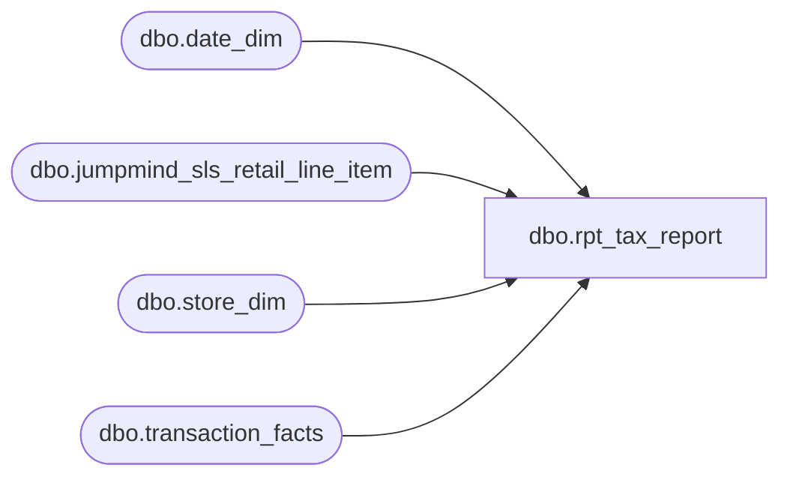

# dbo.rpt_tax_report

**Database:** LH_Mart  
**Server:** 4db76rlxaxcuvmuh5kw37wbnqq-ovsykae43znuhlmnflcdwm4ohu.datawarehouse.fabric.microsoft.com  

## Architecture Diagram



## Table Dependencies

| Referenced Table |
|---|
| dbo.date_dim |
| dbo.jumpmind_sls_retail_line_item |
| dbo.store_dim |
| dbo.transaction_facts |

## View Code

```sql
/* =============================================================================    rpt_tax_report.sql -- #18 Sales Tax Subledger by (Store, Object-Action)    =============================================================================    Sources (portable across any reporting window):      - LH_Mart.dbo.transaction_facts.tax_amount       (post-net per-tx tax)      - LH_Mart.dbo.store_dim, date_dim                (US filter + window)      - LH_Source.dbo.jumpmind_sls_retail_line_item    (BOPIS leg recovery)     tax_amount > 0 -> "Sales Tax charged" (debit-positive, credit shown                                           negative in Linda's xlsx)    tax_amount < 0 -> "Sales Tax refunded"     bopis_legs recovers the symmetric (charged+refunded) tax-only journal    AW emits when a web order (device 1013-*) is fulfilled at a physical    store via BOPIS / ship-from-store / curbside / same-day-shipt /    web-gift. These tx are net-zero in TF (tax_amount=0,    GAAP_sales_amount=0, webOrderNumber populated); the original web tax    is recovered from jumpmind line-level by stripping the shipment    suffix off webOrderNumber and re-aggregating positive line tax.     Output columns (in Linda's row order; [Posting Date] appended for    downstream date-window consumers in the all_reports harness):         [Store], [Object-Action], [Debit], [Credit], [Balance], [Posting Date]    ============================================================================= */  CREATE   VIEW dbo.rpt_tax_report AS WITH base AS (     SELECT         CASE WHEN s.store_id BETWEEN 1 AND 999              THEN s.store_id + 1000              ELSE s.store_id END                                            AS [Store],         CASE WHEN tf.tax_amount > 0              THEN 'Sales Tax charged'              ELSE 'Sales Tax refunded' END                                  AS [Object-Action],         CAST(d.actual_date AS date)                                         AS [Posting Date],         tf.tax_amount                                                       AS amt       FROM LH_Mart.dbo.transaction_facts AS tf       JOIN LH_Mart.dbo.store_dim         AS s ON s.store_key = tf.store_key       JOIN LH_Mart.dbo.date_dim          AS d ON d.date_key  = tf.date_key      WHERE d.actual_date BETWEEN '2026-01-01' AND '2026-03-31'        AND (s.country = 'US' OR (s.country IS NULL AND s.store_id < 1000))        AND tf.tax_amount <> 0 ), bopis_event AS (     /* Net-zero TF tx that are clean web-order fulfillment events        (BOPIS pickup, ship-from-store, curbside, same-day-shipt, web-gift)        with no merchandise flow change at the event. Per AW convention,        these become tax-only journal entries at the fulfillment store. */     SELECT         CASE WHEN s.store_id BETWEEN 1 AND 999              THEN s.store_id + 1000              ELSE s.store_id END                                            AS [Store],         CAST(d.actual_date AS date)                                         AS [Posting Date],         CASE WHEN CHARINDEX('_', tf.webOrderNumber) > 0              THEN LEFT(tf.webOrderNumber, CHARINDEX('_', tf.webOrderNumber) - 1)              ELSE tf.webOrderNumber END                                     AS web_order_base       FROM LH_Mart.dbo.transaction_facts AS tf       JOIN LH_Mart.dbo.store_dim         AS s ON s.store_key = tf.store_key       JOIN LH_Mart.dbo.date_dim          AS d ON d.date_key  = tf.date_key      WHERE d.actual_date BETWEEN '2026-01-01' AND '2026-03-31'        AND (s.country = 'US' OR (s.country IS NULL AND s.store_id < 1000))        AND tf.tax_amount = 0        AND ISNULL(tf.GAAP_sales_amount, 0) = 0        AND tf.webOrderNumber IS NOT NULL        AND tf.webOrderNumber <> '' ), bopis_legs AS (     SELECT         bp.[Store],         bp.[Posting Date],         SUM(rli.tax_amount)                                                 AS bopis_amt       FROM bopis_event AS bp       JOIN LH_Source.dbo.jumpmind_sls_retail_line_item AS rli         ON rli.order_id  = bp.web_order_base        AND rli.device_id LIKE '1013-%'        AND ISNULL(rli.voided, 0) = 0      GROUP BY bp.[Store], bp.[Posting Date] ), unioned AS (     SELECT [Store], [Object-Action], [Posting Date], amt FROM base     UNION ALL     SELECT [Store], 'Sales Tax charged'  AS [Object-Action], [Posting Date],             bopis_amt AS amt FROM bopis_legs     UNION ALL     SELECT [Store], 'Sales Tax refunded' AS [Object-Action], [Posting Date],            -bopis_amt AS amt FROM bopis_legs ), agg AS (     SELECT         [Store],         [Object-Action],         MIN([Posting Date])                                                 AS [Posting Date],         CAST(SUM(CASE WHEN [Object-Action] = 'Sales Tax refunded'                       THEN -amt ELSE 0 END) AS decimal(18,2))               AS [Debit],         CAST(SUM(CASE WHEN [Object-Action] = 'Sales Tax charged'                       THEN -amt ELSE 0 END) AS decimal(18,2))               AS [Credit]       FROM unioned      GROUP BY [Store], [Object-Action] ) SELECT     [Store],     [Object-Action],     [Debit],     [Credit],     /* Cumulative running ledger total, matching Linda's xlsx Balance        semantic. Ordered by [Store] then 'Sales Tax charged' before        'Sales Tax refunded' to mirror Aptos' within-GL row ordering.        Stores 1525 (Linda 525, Shops At River Center) and 1562 (Linda 562,        Springfield Town Center) sit in their own '204500-9999-9999-10' /        '-10-' chains in Linda's xlsx; isolate them so their cumulative        does not inherit the dominant '-10--' chain total. */     CAST(         SUM([Debit] + [Credit]) OVER (             PARTITION BY CASE WHEN [Store] IN (1525, 1562) THEN [Store] ELSE 0 END             ORDER BY [Store],                      CASE [Object-Action]                           WHEN 'Sales Tax charged'  THEN 0                           WHEN 'Sales Tax refunded' THEN 1                           ELSE 2 END             ROWS UNBOUNDED PRECEDING         )         AS decimal(18,2)     ) AS [Balance],     [Posting Date] FROM agg;
```

