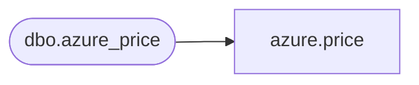

# azure.price

**Database:** LH_Mart_CI  
**Server:** 4db76rlxaxcuvmuh5kw37wbnqq-ovsykae43znuhlmnflcdwm4ohu.datawarehouse.fabric.microsoft.com  

## Architecture Diagram



## Table Dependencies

| Referenced Table |
|---|
| dbo.azure_price |

## View Code

```sql
; CREATE   VIEW azure.price AS SELECT * FROM LH_Mart.dbo.azure_price;
```

