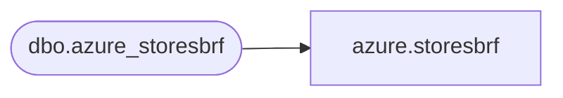

# azure.storesbrf

**Database:** LH_Mart_CI  
**Server:** 4db76rlxaxcuvmuh5kw37wbnqq-ovsykae43znuhlmnflcdwm4ohu.datawarehouse.fabric.microsoft.com  

## Architecture Diagram



## Table Dependencies

| Referenced Table |
|---|
| dbo.azure_storesbrf |

## View Code

```sql
CREATE   VIEW azure.storesbrf AS SELECT * FROM LH_Mart.dbo.azure_storesbrf;
```

