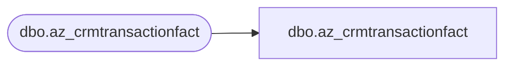

# dbo.az_crmtransactionfact

**Database:** LH_Mart_CI  
**Server:** 4db76rlxaxcuvmuh5kw37wbnqq-ovsykae43znuhlmnflcdwm4ohu.datawarehouse.fabric.microsoft.com  

## Architecture Diagram



## Table Dependencies

| Referenced Table |
|---|
| dbo.az_crmtransactionfact |

## View Code

```sql
; CREATE   VIEW [dbo].[az_crmtransactionfact] AS    SELECT [TransactionID] COLLATE Latin1_General_CI_AS AS [TransactionID]       ,[StoreKey]       ,[TransactionDate]       ,[TransactionPostedDate]       ,[CRMTransactionType] COLLATE Latin1_General_CI_AS AS [CRMTransactionType]       ,[POSTransactionNumber] COLLATE Latin1_General_CI_AS AS [POSTransactionNumber]       ,[POSRegisterNumber]       ,[CustomerNumber] COLLATE Latin1_General_CI_AS AS [CustomerNumber]       ,[InsertedDate]       ,[UpdatedDate]       ,[MNTH_01_12_VST_CNT]       ,[MNTH_01_24_VST_CNT]       ,[MNTH_01_36_VST_CNT]       ,[daysSinceLastVisit]       ,[numTransToday]       ,[lifetimeVisitNumber]       ,[GaapSales]       ,[GaapUnits]       ,[LifetimeTransactionSequence]       ,[LifetimeVisitSequence]       ,[POS]       ,[matchedByEmail]       ,[isWebGift]   FROM LH_Mart.[dbo].[az_crmtransactionfact]
```

