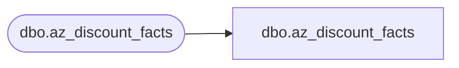

# dbo.az_discount_facts

**Database:** LH_Mart_CI  
**Server:** 4db76rlxaxcuvmuh5kw37wbnqq-ovsykae43znuhlmnflcdwm4ohu.datawarehouse.fabric.microsoft.com  

## Architecture Diagram



## Table Dependencies

| Referenced Table |
|---|
| dbo.az_discount_facts |

## View Code

```sql
; CREATE   VIEW [dbo].[az_discount_facts] AS     SELECT       [Transaction_ID] COLLATE Latin1_General_CI_AS AS [Transaction_ID] 	, [store_key]     , [date_key]     , [time_key]     , [Line_Sequence] 	, [LineNum] 	, [Cashier_No] COLLATE Latin1_General_CI_AS AS [Cashier_No] 	, [Gross_Line_Amount] 	, [Line_Object_Key]     , [Reference_No] COLLATE Latin1_General_CI_AS AS [Reference_No]     , [Transaction_No] COLLATE Latin1_General_CI_AS AS [Transaction_No]     , [Units]     , [Coupon_Flag]     , [coupon_key]     , [origReference_no] COLLATE Latin1_General_CI_AS AS [origReference_no]     , [categoryTypeID] COLLATE Latin1_General_CI_AS AS [categoryTypeID]     , [isExpired]     , [Lift_Amount]  	, [Store_No]     , [InsertDate]     , [UpdateDate]     FROM LH_Mart.[dbo].[az_discount_facts]
```

