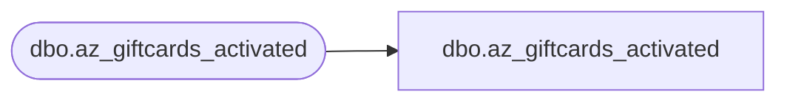

# dbo.az_giftcards_activated

**Database:** LH_Mart_CI  
**Server:** 4db76rlxaxcuvmuh5kw37wbnqq-ovsykae43znuhlmnflcdwm4ohu.datawarehouse.fabric.microsoft.com  

## Architecture Diagram



## Table Dependencies

| Referenced Table |
|---|
| dbo.az_giftcards_activated |

## View Code

```sql
; CREATE   VIEW [dbo].[az_giftcards_activated] AS    SELECT [store_key]       ,[transaction_id] COLLATE Latin1_General_CI_AS AS [transaction_id]       ,[date_key]       ,[activated_amount]       ,[discount_amount]       ,[giftcard_no] COLLATE Latin1_General_CI_AS AS [giftcard_no]       ,[currency_key]       ,[MID] COLLATE Latin1_General_CI_AS AS [MID]       ,[Source] COLLATE Latin1_General_CI_AS AS [Source]       ,[VLVerified]   FROM LH_Mart.[dbo].[az_giftcards_activated]
```

