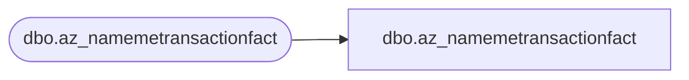

# dbo.az_namemetransactionfact

**Database:** LH_Mart_CI  
**Server:** 4db76rlxaxcuvmuh5kw37wbnqq-ovsykae43znuhlmnflcdwm4ohu.datawarehouse.fabric.microsoft.com  

## Architecture Diagram



## Table Dependencies

| Referenced Table |
|---|
| dbo.az_namemetransactionfact |

## View Code

```sql
; CREATE   VIEW [dbo].[az_namemetransactionfact] AS    SELECT [StoreKey]       ,[ProductKey]       ,[NameMeTransactionNumber] COLLATE Latin1_General_CI_AS AS [NameMeTransactionNumber]       ,[AnimalBarCode] COLLATE Latin1_General_CI_AS AS [AnimalBarCode]       ,[AnimalName] COLLATE Latin1_General_CI_AS AS [AnimalName]       ,[AnimalBirthDate]       ,[TransactionStartDate]       ,[TransactionEndDate]       ,[TransactionDuration]       ,[Gift]       ,[FirstVisit]       ,[TransactionSource] COLLATE Latin1_General_CI_AS AS [TransactionSource]       ,[Age]       ,[Gender] COLLATE Latin1_General_CI_AS AS [Gender]       ,[InsertedDate]       ,[UpdatedDate]       ,[InsertedBy] COLLATE Latin1_General_CI_AS AS [InsertedBy]       ,[UpdatedBy] COLLATE Latin1_General_CI_AS AS [UpdatedBy]       --,[ETLLogID]       --,[ETLEventID]       ,[POSTransactionID] COLLATE Latin1_General_CI_AS AS [POSTransactionID]   FROM LH_Mart.[dbo].[az_namemetransactionfact]
```

