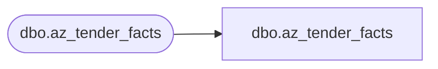

# dbo.az_tender_facts

**Database:** LH_Mart_CI  
**Server:** 4db76rlxaxcuvmuh5kw37wbnqq-ovsykae43znuhlmnflcdwm4ohu.datawarehouse.fabric.microsoft.com  

## Architecture Diagram



## Table Dependencies

| Referenced Table |
|---|
| dbo.az_tender_facts |

## View Code

```sql
; CREATE   VIEW [dbo].[az_tender_facts] AS     SELECT         [transaction_id] COLLATE Latin1_General_CI_AS AS [Transaction_ID]       ,[tender_key]       ,[store_key]       ,[date_key]       ,[tender_amt]       ,[tender_count]       ,[INS_DT]       ,[UPDT_DT]    FROM LH_Mart.[dbo].[az_tender_facts]
```

