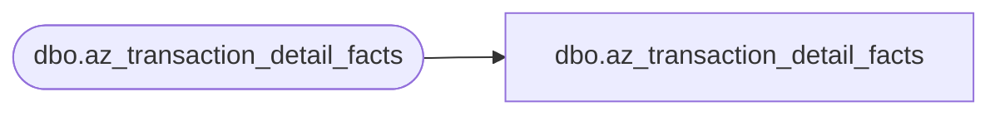

# dbo.az_transaction_detail_facts

**Database:** LH_Mart_CI  
**Server:** 4db76rlxaxcuvmuh5kw37wbnqq-ovsykae43znuhlmnflcdwm4ohu.datawarehouse.fabric.microsoft.com  

## Architecture Diagram



## Table Dependencies

| Referenced Table |
|---|
| dbo.az_transaction_detail_facts |

## View Code

```sql
;    CREATE  VIEW [dbo].[az_transaction_detail_facts] AS         SELECT [product_key]       ,[transaction_id] COLLATE Latin1_General_CI_AS AS [transaction_id]       ,[transaction_line_seq]       --,[transaction_type_key]       --,[tdf_key]       , [transaction_no]       ,[Register_Num]       ,[currency_key]       ,[cashier_id]       ,[date_key]       ,[time_key]       ,[store_key]       ,[line_object_key]       ,[line_action_key]       ,[unit_gross_amount]       ,[units]       ,[unit_disc_amount]       ,[upsell_disc_allocated]       ,[vat_tax_amount]       ,[ext_cost]       ,[reference_no]       ,[party_y_n]       ,[INS_DT]       ,[UPDT_DT]       --,[ETL_LOG_ID]       --,[ETL_EVNT_ID]       ,[LineItemType]       ,[NativeItemId]   FROM LH_Mart.[dbo].[az_transaction_detail_facts]
```

