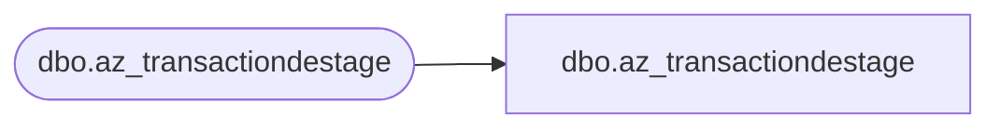

# dbo.az_transactiondestage

**Database:** LH_Mart_CI  
**Server:** 4db76rlxaxcuvmuh5kw37wbnqq-ovsykae43znuhlmnflcdwm4ohu.datawarehouse.fabric.microsoft.com  

## Architecture Diagram



## Table Dependencies

| Referenced Table |
|---|
| dbo.az_transactiondestage |

## View Code

```sql
;    CREATE  VIEW [dbo].[az_transactiondestage] AS      SELECT [SkinType]  COLLATE Latin1_General_CI_AS AS [SkinType]       ,[BasePointsEarned]       ,[CategoryType]  COLLATE Latin1_General_CI_AS AS [CategoryType]        ,[ConsumerGroup] COLLATE Latin1_General_CI_AS AS [ConsumerGroup]       ,[Country] COLLATE Latin1_General_CI_AS AS [Country]       ,[CurrencyType] COLLATE Latin1_General_CI_AS AS [CurrencyType]       ,[CustomerNumber] COLLATE Latin1_General_CI_AS AS [CustomerNumber]       ,[Department] COLLATE Latin1_General_CI_AS AS [Department]       ,[EmbroideryType] COLLATE Latin1_General_CI_AS AS [EmbroideryType]       ,[FulfillmentDate]       ,[GroupedTendersCash]       ,[GroupedTendersCreditDebit]       ,[GroupedTendersGiftCard]       ,[GroupedTendersKlarna]       ,[GroupedTendersPayPal]       ,[GroupedTendersAmazon]       ,[inDiscountFacts]       ,[IsBundle]       ,[IsSet]       ,[KeyStory]       ,[LicensedOrNot]       ,[LifetimeVisitNumber]       ,[MSTAT] COLLATE Latin1_General_CI_AS AS [MSTAT]       ,[NetRetailAmountwVAT]       ,[Occasions] COLLATE Latin1_General_CI_AS AS [Occasions]       ,[OnlineExclusive]       ,[ProductHierarchyCode] COLLATE Latin1_General_CI_AS AS [ProductHierarchyCode]       ,[ShippingType] COLLATE Latin1_General_CI_AS AS [ShippingType]       ,[ShippingAmount]       ,[SKU] COLLATE Latin1_General_CI_AS AS [SKU]       ,[SoundEligible]       ,[SportsTeams] COLLATE Latin1_General_CI_AS AS [SportsTeams]       ,[StoreConcept] COLLATE Latin1_General_CI_AS AS [StoreConcept]       ,[StoreNumber] COLLATE Latin1_General_CI_AS AS [StoreNumber]        ,[TransactionDate]       ,[TransactionID] COLLATE Latin1_General_CI_AS AS [TransactionID]       ,[TransactionLineNumber]       ,[TransactionMonth]       ,[TransactionYear]       ,[UnitDiscountAmount]       ,[Units]       ,[UpdatedTransaction]       ,[GroupedTendersAliPay]       ,[GroupedTendersFacebook]       ,[GroupedTendersOther]       ,[GroupedTendersPartyDeposit]       ,[GroupedTendersPOParty]       ,[GroupedTendersWeChatPay]       ,[Class] COLLATE Latin1_General_CI_AS AS [Class]       ,[SubClass] COLLATE Latin1_General_CI_AS AS [SubClass]       ,[isBundleOrSet]       ,[OrderReference] COLLATE Latin1_General_CI_AS AS [OrderReference]       ,[EmployeeID]       ,[GAAPSalesAmount]       ,[MatchedByEmail] COLLATE Latin1_General_CI_AS AS [MatchedByEmail]       ,[isWebGift]        FROM LH_Mart.[dbo].[az_transactiondestage]
```

