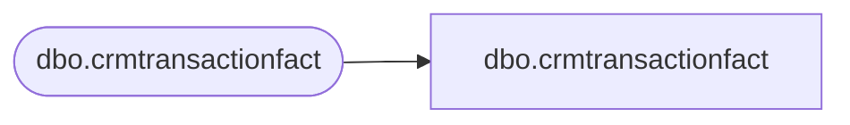

# dbo.crmtransactionfact

**Database:** LH_Mart_CI  
**Server:** 4db76rlxaxcuvmuh5kw37wbnqq-ovsykae43znuhlmnflcdwm4ohu.datawarehouse.fabric.microsoft.com  

## Architecture Diagram



## Table Dependencies

| Referenced Table |
|---|
| dbo.crmtransactionfact |

## View Code

```sql
; CREATE   VIEW [dbo].[crmtransactionfact] AS     SELECT [TransactionID], [CRMTransactionID], [StoreKey], [TransactionDate], [TransactionPostedDate], [CRMTransactionType] COLLATE Latin1_General_CI_AS AS [CRMTransactionType], [POSTransactionNumber] COLLATE Latin1_General_CI_AS AS [POSTransactionNumber], [POSRegisterNumber], [CustomerNumber] COLLATE Latin1_General_CI_AS AS [CustomerNumber], [PointsEarned], [ETLLogID], [ETLEventID], [InsertedDate], [UpdatedDate], [InsertedBy] COLLATE Latin1_General_CI_AS AS [InsertedBy], [UpdatedBy] COLLATE Latin1_General_CI_AS AS [UpdatedBy], [MNTH_01_12_VST_CNT], [MNTH_01_24_VST_CNT], [MNTH_01_36_VST_CNT], [daysSinceLastVisit], [numTransToday], [lifetimeVisitNumber], [GaapSales], [GaapUnits], [LifetimeTransactionSequence], [LifetimeVisitSequence], [POS] COLLATE Latin1_General_CI_AS AS [POS], [matchedByEmail], [isWebGift]     FROM [dbo].[crmtransactionfact]
```

