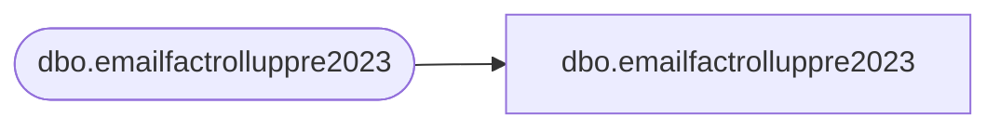

# dbo.emailfactrolluppre2023

**Database:** LH_Mart_CI  
**Server:** 4db76rlxaxcuvmuh5kw37wbnqq-ovsykae43znuhlmnflcdwm4ohu.datawarehouse.fabric.microsoft.com  

## Architecture Diagram



## Table Dependencies

| Referenced Table |
|---|
| dbo.emailfactrolluppre2023 |

## View Code

```sql
; CREATE   VIEW [dbo].[emailfactrolluppre2023] AS     SELECT [EmailAddress] COLLATE Latin1_General_CI_AS AS [EmailAddress], [LastSendDate], [LastClickDate], [LastOpenDate], [LastBounceDate], [LastUnSubscribeDate]     FROM [dbo].[emailfactrolluppre2023]
```

