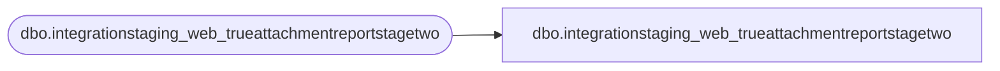

# dbo.integrationstaging_web_trueattachmentreportstagetwo

**Database:** LH_Mart_CI  
**Server:** 4db76rlxaxcuvmuh5kw37wbnqq-ovsykae43znuhlmnflcdwm4ohu.datawarehouse.fabric.microsoft.com  

## Architecture Diagram



## Table Dependencies

| Referenced Table |
|---|
| dbo.integrationstaging_web_trueattachmentreportstagetwo |

## View Code

```sql
; CREATE   VIEW integrationstaging_web_trueattachmentreportstagetwo AS SELECT * FROM LH_Mart.dbo.integrationstaging_web_trueattachmentreportstagetwo;
```

