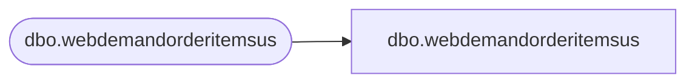

# dbo.webdemandorderitemsus

**Database:** LH_Mart_CI  
**Server:** 4db76rlxaxcuvmuh5kw37wbnqq-ovsykae43znuhlmnflcdwm4ohu.datawarehouse.fabric.microsoft.com  

## Architecture Diagram



## Table Dependencies

| Referenced Table |
|---|
| dbo.webdemandorderitemsus |

## View Code

```sql
; CREATE   VIEW webdemandorderitemsus AS SELECT * FROM LH_Mart.dbo.webdemandorderitemsus;
```

