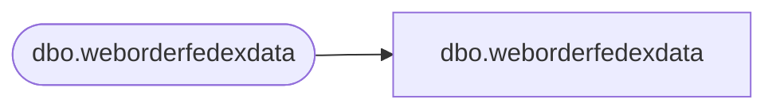

# dbo.weborderfedexdata

**Database:** LH_Mart_CI  
**Server:** 4db76rlxaxcuvmuh5kw37wbnqq-ovsykae43znuhlmnflcdwm4ohu.datawarehouse.fabric.microsoft.com  

## Architecture Diagram



## Table Dependencies

| Referenced Table |
|---|
| dbo.weborderfedexdata |

## View Code

```sql
; CREATE   VIEW [dbo].[weborderfedexdata] AS     SELECT [ShipmentTrackingNumber] COLLATE Latin1_General_CI_AS AS [ShipmentTrackingNumber], [ServiceType] COLLATE Latin1_General_CI_AS AS [ServiceType], [ShipmentDeliveryDate] COLLATE Latin1_General_CI_AS AS [ShipmentDeliveryDate], [NetChargeAmountUSD] COLLATE Latin1_General_CI_AS AS [NetChargeAmountUSD], [Invoicedate] COLLATE Latin1_General_CI_AS AS [Invoicedate], [MasterTrackingNumber] COLLATE Latin1_General_CI_AS AS [MasterTrackingNumber], [InsertDate], [UpdateDate]     FROM [dbo].[weborderfedexdata]
```

