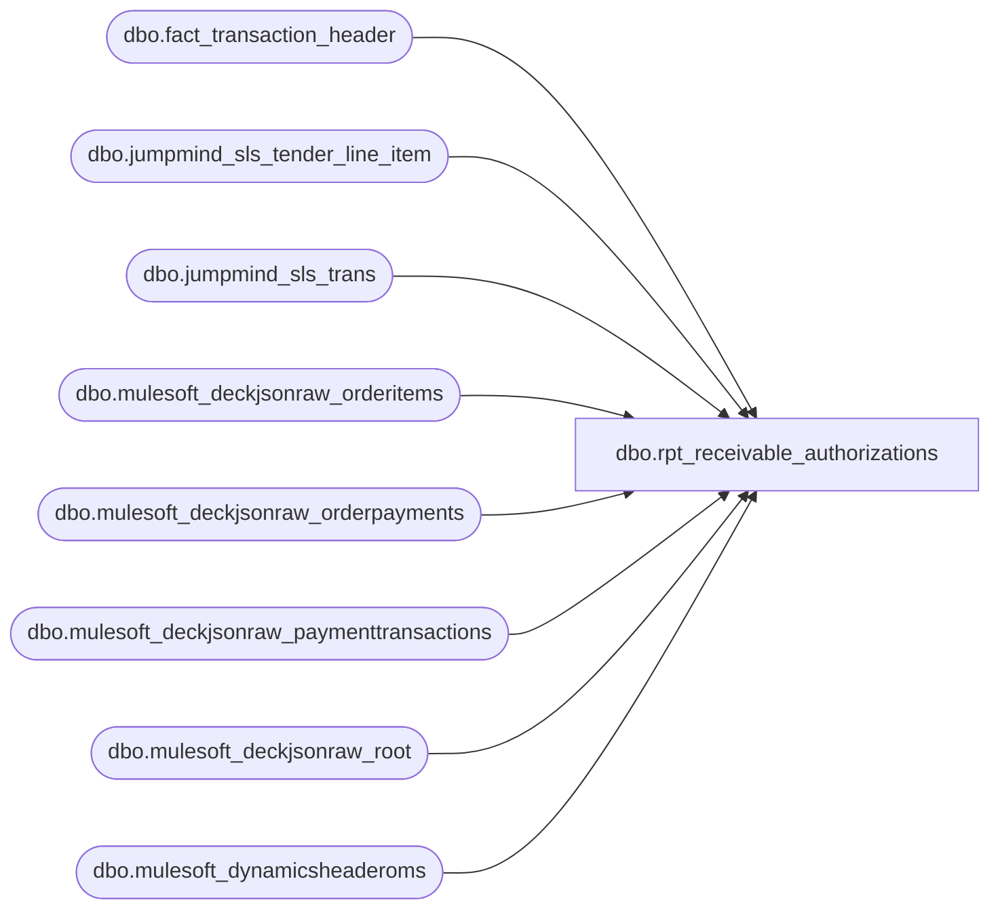

# dbo.rpt_receivable_authorizations

**Database:** LH_Reporting  
**Server:** 4db76rlxaxcuvmuh5kw37wbnqq-ovsykae43znuhlmnflcdwm4ohu.datawarehouse.fabric.microsoft.com  

## Architecture Diagram



## Table Dependencies

| Referenced Table |
|---|
| dbo.fact_transaction_header |
| dbo.jumpmind_sls_tender_line_item |
| dbo.jumpmind_sls_trans |
| dbo.mulesoft_deckjsonraw_orderitems |
| dbo.mulesoft_deckjsonraw_orderpayments |
| dbo.mulesoft_deckjsonraw_paymenttransactions |
| dbo.mulesoft_deckjsonraw_root |
| dbo.mulesoft_dynamicsheaderoms |

## View Code

```sql
/* =============================================================================    rpt_receivable_authorizations.sql -- Receivable Authorizations Report    =============================================================================    Domain:    Reconciliation (Receivables)    Audience:  Sales Audit, Accounts Receivable    Consumer:  Power BI dashboard "Daily Receivable Authorizations"     STATUS: Rebuilt on pure LH_Source 2026-06-17 (LH_Mart removed).            Sourced directly from DECK paymenttransactions per order, one row            per distinct Adyen settlement/refund reference (Generic1).     PURPOSE      Surface every authorisation against a Receivable tender so AR can      reconcile the authorised amount against the third-party receivable      statement (Klarna, Global-E, Amazon).     ELIGIBLE PAYMENT SUBTYPES      Adyen_Klarna  → line object 637 (Klarna Receivable)      Adyen_GlobalE / GlobalE → line object 638 (Global-E Receivable)      Amazon (631) is excluded: not present in DECK paymenttransactions.     WHY DECK DIRECT (not stg_canonical_payments)      stg_canonical_payments emits ONE row per OMS order for Klarna/GlobalE      and uses MAX(Generic1) per order. Each Klarna order has two distinct      Generic1 values: one for the type-1 Authorization and one for the      type-2/10 Capture. Linda's AuditWorks includes the Capture ref, not      the Auth ref. MAX() picks the alphabetically larger of the two, which      is often the auth ref -- causing ~5,000 Capture refs to be dropped.      Sourcing from paymenttransactions directly and filtering to types      2, 3, 10, 11 (capture + refund, excluding type-1 auth) reproduces      Linda's population.     PAYMENT TRANSACTION TYPES (Klarna/GlobalE)      10 = Pending Capture   (capture initiated)      2  = Capture           (confirmed settlement; shares Generic1 with type 10)      11 = Pending Refund      3  = Refund      Types 2 and 10 always share the same Generic1 per orderpayment leg --      deduplicated by GROUP BY on (order, Generic1).      Type 1 (Authorization) has a different Generic1 and is excluded.     DATE      TransactionDateUTC → PST (Pacific Standard Time, UTC-8) for all stores.      PST matches Linda's AuditWorks date: AW date-stamps Klarna events in PST.      CST (UTC-6) was off by 1 day for ~250 settlements falling 06:00-07:59 UTC.     STORE      MIN(WarehouseCode) from mulesoft_deckjsonraw_orderitems per order,      '0' prefix → '1' prefix (e.g., 0013 → 1013).     DATA GAP: House Charge 609 / BAB Charge 630      Venue (ShopInShop) stores route all in-store tenders through a house-account GL.      Source confirmed in AuditWorks av_transaction_header + av_transaction_line --      70,050 rows for Jan-Mar 2026 across stores 417, 2019, 2079, 2080, 2081, 2083.      These tables are not yet mirrored into LH_Source. Once BBW exposes them,      add a UNION ALL here; routing rule: POLLING_STORES.STORE_TYPE = 'ShopInShop'      → line_object 609.     Read-only and idempotent.    ============================================================================= */  CREATE   VIEW dbo.rpt_receivable_authorizations AS WITH klarna_settled AS (     /* One row per distinct Adyen settlement/refund reference per order.        Types 2 (Capture) and 10 (Pending Capture) share the same Generic1        and are deduplicated by the GROUP BY.  Type 1 (Authorization) has a        different Generic1 and is excluded via the type filter.        Amount signed negative for refund types (3/11). */     SELECT         djr.OrderNumber                                         AS order_no,         djr.OrderID,         CAST(pt.Generic1 AS varchar(100))                       AS reference_no,         CASE             WHEN op.PaymentSubType IN ('Adyen_GlobalE', 'GlobalE') THEN 638             ELSE 637         END                                                     AS recv_code,         MAX(             CASE WHEN pt.PaymentTransactionTypeId IN (3, 11)                  THEN -ABS(CAST(pt.Amount AS decimal(18,6)))                  ELSE  ABS(CAST(pt.Amount AS decimal(18,6)))             END         )                                                       AS auth_amount,         CAST(             MIN(CAST(pt.TransactionDateUTC AT TIME ZONE 'UTC'                      AT TIME ZONE 'Pacific Standard Time' AS datetime2(6)))         AS date)                                                AS settlement_date       FROM LH_Source.dbo.mulesoft_deckjsonraw_paymenttransactions pt       JOIN LH_Source.dbo.mulesoft_deckjsonraw_orderpayments       op            ON op.ID = pt.OrderPaymentId       JOIN LH_Source.dbo.mulesoft_deckjsonraw_root                djr            ON djr.OrderID = op._ParentKeyField      WHERE op.PaymentSubType IN ('Adyen_Klarna', 'Adyen_GlobalE', 'GlobalE')        AND pt.PaymentTransactionTypeId IN (2, 3, 10, 11)        AND pt.Generic1  IS NOT NULL AND pt.Generic1  <> ''        AND pt.Amount    IS NOT NULL AND pt.Amount    <> 0      GROUP BY djr.OrderNumber, djr.OrderID,               CAST(pt.Generic1 AS varchar(100)),               CASE WHEN op.PaymentSubType IN ('Adyen_GlobalE', 'GlobalE') THEN 638 ELSE 637 END ), warehouse_store AS (     SELECT         oi._ParentKeyField                                      AS OrderID,         MIN(             CASE WHEN oi.WarehouseCode LIKE '0%'                  THEN STUFF(oi.WarehouseCode, 1, 1, '1')                  ELSE oi.WarehouseCode             END         )                                                       AS store_code       FROM LH_Source.dbo.mulesoft_deckjsonraw_orderitems oi      WHERE oi.WarehouseCode IS NOT NULL AND oi.WarehouseCode <> ''      GROUP BY oi._ParentKeyField ), d365_oms_header AS (     SELECT CAST(RetailReceiptId AS varchar(64))          AS receipt_txt,            MAX(CAST(TransactionKey      AS varchar(80))) AS transaction_key,            MAX(CAST(RetailTransactionId AS varchar(64))) AS transaction_id       FROM LH_Source.dbo.mulesoft_dynamicsheaderoms      WHERE RetailReceiptId IS NOT NULL AND RetailReceiptId <> ''      GROUP BY CAST(RetailReceiptId AS varchar(64)) ) SELECT     TRY_CONVERT(int, ws.store_code)                             AS [Store Number],     ks.settlement_date                                          AS [Transaction Date],     CAST(ks.order_no AS varchar(50))                            AS [Transaction Number],     CAST('052' AS varchar(10))                                  AS [Register Number],     CAST(h.tender_total AS decimal(18,6))                       AS [Tender Total Amount (Native Currency)],     ks.reference_no                                             AS [Reference Number],     ks.auth_amount                                              AS [Auth Amount (Native Currency)],     ks.recv_code                                                AS [Line Object Code],     CAST(dho.transaction_id  AS varchar(64))                    AS [Transaction Id],     CAST(dho.transaction_key AS varchar(80))                    AS [Transaction Key]    FROM klarna_settled ks   LEFT JOIN warehouse_store ws          ON ws.OrderID = ks.OrderID   LEFT JOIN LH_Source.dbo.fact_transaction_header h          ON CAST(h.transaction_no AS varchar(50)) = ks.order_no   LEFT JOIN d365_oms_header dho          ON dho.receipt_txt = ks.order_no  UNION ALL  /* Venue / ShopInShop stores (417 = FAO Schwarz, 2019 = Hamleys UK,    2079, 2080, 2081, 2083).  In-store tenders route through a house-account    GL (AuditWorks line_object 609) with no Adyen authorisation.  The tender    lives in jumpmind_sls_tender_line_item as tender_code = 'LOCAL_TENDER'    (tender_type_code = 'UNSUPPORTED_AUTHORIZATION').    JumpMind store IDs: FAO Schwarz = 1417 (reported as 417 by Linda),    UK/IE venues = 2019/2079/2080/2081/2083.    Date: business_date (already local -- venue stores do not apply a UTC    shift; AuditWorks uses business_date verbatim for these stores).    Reference: NULL (house-account tenders carry no external payment ref).    Added 2026-06-24 after Ben Barud confirmed data presence in    jumpmind_sls_trans. */ SELECT     CASE t.business_unit_id         WHEN '1417' THEN 417          -- FAO Schwarz: JM stores as 1417, Linda reports as 417         ELSE TRY_CONVERT(int, t.business_unit_id)     END                                                         AS [Store Number],     /* Use DATEADD(MILLISECOND, local_offset, begin_time) to get the true local date.        JumpMind's business_date sometimes reflects the prior day when a terminal fails        to roll over at midnight (observed at stores 2079, 2080).  local_offset is in        milliseconds: -18000000 = EST (UTC-5), 0 = GMT, 3600000 = BST (UTC+1). */     CAST(DATEADD(MILLISECOND, t.local_offset, t.begin_time) AS date)                                                                 AS [Transaction Date],     CAST(t.sequence_number AS varchar(50))                      AS [Transaction Number],     TRY_CONVERT(int, RIGHT(t.device_id, 3))                     AS [Register Number],     SUM(CAST(tl.tender_amount AS decimal(18,6)))                AS [Tender Total Amount (Native Currency)],     CAST(NULL AS varchar(100))                                  AS [Reference Number],     SUM(CAST(tl.tender_amount AS decimal(18,6)))                AS [Auth Amount (Native Currency)],     609                                                         AS [Line Object Code],     CAST(NULL AS varchar(64))                                   AS [Transaction Id],     /* Transaction Key in D365 convention: store-register-YYYYMMDD-sequence.        Date portion uses the corrected local date (ISO format, no separators). */     CAST(         CASE t.business_unit_id WHEN '1417' THEN '417' ELSE t.business_unit_id END         + '-'         + RIGHT('000' + CAST(TRY_CONVERT(int, RIGHT(t.device_id, 3)) AS varchar(10)), 3)         + '-'         + CONVERT(varchar(8), CAST(DATEADD(MILLISECOND, t.local_offset, t.begin_time) AS date), 112)         + '-'         + CAST(t.sequence_number AS varchar(20))     AS varchar(80))                                             AS [Transaction Key]   FROM LH_Source.dbo.jumpmind_sls_trans t   JOIN LH_Source.dbo.jumpmind_sls_tender_line_item tl        ON tl.device_id       = t.device_id       AND tl.business_date   = t.business_date       AND tl.sequence_number = t.sequence_number  WHERE t.business_unit_id IN ('1417','2019','2079','2080','2081','2083')    AND tl.tender_code = 'LOCAL_TENDER'    AND ISNULL(tl.post_void, 0) = 0    AND ISNULL(tl.voided,    0) = 0  GROUP BY     t.business_unit_id,     t.sequence_number,     t.device_id,     t.local_offset,     t.begin_time;
```

