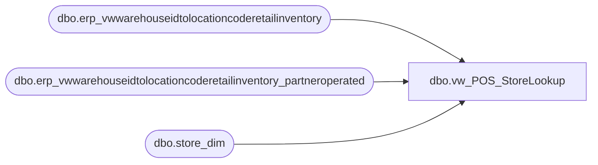

# dbo.vw_POS_StoreLookup

**Database:** LH_Reporting  
**Server:** 4db76rlxaxcuvmuh5kw37wbnqq-ovsykae43znuhlmnflcdwm4ohu.datawarehouse.fabric.microsoft.com  

## Architecture Diagram



## Table Dependencies

| Referenced Table |
|---|
| dbo.erp_vwwarehouseidtolocationcoderetailinventory |
| dbo.erp_vwwarehouseidtolocationcoderetailinventory_partneroperated |
| dbo.store_dim |

## View Code

```sql
CREATE VIEW vw_POS_StoreLookup AS SELECT      WarehouseID as DynanmicsLocationCode,     LocationCode as DwLocationCode,      CASE          WHEN Entity = '1100' THEN 'US' 	    WHEN Entity = '1700' THEN 'CA' 	    WHEN Entity = '2110' THEN 'UK' 	    ELSE NULL  	END AS Country  FROM LH_Source.dbo.erp_vwwarehouseidtolocationcoderetailinventory UNION SELECT  	v.WarehouseID as DynanmicsLocationCode, 	v.LocationCode as DwLocationCode,  	UPPER(sd.country) AS country FROM  LH_Source.dbo.erp_vwwarehouseidtolocationcoderetailinventory_partneroperated AS v  INNER JOIN  LH_Mart.dbo.store_dim AS sd  	ON CAST(v.LocationCode as int)=sd.store_id;
```

