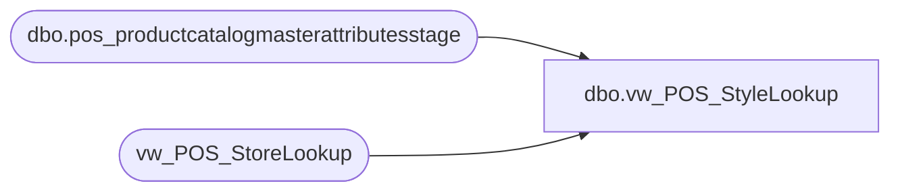

# dbo.vw_POS_StyleLookup

**Database:** LH_Reporting  
**Server:** 4db76rlxaxcuvmuh5kw37wbnqq-ovsykae43znuhlmnflcdwm4ohu.datawarehouse.fabric.microsoft.com  

## Architecture Diagram



## Table Dependencies

| Referenced Table |
|---|
| dbo.pos_productcatalogmasterattributesstage |
| vw_POS_StoreLookup |

## View Code

```sql
CREATE VIEW vw_POS_StyleLookup  AS SELECT        a.ProductNumber     ,LOWER(a.ProductDescription) AS ProductDescription     ,a.Department     ,a.DepartmentCode     ,sl.Country AS ProductSellingGeography     ,a.ItemType FROM LH_Source.dbo.pos_productcatalogmasterattributesstage AS a  INNER JOIN vw_POS_StoreLookup AS sl      ON UPPER(sl.Country)=UPPER(a.ProductSellingGeography) -- Added Join on 9/15/2023 GROUP BY       a.ProductNumber     ,LOWER(a.ProductDescription)     ,a.Department     ,a.DepartmentCode     ,sl.Country     ,a.ItemType     ;
```

