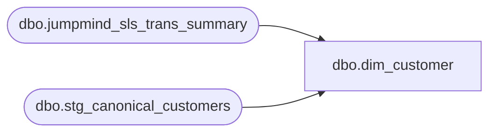

# dbo.dim_customer

**Database:** LH_Source  
**Server:** 4db76rlxaxcuvmuh5kw37wbnqq-ovsykae43znuhlmnflcdwm4ohu.datawarehouse.fabric.microsoft.com  

## Architecture Diagram



## Table Dependencies

| Referenced Table |
|---|
| dbo.jumpmind_sls_trans_summary |
| dbo.stg_canonical_customers |

## View Code

```sql
CREATE   VIEW dbo.dim_customer AS WITH /* Pull all customer records emitted by Stage 2 across POS and OMS.    stg_canonical_customers emits one row per (transaction, customer_role)    pair — so multiple rows per customer_no when the customer appears in    multiple transactions or multiple roles. */ all_customer_records AS (     SELECT         c.customer_no,         c.first_name,         c.last_name,         c.email_address,         c.address_1,         c.address_2,         c.city,         c.state,         c.country,         c.postal_code,         c.telephone_no_1,         c.telephone_no_2,         c.source_system,         c.transaction_id                                            AS ref_transaction_id,         c.customer_role       FROM dbo.stg_canonical_customers AS c      WHERE c.customer_no IS NOT NULL        AND c.customer_no <> '' ), /* Most-recent wins per customer_no via ROW_NUMBER. Order by transaction_id    DESC as a deterministic proxy for "most recent" — JumpMind composite key    sorts approximately by business_date due to its device|date|seq format,    and OMS OrderNumber is monotonically increasing. */ ranked_customer_records AS (     SELECT         c.*,         ROW_NUMBER() OVER (             PARTITION BY c.customer_no             ORDER BY c.ref_transaction_id DESC, c.customer_role ASC         ) AS rn       FROM all_customer_records AS c ), /* Take the most recent record per customer_no. Loyalty card number    sourced from POS only (jumpmind_sls_trans_summary.loyalty_card_number);    for OMS-only customers it's NULL. */ loyalty_card_lookup AS (     SELECT         ts.customer_id                                              AS customer_no,         MAX(ts.loyalty_card_number)                                 AS loyalty_card_number       FROM LH_Source.dbo.jumpmind_sls_trans_summary AS ts      WHERE ts.customer_id IS NOT NULL        AND ts.customer_id <> ''      GROUP BY ts.customer_id ) SELECT     CAST(r.customer_no AS bigint)                                   AS customer_no,     l.loyalty_card_number,     r.first_name,     r.last_name,     r.email_address                                                 AS email,     r.address_1,     r.address_2,     r.city,     r.state,     r.postal_code                                                   AS zip,     r.country,     r.telephone_no_1                                                AS phone,     r.telephone_no_2                                                AS phone_secondary,     r.source_system   FROM ranked_customer_records AS r   LEFT JOIN loyalty_card_lookup AS l     ON l.customer_no = r.customer_no  WHERE r.rn = 1    AND TRY_CAST(r.customer_no AS bigint) IS NOT NULL;
```

