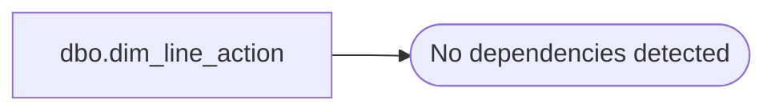

# dbo.dim_line_action

**Database:** LH_Source  
**Server:** 4db76rlxaxcuvmuh5kw37wbnqq-ovsykae43znuhlmnflcdwm4ohu.datawarehouse.fabric.microsoft.com  

## Architecture Diagram



## Table Dependencies

_No table dependencies detected._

## View Code

```sql
CREATE   VIEW dbo.dim_line_action AS SELECT * FROM (VALUES     (  0, 'rejected'),     (  1, 'sold'),     (  2, 'returned'),     (  3, 'charged on rental out'),     (  4, 'refunded on rental return'),     (  5, 'recognized on rental completion'),     (  6, 'sold following rental'),     (  7, 'ordered'),     (  8, 'order cancelled'),     (  9, 'rented out'),     ( 10, 'rental returned'),     ( 11, 'charged'),     ( 12, 'refunded'),     ( 13, 'received'),     ( 14, 'change received'),     ( 15, 'incurred'),     ( 16, 'recovered'),     ( 17, 'forfeited'),     ( 18, 'change returned'),     ( 19, 'applied'),     ( 20, 'deducted'),     ( 21, 'reversed'),     ( 22, 'prorated'),     ( 23, 'remitted in exchange'),     ( 24, 'issued'),     ( 25, 'redeemed'),     ( 26, 'cashed'),     ( 27, 'credited'),     ( 28, 'tendered'),     ( 29, 'disbursed'),     ( 30, 'run'),     ( 31, 'opening'),     ( 32, 'closing'),     ( 33, 'log-on'),     ( 34, 'log-off'),     ( 35, 'post-voided'),     ( 36, 'confirmation'),     ( 37, 'sent'),     ( 38, 'recorded'),     ( 39, 'transfered in'),     ( 40, 'transfered out'),     ( 41, 'distributed in'),     ( 42, 'returned to vendor'),     ( 43, 'received from vendor'),     ( 44, 'counted in inventory'),     ( 45, 'counted for price change'),     ( 46, 'increase'),     ( 47, 'decrease'),     ( 48, 'withheld'),     ( 49, 'entered'),     ( 50, 'exited'),     ( 51, 'to deliver'),     ( 52, 'no-sale'),     ( 53, 'retrieved from POS records'),     ( 54, 'cancelled'),     ( 55, 'posted to POS records'),     ( 56, 'balance forward'),     ( 57, 'date change'),     ( 58, 'charged to vendor'),     ( 59, 'changed'),     ( 60, 'stocked'),     ( 61, 'stolen/destroyed (from stock)'),     ( 62, 'invalidated (stolen/lost)'),     ( 63, 'flagged for ELP'),     ( 64, 'dated'),     ( 65, 're-boot detected'),     ( 66, 'delete'),     ( 67, 'marked out of stock'),     ( 68, 'post-voided-by'),     ( 69, 'reassigned'),     ( 70, 'held'),     ( 71, 'released'),     ( 72, 'authorized'),     ( 73, 'declined'),     ( 74, 'selected'),     ( 75, 'added to stock'),     ( 76, 'clocked in'),     ( 77, 'clocked out'),     ( 78, 'deducted on rental out'),     ( 79, 'reversed on rental return'),     ( 80, 'deducted on rental sale'),     ( 90, 'order delivered'),     ( 91, 'deducted on order'),     ( 92, 'reversed on order cancellation'),     ( 93, 'deducted on order delivery'),     ( 94, 'reversed on delivery return'),     ( 95, 'charged on order'),     ( 96, 'refunded on order cancellation'),     ( 97, 'recognized on order delivery'),     ( 98, 'refunded after fulfillment'),     ( 99, 'delivery returned'),     (100, 'reroute requested'),     (101, 'placed on layaway'),     (102, 'released from layaway'),     (111, 'charged on layaway sale'),     (112, 'refunded on layaway cancellati'),     (120, 'deducted on layaway sale'),     (121, 'reversed on layaway cancellati'),     (130, 'returned for delivery'),     (131, 'returned for pickup'),     (132, 'return picked up'),     (133, 'return delivered'),     (134, 'return for delivery cancelled'),     (135, 'return for pickup cancelled'),     (136, 'sold for delivery'),     (137, 'sold for pickup'),     (138, 'sale picked up'),     (139, 'sale delivered'),     (140, 'sale for delivery cancelled'),     (141, 'sale for pickup cancelled'),     (142, 'order picked up'),     (143, 'charged on sale for delivery'),     (144, 'charged on sale for pickup'),     (145, 'recognized on sale delivery'),     (146, 'recognized on sale pickup'),     (147, 'recognized on order pickup'),     (148, 'refunded on sale delivery cancellation'),     (149, 'refunded on sale pickup cancellation'),     (150, 'refunded on return for delivery'),     (151, 'refunded on return for pickup'),     (152, 'refunded on return delivery'),     (153, 'refunded on return pickup'),     (154, 'charged on return for delivery cancellation'),     (155, 'charged on return for pickup cancellation'),     (156, 'deducted on sale for delivery'),     (157, 'deducted on sale for pickup'),     (158, 'deducted on sale delivery'),     (159, 'deducted on sale pickup'),     (160, 'deducted on order pickup'),     (161, 'reversed on sale for delivery cancellation'),     (162, 'reversed on sale for pickup cancellation'),     (163, 'reversed on return for delivery'),     (164, 'reversed on return for pickup'),     (165, 'reversed on return delivery'),     (166, 'reversed on return pickup'),     (167, 'deducted on return for delivery cancellation'),     (168, 'deducted on return for pickup cancellation'),     (169, 'owed'),     (170, 'collected'),     (171, 'reserved'),     (172, 'reservation cancelled'),     (191, 'alteration requested'),     (192, 'charged on alteration request'),     (193, 'deducted on alteration request'),     (194, 'alteration cancelled'),     (195, 'refunded on alteration cancellation'),     (196, 'reversed on alteration cancellation'),     (197, 'alteration picked up'),     (198, 'recognized on alteration pick-up'),     (199, 'deducted on alteration pick-up'),     (200, 'loan returned'),     (201, 'picked up'),     (202, 'pick-up returned'),     (203, 'loaned-in'),     (204, 'loaned-out'),     (205, 'exchange transfer'),     (206, 'quantity transferred'),     (207, 'withdrawn'),     (208, 'retained'),     (209, 'released'),     (210, 'charged on loan out'),     (211, 'recognized on layaway pickup'),     (212, 'refunded on pickup return'),     (213, 'deducted on loan out'),     (214, 'refunded on loan return'),     (215, 'reversed on loan return'),     (216, 'recognized on loan completion'),     (217, 'deducted on sale following loan'),     (218, 'deducted on pick-up assumed'),     (219, 'pick-up assumed'),     (220, 'deducted on layaway pick up'),     (221, 'reversed on pickup return'),     (222, 'sold following loan'),     (223, 'repair requested'),     (224, 'charged on repair request'),     (225, 'deducted on repair request'),     (226, 'repair cancelled'),     (227, 'refunded on repair cancellation'),     (228, 'reversed on repair cancellation'),     (229, 'repair picked up'),     (230, 'recognized on repair pick-up'),     (231, 'deducted on repair pick-up'),     (234, 'reconciliation picked up'),     (235, 'pickup initiated'),     (236, 'quantity counted'),     (237, 'exchange counted'),     (238, 'transfer confirmed'),     (239, 'deposit exchange declared'),     (240, 'exchange deposited'),     (241, 'settlement transmitted'),     (242, 'settlement confirmed'),     (243, 'quantity deposited'),     (244, 'traffic counted'),     (245, 'foreign exchange'),     (246, 'counted'),     (247, 'deposit declared'),     (248, 'quantity declared'),     (249, 'deposited'),     (250, 'short'),     (251, 'exchange short'),     (252, 'quantity short'),     (254, 'offset') ) AS la(line_action_code, description);
```

