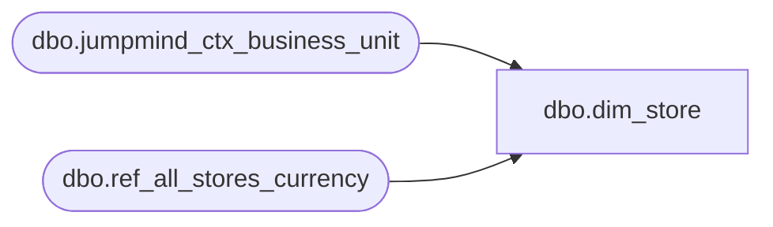

# dbo.dim_store

**Database:** LH_Source  
**Server:** 4db76rlxaxcuvmuh5kw37wbnqq-ovsykae43znuhlmnflcdwm4ohu.datawarehouse.fabric.microsoft.com  

## Architecture Diagram



## Table Dependencies

| Referenced Table |
|---|
| dbo.jumpmind_ctx_business_unit |
| dbo.ref_all_stores_currency |

## View Code

```sql
CREATE   VIEW dbo.dim_store AS WITH all_stores AS (     SELECT         CAST(LTRIM(RTRIM(store_number)) AS varchar(4))             AS store_id,         retail_channel_id,         name                                                       AS store_name,         company                                                    AS legal_entity_company,         currency                                                   AS currency_code,         operating_unit_number,         warehouse,         sales_tax_group,         default_customer       FROM LH_Source.dbo.ref_all_stores_currency ), jumpmind_bu_raw AS (     /* jumpmind_ctx_business_unit columns (verified May 8 sample, 8 cols):          business_unit_id, geo_code, business_unit_name, government_id,          create_time, create_by, last_update_time, last_update_by        No status column exists. Active/closed signal comes from the static        ref_all_stores_currency.store_name field instead (legacy data has        "- Closed" / "- closed" suffixes for inactive stores). */     SELECT         bu.business_unit_id,         /* Stage A pad: business_unit_id is variable-length per JumpMind raw.            BBW operational store IDs from JumpMind already start with 1+digits            or just digits — pad to 4 with leading 1 if needed. */         CASE             WHEN LEN(LTRIM(RTRIM(bu.business_unit_id))) = 4               AND LEFT(LTRIM(RTRIM(bu.business_unit_id)), 1) = '1'                 THEN LTRIM(RTRIM(bu.business_unit_id))             WHEN LEN(LTRIM(RTRIM(bu.business_unit_id))) <= 3                 THEN '1' + RIGHT('000' + LTRIM(RTRIM(bu.business_unit_id)), 3)             ELSE LTRIM(RTRIM(bu.business_unit_id))         END                                                          AS store_id,         bu.last_update_time       FROM LH_Source.dbo.jumpmind_ctx_business_unit AS bu ), jumpmind_bu AS (     /* DEDUP: jumpmind_ctx_business_unit can have multiple rows per        business_unit_id (different last_update_time snapshots). Without        deduplication, the LEFT JOIN to all_stores multiplies output rows,        producing duplicate dim_store rows per store_id. Confirmed by        validation 2026-05-11: dim_store had 1,138 rows for ~400 expected        stores.        Take the most recent snapshot per business_unit_id (= per store_id). */     SELECT         business_unit_id,         store_id,         last_update_time       FROM (           SELECT               business_unit_id,               store_id,               last_update_time,               ROW_NUMBER() OVER (                   PARTITION BY store_id                   ORDER BY last_update_time DESC, business_unit_id DESC               ) AS rn             FROM jumpmind_bu_raw       ) ranked      WHERE rn = 1 ) SELECT     s.store_id,     j.business_unit_id,     s.retail_channel_id,     s.store_name,     s.legal_entity_company,     CASE s.legal_entity_company         WHEN '1100' THEN 'US'         WHEN '1200' THEN 'CN'         WHEN '1700' THEN 'CA'         WHEN '2110' THEN CASE WHEN s.currency_code = 'GBP' THEN 'GB' ELSE 'IE' END         WHEN '2300' THEN 'DK'         WHEN '3001' THEN 'CN'         ELSE NULL     END                                                             AS country_code,     s.currency_code,     s.operating_unit_number,     s.warehouse,     s.sales_tax_group,     s.default_customer,     /* tax_geo_code: padded 4-digit form by default. Flip to unpadded if Ben        confirms tax_jurisdiction.geo_code uses "16" rather than "1006". */     s.store_id                                                      AS tax_geo_code,     /* is_active derived from store_name suffix per ref_all_stores_currency        convention. JumpMind business_unit table has no status column;        legacy data records closed stores with "- Closed" / "- closed"        in the name. */     CASE         WHEN s.store_name LIKE '%Closed%' OR s.store_name LIKE '%closed%' THEN 0         ELSE 1     END                                                              AS is_active   FROM all_stores AS s   LEFT JOIN jumpmind_bu AS j     ON j.store_id = s.store_id;
```

