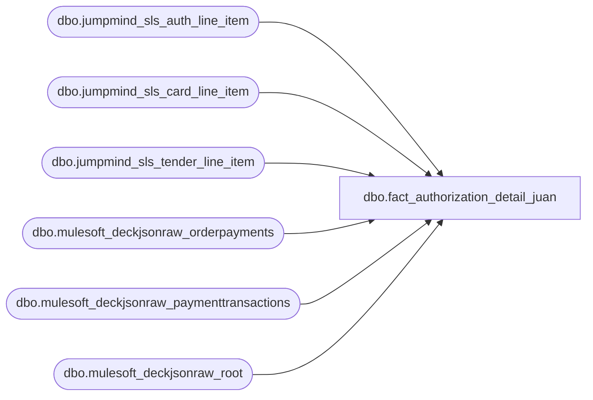

# dbo.fact_authorization_detail_juan

**Database:** LH_Source  
**Server:** 4db76rlxaxcuvmuh5kw37wbnqq-ovsykae43znuhlmnflcdwm4ohu.datawarehouse.fabric.microsoft.com  

## Architecture Diagram



## Table Dependencies

| Referenced Table |
|---|
| dbo.jumpmind_sls_auth_line_item |
| dbo.jumpmind_sls_card_line_item |
| dbo.jumpmind_sls_tender_line_item |
| dbo.mulesoft_deckjsonraw_orderpayments |
| dbo.mulesoft_deckjsonraw_paymenttransactions |
| dbo.mulesoft_deckjsonraw_root |

## View Code

```sql
/* =============================================================================    fact_authorization_detail.sql — Authorization Detail Fact (XPOLLD0013 'A')    =============================================================================    Purpose: Replicates the AuditWorks authorization-detail layer that is             populated from the Aptos XPOLLD0013 Authorization Detail records             (record type 'A'). Drives credit-card balancing, PayPal auth,             credit-card auth, and receivable-authorization reports.     C# source (BABW.Services.SalesAuditTranslate.cs:4032 BuildAuthRecord               + JumpMindPOSSalesAuditTranslate.cs:916 BuildCreditCardPayment               + ScriptMain 1.cs:831 BuildCreditCardPayment):      - BuildAuthRecord emits 14 fields. Eight of those are HARDCODED constants        in the C# (lines 4085-4092), independent of any source row:          licenseNumber       = ""          otherIdType         = "0"          otherId             = ""          custSigObtained     = "0"          deferredBillDate    = ""          deferredBillPlan    = "0"          posStateCode        = ""          swipeIndicator      = "1"   (always Manually Keyed)        Aptos spec lists 15 fields (offline_flag); the C# does not write it.      - Only four output fields are dynamic:          authNumber       ← AuthorizationCode          expiryDate       ← ExpirationMonth + last 2 chars of ExpirationYear          approvalMessage  ← orderSourceId branch — WebCart→PaymentOrderNumber,                             else→TransactionID (which the C# itself sets to the                             same auth code, see JumpMindPOSSalesAuditTranslate                             cs:936  cc.TransactionId = authlineitem.authCode)          cardType         ← derived from iLineObject (not from a row column):             604/670→V, 605/671→M, 606/673→A, 608/672→D, 611→T, 642→J     Filter (per BABW SalesAuditTranslate.cs:4011-4027): only emit rows for    tender-line line_objects 604, 605, 606, 608, 611, 642, 670, 671, 672, 673.    These are the credit-card / debit-card line_objects. Non-card tenders    (cash 600, gift cards 619/623/624/640, etc.) do NOT get 'A' records.     Source tables (LH_Source):      POS  — jumpmind_sls_tender_line_item × jumpmind_sls_card_line_item             × jumpmind_sls_auth_line_item (3-table join, per JumpMind C#             BuildCreditCardPayment(tender, cardLineItem, authlineitem))      OMS  — mulesoft_deckjsonraw_root × mulesoft_deckjsonraw_orderpayments             × mulesoft_deckjsonraw_paymenttransactions (Generic1 carries the             auth/transaction reference per Ryan May 8)    ============================================================================= */  CREATE   VIEW [dbo].[fact_authorization_detail_juan] AS WITH /* ── POS branch ──────────────────────────────────────────────────────────    JumpMind C# BuildCreditCardPayment(tender, cardLineItem, authlineitem)    joins three tables. The auth row is the driving row (one 'A' record per    auth) and joins back to the card and tender rows for expiry / line-id.    - tender provides line_id (PaymentOrderNumber = tender.lineSequenceNumber)    - card_line_item provides expiration_date (MMYY, parsed via Substring(0,2)      for month and Substring(2,2) for year — JumpMind C# lines 930-931)    - auth_line_item provides auth_code (AuthorizationCode AND TransactionId,      same value per JumpMind C# line 936)     Card-type derivation: card_line_item.brand drives iLineObject. We replicate    the brand→iLineObject mapping inline so the BuildAuthRecord cardType switch    can be applied identically to POS and OMS rows downstream. */ pos_auth AS (     SELECT         CAST(ali.device_id       AS varchar(64)) + '|' +         CAST(ali.business_date   AS varchar(8))  + '|' +         CAST(ali.sequence_number AS varchar(20))                     AS transaction_id,         CAST(tli.line_sequence_number AS varchar(20))                AS line_id,           /* tender.lineSequenceNumber */         ali.auth_code                                                AS authorization_no,  /* authlineitem.authCode */         /* expiration_date on card_line_item is MMYY (4 chars) per JumpMind C#            Substring(0,2)+Substring(2,2). T-SQL is 1-indexed: chars 1-2 = month,            3-4 = year. Concat directly to preserve MMYY shape. */         CASE             WHEN cli.expiration_date IS NULL OR LEN(cli.expiration_date) < 4 THEN NULL             ELSE SUBSTRING(cli.expiration_date, 1, 2) + SUBSTRING(cli.expiration_date, 3, 2)         END                                                          AS expiry_date_mmyy,         ali.auth_code                                                AS approval_message,  /* POS: TransactionId = authCode (cc:936) */         /* Brand → line_object per BuildAuthRecord switch (SalesAuditTranslate.cs            4039-4073). UPPER() needed because LH_Source brand column has both            lower- and upper-case variants (visa/VISA, mc/MASTERCARD per May 8 dump).            Non-CC brands (GIFTCARD, valuelink, KLARNA, PAYPAL, AMAZON, GLOBALE,            ADYEN_*, APPLEPAY, WEB STORE CREDIT, HOUSE CHARGE, ACH) return NULL            and are filtered out by the WHERE on the outer SELECT. */         CASE             WHEN UPPER(cli.brand) IN ('VISA','V')                                   THEN 604             WHEN UPPER(cli.brand) IN ('MASTERCARD','MC','M')                        THEN 605             WHEN UPPER(cli.brand) IN ('AMEX','AMERICAN EXPRESS','AMERICAN_EXPRESS','A') THEN 606             WHEN UPPER(cli.brand) IN ('DISCOVER','D')                               THEN 608             WHEN UPPER(cli.brand) IN ('MAESTRO','VPAY','INTERAC_CARD','USPINDEBIT',                                       'DEBIT CARD','DEBIT','SOLO','SWITCH','T')     THEN 611             WHEN UPPER(cli.brand) IN ('JCB','J')                                    THEN 642             /* UK CREDIT CARD: legacy bucket per Brandon May 8 — default to 604 (Visa) */             WHEN UPPER(cli.brand) = 'UK CREDIT CARD'                                THEN 604             ELSE NULL         END                                                          AS line_object,         CAST('JUMPMIND' AS varchar(10))                              AS source_system       FROM LH_Source.dbo.jumpmind_sls_auth_line_item AS ali       JOIN LH_Source.dbo.jumpmind_sls_card_line_item AS cli         ON  cli.device_id            = ali.device_id         AND cli.business_date        = ali.business_date         AND cli.sequence_number      = ali.sequence_number         AND cli.line_sequence_number = ali.card_line_sequence_number       JOIN LH_Source.dbo.jumpmind_sls_tender_line_item AS tli         ON  tli.device_id                = cli.device_id         AND tli.business_date            = cli.business_date         AND tli.sequence_number          = cli.sequence_number         AND tli.line_sequence_number     = cli.ref_line_sequence_number  /* card refs tender via ref_line_sequence_number */      WHERE ali.voided = 0        AND (ali.post_void = 0 OR ali.post_void IS NULL)        /* Filter to credit-card authorizations only — exclude gift card           activations (auth_type_code='ACTIVATE') which dominate the auth           table per May 8 sample (498/500 rows). BuildAuthRecord (BABW           SalesAuditTranslate.cs:4011-4027) is invoked only for CC           tender-line line_objects; activations don't reach BuildAuthRecord. */        AND ali.auth_type_code = 'CHARGE'        /* Exclude declines / errors. Sample showed result_code='OK' for 500/500           rows; non-OK auths shouldn't emit 'A' records since they didn't settle. */        AND ali.result_code = 'OK' ), /* ── OMS branch ──────────────────────────────────────────────────────────    Schema realities verified May 8 from 500-row sample:      - orderpayments.OrderID = 0 for ALL rows. Brandon's May 7 "use OrderID FK"        guidance applied to orderitems, NOT orderpayments. Must use the        JSON-shred parent-key chain: orderpayments._ParentKeyField → root._RowIndex.      - orderpayments.CardType = NULL for ALL rows. Brand is in Generic1        (e.g. "Visa", "MasterCard"). CASE pivots on Generic1 instead.      - orderpayments.ExpirationMonth/Year = 0 for ALL rows. The expiry data        isn't in those columns despite the schema. Source unconfirmed (likely        inside PaymentToken or absent from contract). Emit NULL until known.      - paymenttransactions.Generic1 = 16-char Adyen pspReference / Cybersource        transaction id. Confirmed by Ryan May 8 + sample data.     approvalMessage branch: OMS orders are WebCart by definition (orderSourceId    = CreditCardProcessorClientIds.WebCart on the BABW side), so    approvalMessage = PaymentOrderNumber. We use orderpayments.ID for that    value, matching the C# PaymentNum→PaymentOrderNumber assignment. */ oms_auth AS (     SELECT         djr.OrderNumber                                              AS transaction_id,         CAST(op.ID AS varchar(20))                                   AS line_id,         pt.Generic1                                                  AS authorization_no,         /* OMS expiry is NULL in the Mulesoft Deck contract per May 8 sample            (op.ExpirationMonth / op.ExpirationYear = 0 across all 500 rows).            ⚠ TODO Brandon: confirm whether expiry is captured elsewhere            (PaymentToken decode?) or genuinely absent. */         CAST(NULL AS varchar(4))                                     AS expiry_date_mmyy,         CAST(op.ID AS varchar(40))                                   AS approval_message,  /* OMS=WebCart → PaymentOrderNumber */         /* Brand is in Generic1, NOT CardType (NULL on this table). */         CASE             WHEN UPPER(op.Generic1) IN ('VISA','V')                                   THEN 604             WHEN UPPER(op.Generic1) IN ('MASTERCARD','MC','M')                        THEN 605             WHEN UPPER(op.Generic1) IN ('AMEX','AMERICAN EXPRESS','AMERICAN_EXPRESS','A') THEN 606             WHEN UPPER(op.Generic1) IN ('DISCOVER','D')                               THEN 608             WHEN UPPER(op.Generic1) IN ('MAESTRO','VPAY','INTERAC_CARD','USPINDEBIT',                                         'DEBIT CARD','DEBIT','SOLO','SWITCH','T')     THEN 611             WHEN UPPER(op.Generic1) IN ('JCB','J')                                    THEN 642             ELSE NULL         END                                                          AS line_object,         CAST('DECK_OMS' AS varchar(10))                              AS source_system       FROM LH_Source.dbo.mulesoft_deckjsonraw_orderpayments AS op       JOIN LH_Source.dbo.mulesoft_deckjsonraw_root AS djr         ON djr._RowIndex = op._ParentKeyField  /* op.OrderID is 0; use JSON-shred parent-key chain */       OUTER APPLY (           /* Most recent non-decline auth/capture event carries the auth ref */           SELECT TOP 1 x.Generic1             FROM LH_Source.dbo.mulesoft_deckjsonraw_paymenttransactions AS x            WHERE x.OrderPaymentId = op.ID              AND (x.IsDecline = 0 OR x.IsDecline IS NULL)              AND x.Generic1 IS NOT NULL            ORDER BY x.TransactionDateUTC DESC       ) AS pt      WHERE pt.Generic1 IS NOT NULL ), unified AS (     SELECT * FROM pos_auth     UNION ALL     SELECT * FROM oms_auth ) SELECT     u.transaction_id,     u.line_id,     /* Aptos XPOLLD0013 Authorization Detail — 14 fields the C# emits        (BuildAuthRecord lines 4108-4111). Constant fields hardcoded in C#        are reproduced as constants here to mirror the legacy output exactly. */     CAST('A' AS char(1))                                AS record_type,                /*  1 */     u.line_id                                           AS line_id_aptos,              /*  2 */     u.authorization_no                                  AS authorization_no,           /*  3 */     u.expiry_date_mmyy                                  AS expiry_date,                /*  4  AW column name. Aptos calls it "Expiry date from POS YYMM" (Integer 10) but BBW JumpMind raw stores MMYY (4 chars per C# Substring chain). Format mirrors what AW.authorization_detail.expiry_date contains, which is what legacy SmartLook reports SELECT verbatim. */     CAST('1' AS varchar(3))                             AS swipe_indicator,            /*  5  C# const "1" — Manually Keyed */     u.approval_message                                  AS approval_message,           /*  6 */     CAST('' AS varchar(50))                             AS license_no,                 /*  7  C# const "" */     CAST('0' AS varchar(3))                             AS other_id_type_or_auth_status, /*  8  C# const "0" */     CAST('' AS varchar(50))                             AS other_id,                   /*  9  C# const "" */     CAST('0' AS varchar(3))                             AS customer_signature_obtained, /* 10  C# const "0" */     /* Field 11 — single-char card type, derived from line_object per        BuildAuthRecord switch (SalesAuditTranslate.cs:4039-4073). The C# pairs:          604/670 → V, 605/671 → M, 606/673 → A, 608/672 → D, 611 → T, 642 → J. */     CASE u.line_object         WHEN 604 THEN 'V'         WHEN 605 THEN 'M'         WHEN 606 THEN 'A'         WHEN 608 THEN 'D'         WHEN 611 THEN 'T'         WHEN 642 THEN 'J'         WHEN 670 THEN 'V'         WHEN 671 THEN 'M'         WHEN 672 THEN 'D'         WHEN 673 THEN 'A'         ELSE ''     END                                                 AS card_type,                  /* 11 */     CAST('' AS varchar(30))                             AS deferred_billing_or_auth_datetime, /* 12  C# const "" */     CAST('0' AS varchar(3))                             AS deferred_billing_plan,      /* 13  C# const "0" */     CAST('' AS varchar(10))                             AS pos_state_code,             /* 14  C# const "" */     /* Lineage / helper columns (not part of the 14-field 'A' record).        swipe_indicator_desc + exclude_from_settlement are consumed by        rpt_credit_card_auth and rpt_receivable_authorizations; restored        as derived columns since the BABW C# hardcodes the underlying        inputs (swipe_indicator='1', other_id=''). */     CASE         WHEN '1' = '1' THEN 'Manually Keyed'         ELSE 'Other'     END                                                 AS swipe_indicator_desc,     /* HostCapture marker → exclude from settlement (Aptos spec footnote 4).        BABW C# hardcodes other_id="" so this is always 0 in the new pipeline,        but exposed as a column so downstream report SQL compiles. If a future        data path ever populates other_id with HostCapture text, this branch        lights up automatically. */     CASE WHEN CAST('' AS varchar(50)) LIKE '%HostCapture%' THEN 1 ELSE 0 END                                                         AS exclude_from_settlement,     u.line_object                                       AS line_object,     u.source_system   FROM unified AS u  /* BuildAuthRecord is invoked only for credit/debit-card line_objects     (BABW SalesAuditTranslate.cs:4011-4027). Filter unmatched brands out. */  WHERE u.line_object IN (604, 605, 606, 608, 611, 642, 670, 671, 672, 673);
```

