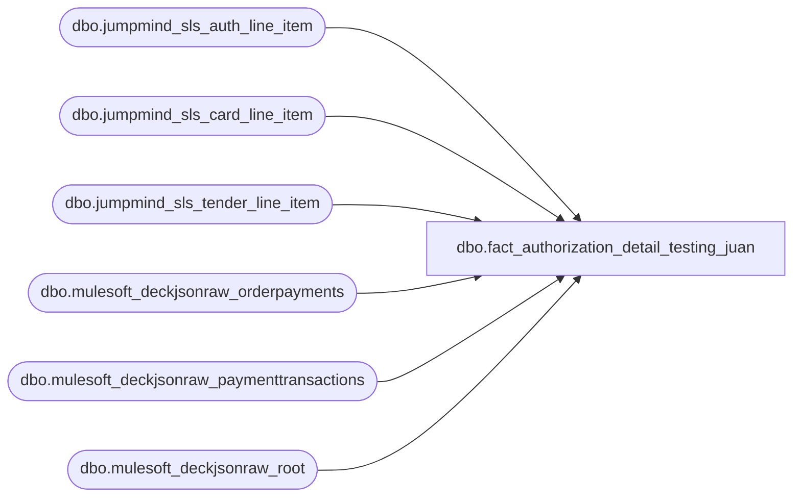

# dbo.fact_authorization_detail_testing_juan

**Database:** LH_Source  
**Server:** 4db76rlxaxcuvmuh5kw37wbnqq-ovsykae43znuhlmnflcdwm4ohu.datawarehouse.fabric.microsoft.com  

## Architecture Diagram



## Table Dependencies

| Referenced Table |
|---|
| dbo.jumpmind_sls_auth_line_item |
| dbo.jumpmind_sls_card_line_item |
| dbo.jumpmind_sls_tender_line_item |
| dbo.mulesoft_deckjsonraw_orderpayments |
| dbo.mulesoft_deckjsonraw_paymenttransactions |
| dbo.mulesoft_deckjsonraw_root |

## View Code

```sql
CREATE VIEW [dbo].[fact_authorization_detail_testing_juan] AS WITH pos_auth AS (     SELECT         CAST(ali.device_id       AS varchar(64)) + '|' +         CAST(ali.business_date   AS varchar(8))  + '|' +         CAST(ali.sequence_number AS varchar(20))                     AS transaction_id,         CAST(tli.line_sequence_number AS varchar(20))                AS line_id,         ali.auth_code                                                AS authorization_no,         CASE             WHEN cli.expiration_date IS NULL OR LEN(cli.expiration_date) < 4 THEN NULL             ELSE SUBSTRING(cli.expiration_date, 1, 2) + SUBSTRING(cli.expiration_date, 3, 2)         END                                                          AS expiry_date_mmyy,         ali.auth_code                                                AS approval_message,         CASE             WHEN UPPER(cli.brand) IN ('VISA','V')                                   THEN 604             WHEN UPPER(cli.brand) IN ('MASTERCARD','MC','M')                        THEN 605             WHEN UPPER(cli.brand) IN ('AMEX','AMERICAN EXPRESS','AMERICAN_EXPRESS','A') THEN 606             WHEN UPPER(cli.brand) IN ('DISCOVER','D')                               THEN 608             WHEN UPPER(cli.brand) IN ('MAESTRO','VPAY','INTERAC_CARD','USPINDEBIT',                                       'DEBIT CARD','DEBIT','SOLO','SWITCH','T')     THEN 611             WHEN UPPER(cli.brand) IN ('JCB','J')                                    THEN 642             WHEN UPPER(cli.brand) = 'UK CREDIT CARD'                                THEN 604             ELSE NULL         END                                                          AS line_object,         CAST('JUMPMIND' AS varchar(10))                              AS source_system       FROM LH_Source.dbo.jumpmind_sls_auth_line_item AS ali       JOIN LH_Source.dbo.jumpmind_sls_card_line_item AS cli         ON  cli.device_id            = ali.device_id         AND cli.business_date        = ali.business_date         AND cli.sequence_number      = ali.sequence_number         AND cli.line_sequence_number = ali.card_line_sequence_number       JOIN LH_Source.dbo.jumpmind_sls_tender_line_item AS tli         ON  tli.device_id                = cli.device_id         AND tli.business_date            = cli.business_date         AND tli.sequence_number          = cli.sequence_number         AND tli.line_sequence_number     = cli.ref_line_sequence_number      WHERE ali.voided = 0        AND (ali.post_void = 0 OR ali.post_void IS NULL)        AND ali.auth_type_code = 'CHARGE'        AND ali.result_code = 'OK' ), oms_auth AS (     SELECT         djr.OrderNumber                                              AS transaction_id,         CAST(op.ID AS varchar(20))                                   AS line_id,         pt.Generic1                                                  AS authorization_no,         CAST(NULL AS varchar(4))                                     AS expiry_date_mmyy,         CAST(op.ID AS varchar(40))                                   AS approval_message,         CASE             WHEN UPPER(op.Generic1) IN ('VISA','V')                                   THEN 604             WHEN UPPER(op.Generic1) IN ('MASTERCARD','MC','M')                        THEN 605             WHEN UPPER(op.Generic1) IN ('AMEX','AMERICAN EXPRESS','AMERICAN_EXPRESS','A') THEN 606             WHEN UPPER(op.Generic1) IN ('DISCOVER','D')                               THEN 608             WHEN UPPER(op.Generic1) IN ('MAESTRO','VPAY','INTERAC_CARD','USPINDEBIT',                                         'DEBIT CARD','DEBIT','SOLO','SWITCH','T')     THEN 611             WHEN UPPER(op.Generic1) IN ('JCB','J')                                    THEN 642             ELSE NULL         END                                                          AS line_object,         CAST('DECK_OMS' AS varchar(10))                              AS source_system       FROM LH_Source.dbo.mulesoft_deckjsonraw_orderpayments AS op       JOIN LH_Source.dbo.mulesoft_deckjsonraw_root AS djr         ON djr.OrderID = op._ParentKeyField       OUTER APPLY (           /* Prefer auth/capture events (TypeId 1=Auth, 2=Capture, 10=ReAuth)              over refund events. AW always records the original auth/capture              PSP reference; picking by DESC date alone returns the refund              event on returned orders, producing an auth_no mismatch. */           SELECT TOP 1 x.Generic1             FROM LH_Source.dbo.mulesoft_deckjsonraw_paymenttransactions AS x            WHERE x.OrderPaymentId = op.ID              AND (x.IsDecline = 0 OR x.IsDecline IS NULL)              AND x.Generic1 IS NOT NULL            ORDER BY CASE WHEN x.PaymentTransactionTypeId IN (1, 2, 10) THEN 0 ELSE 1 END,                     x.TransactionDateUTC DESC       ) AS pt      WHERE pt.Generic1 IS NOT NULL ), unified AS (     SELECT * FROM pos_auth     UNION ALL     SELECT * FROM oms_auth ) SELECT     u.transaction_id,     u.line_id,     CAST('A' AS char(1))                                AS record_type,     u.line_id                                           AS line_id_aptos,     u.authorization_no                                  AS authorization_no,     u.expiry_date_mmyy                                  AS expiry_date,     CAST('1' AS varchar(3))                             AS swipe_indicator,     u.approval_message                                  AS approval_message,     CAST('' AS varchar(50))                             AS license_no,     CAST('0' AS varchar(3))                             AS other_id_type_or_auth_status,     CAST('' AS varchar(50))                             AS other_id,     CAST('0' AS varchar(3))                             AS customer_signature_obtained,     CASE u.line_object         WHEN 604 THEN 'V'         WHEN 605 THEN 'M'         WHEN 606 THEN 'A'         WHEN 608 THEN 'D'         WHEN 611 THEN 'T'         WHEN 642 THEN 'J'         WHEN 670 THEN 'V'         WHEN 671 THEN 'M'         WHEN 672 THEN 'D'         WHEN 673 THEN 'A'         ELSE ''     END                                                 AS card_type,     CAST('' AS varchar(30))                             AS deferred_billing_or_auth_datetime,     CAST('0' AS varchar(3))                             AS deferred_billing_plan,     CAST('' AS varchar(10))                             AS pos_state_code,     CASE WHEN '1' = '1' THEN 'Manually Keyed' ELSE 'Other' END AS swipe_indicator_desc,     CASE WHEN CAST('' AS varchar(50)) LIKE '%HostCapture%' THEN 1 ELSE 0 END AS exclude_from_settlement,     u.line_object                                       AS line_object,     u.source_system   FROM unified AS u  WHERE u.line_object IN (604, 605, 606, 608, 611, 642, 670, 671, 672, 673);
```

