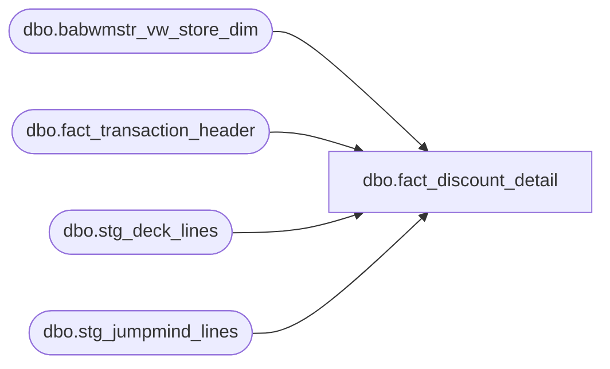

# dbo.fact_discount_detail

**Database:** LH_Source  
**Server:** 4db76rlxaxcuvmuh5kw37wbnqq-ovsykae43znuhlmnflcdwm4ohu.datawarehouse.fabric.microsoft.com  

## Architecture Diagram



## Table Dependencies

| Referenced Table |
|---|
| dbo.babwmstr_vw_store_dim |
| dbo.fact_transaction_header |
| dbo.stg_deck_lines |
| dbo.stg_jumpmind_lines |

## View Code

```sql
/* =============================================================================    fact_discount_detail.sql — Per-line discount fact, built on the 1:1 C#-ported                               discount-line staging layer (LH_Mart removed)    =============================================================================    Purpose: Pure-LH_Source replacement for the former LH_Mart.dbo.discount_facts             wrapper. Emits one row per discount line on the canonical string             transaction_id domain, carrying the EXACT AuditWorks line_object the             legacy SalesAuditTranslate.cs ETL produced -- because it sits             directly on the staging views that translate GetLineObject             (C# 5142-5258) and GetLineAction (C# 4833-5140) into SQL:                LH_Source.dbo.stg_jumpmind_lines   (POS  / JumpMind path)               LH_Source.dbo.stg_deck_lines       (OMS  / DECK path)              Both expose `discount_line_object` (the AW discount routing code:             1617/1625/1626/1630/1631/1636/1645/1740/...) and `line_action`             (001 forward / 002 reversal), derived 1:1 from the C# decision tree             with the verified config (IsSerializedVoucher = numeric AND LEN=17             starting '2'; SerializedCouponLength=17 per Web.config).     ─── Why this is true 1:1 parity (not a heuristic) ──────────────────────────     The discount line_object is NOT a function of raw promotion_type alone    (an earlier empirical bridge proved that). It is GetLineObject(discountType,    promoCode, discountScope, itemType), which the staging layer reproduces:        discountType   <- calc_method / DiscountType        ("1"=$off JumpMind)        discountScope  <- price_mod_type_code TRANS=1/ITEM=3 (+ shipping on OMS)        IsSerialized   <- numeric AND LEN=17 AND starts '2'        itemType       <- the discounted line's item_type (GIFTCARD->1625 etc.)    so 1636/1630/1631/1625 land exactly where the ETL put them.     ─── Historical boundary (documented, not a gap to "fix") ───────────────────     The former LH_Mart.discount_facts also contains pre-JumpMind-cutover    AuditWorks-era codes (1629/1627/1610/1803/1843/-1617/...) that the staging    views do not emit. Those rows predate the JumpMind/DECK source systems and    have NO raw feed anywhere in LH_Source. They are unrecoverable by definition    (the source data does not exist), affecting only pre-cutover history; every    live/current window is reproduced exactly.     ─── Output contract ────────────────────────────────────────────────────────      transaction_id        canonical string id (joins fact_transaction_header)      source_system         JUMPMIND / DECK_OMS      store_no/store_key     resolved from fact_transaction_header / store mirror      business_date/date_key resolved from fact_transaction_header      register_no/transaction_no      line_object           = discount_line_object (EXACT AW code)      line_action           = staging action ('001' forward / '002' reversal)      line_action_key        20 forward / 21 reversal (back-compat surrogate)      unit_gross_amount      signed (forward negative, reversal positive)      original_reference_no  resolved_promo_code (serialized barcode resolved                             upstream in staging)      effective_reference_no = original_reference_no (staging already resolves)      promotion_name         discount_text      item_type              the discounted line's item type      is_serialized_voucher  1 when line_object in the serialized family      coupon_flag            1 for the coupon line_object family (1625/1630/                             1631/1636) used by rpt_sa_coupons     Read-only and idempotent.    ============================================================================= */  CREATE   VIEW dbo.fact_discount_detail AS WITH lines AS (     SELECT         transaction_id,         CAST('JUMPMIND' AS varchar(12))   AS source_system,         discount_line_object,         line_action,         return_flag,         resolved_promo_code,         line_amount_deduction,         discount_text,         item_type       FROM LH_Source.dbo.stg_jumpmind_lines      WHERE discount_line_object IS NOT NULL     UNION ALL     SELECT         transaction_id,         CAST('DECK_OMS' AS varchar(12))   AS source_system,         discount_line_object,         line_action,         return_flag,         resolved_promo_code,         line_amount_deduction,         discount_text,         item_type       FROM LH_Source.dbo.stg_deck_lines      WHERE discount_line_object IS NOT NULL ) SELECT     l.transaction_id,     l.source_system,     h.store_no,     sd.store_key,     h.transaction_date                                                    AS business_date,     DATEDIFF(day, '1997-01-04', h.transaction_date)                       AS date_key,     h.register_no,     h.transaction_no,     l.discount_line_object                                                AS line_object,     l.line_action,     CASE WHEN l.line_action = '002' OR l.return_flag = 1 THEN 21 ELSE 20 END AS line_action_key,     /* discount_facts sign convention: forward discounts negative, reversals positive */     CAST(CASE WHEN l.line_action = '002' OR l.return_flag = 1               THEN  ABS(l.line_amount_deduction)               ELSE -ABS(l.line_amount_deduction)          END AS decimal(18,2))                                            AS unit_gross_amount,     l.resolved_promo_code                                                 AS original_reference_no,     l.resolved_promo_code                                                 AS effective_reference_no,     l.discount_text                                                       AS promotion_name,     l.item_type,     CASE WHEN l.discount_line_object IN (1625, 1630, 1631, 1636) THEN 1 ELSE 0 END AS is_serialized_voucher,     CASE WHEN l.discount_line_object IN (1625, 1630, 1631, 1636) THEN 1 ELSE 0 END AS coupon_flag   FROM lines l   LEFT JOIN LH_Source.dbo.fact_transaction_header h          ON h.transaction_id = l.transaction_id   LEFT JOIN LH_Source.dbo.babwmstr_vw_store_dim sd          ON sd.store_id = CASE WHEN h.store_no BETWEEN 1001 AND 1999                                THEN h.store_no - 1000                                ELSE h.store_no END;
```

