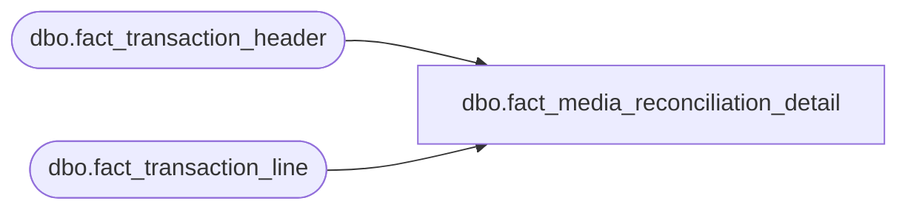

# dbo.fact_media_reconciliation_detail

**Database:** LH_Source  
**Server:** 4db76rlxaxcuvmuh5kw37wbnqq-ovsykae43znuhlmnflcdwm4ohu.datawarehouse.fabric.microsoft.com  

## Architecture Diagram



## Table Dependencies

| Referenced Table |
|---|
| dbo.fact_transaction_header |
| dbo.fact_transaction_line |

## View Code

```sql
CREATE   VIEW dbo.fact_media_reconciliation_detail AS WITH mr_transactions AS (     /* Filter to media reconciliation control transactions only (POS).        Per BBW_Fabric_Table_Specifications.md cross-cutting rule #2 and        Step 5A empirical verification (2026-05-11): BBW does not emit        transaction_series='M' or 'Z' — these are AW-legacy values not        produced by BBW's C# Stage A/B translation. Filter on        transaction_category IN (250, 251) only. */     SELECT         h.transaction_id,         h.store_no,         h.register_no,         h.transaction_date,         h.transaction_no,         h.transaction_series,         h.transaction_category,         h.till_no,         h.cashier_no       FROM dbo.fact_transaction_header AS h      WHERE h.source_system = 'JUMPMIND'        AND h.transaction_category IN (250, 251)                /* Media Rec / Bank Rec */ ), mr_lines AS (     SELECT         mt.store_no,         mt.register_no,         mt.transaction_date,         mt.transaction_no,         mt.transaction_series,         mt.till_no,         mt.cashier_no,         l.line_id,         l.line_object                                          AS rec_group_line_object,         l.line_action,         l.gross_line_amount,         l.pos_discount_amount,         l.units,         l.reference_no,         /* Action-based amount classification */         CASE             WHEN l.line_action IN ('247','248','239')          THEN l.gross_line_amount             ELSE                                                     0         END                                                    AS declared_amount,         CASE             WHEN l.line_action IN ('246','236','237','238','244') THEN l.gross_line_amount             ELSE                                                     0         END                                                    AS counted_amount,         CASE             WHEN l.line_action IN ('249','243','240')          THEN l.gross_line_amount             ELSE                                                     0         END                                                    AS deposited_amount,         CASE             WHEN l.line_action IN ('250','251','252')          THEN l.gross_line_amount             ELSE                                                     0         END                                                    AS short_amount,         l.source_system       FROM dbo.fact_transaction_line AS l       JOIN mr_transactions          AS mt ON mt.transaction_id = l.transaction_id ) SELECT     m.store_no,     m.register_no,     m.transaction_date,     m.transaction_no,     m.transaction_series,     m.till_no,     m.cashier_no,     m.line_id,     m.rec_group_line_object,     m.line_action,     m.declared_amount,     m.counted_amount,     m.deposited_amount,     m.short_amount,     m.gross_line_amount,     m.pos_discount_amount,     m.units,     m.reference_no,     /* Net of declared - deposited (running short or over) */     (m.declared_amount - m.deposited_amount + m.counted_amount - m.short_amount) AS reconciliation_net,     m.source_system   FROM mr_lines AS m;
```

