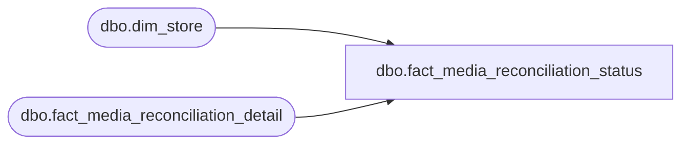

# dbo.fact_media_reconciliation_status

**Database:** LH_Source  
**Server:** 4db76rlxaxcuvmuh5kw37wbnqq-ovsykae43znuhlmnflcdwm4ohu.datawarehouse.fabric.microsoft.com  

## Architecture Diagram



## Table Dependencies

| Referenced Table |
|---|
| dbo.dim_store |
| dbo.fact_media_reconciliation_detail |

## View Code

```sql
/* =============================================================================    fact_media_reconciliation_status.sql — Media Reconciliation Status (POS only)    =============================================================================    Purpose: Replicates AuditWorks `dbo.RPT_V_MED_REC_STATUS` view. Provides             per-store/per-tender running balance snapshot used by media             reconciliation reports.     Source: BBW_Fabric_Analytics/docs/reference-data/views.rpt            RPT_V_MED_REC_STATUS at line 145 (text confirmed):              SELECT DISTINCT                 m.store_no, s.ORG_CHN_NAME,                 MAX(m.last_activity_date_time) last_activity_date_time,                 m.rec_group_line_object,                 SUM(m.current_balance_amount) current_balance,                 SUM(m.current_balance_exchange_amount) ...     Aggregation layer over fact_media_reconciliation_detail. POS only.     Schema:      - store_no, store_name (ORG_CHN_NAME equivalent — from dim_store)      - rec_group_line_object — the tender being tracked      - last_activity_date_time      - current_balance — sum of declared - deposited      - exchange_balance — for foreign-currency tenders (CAD/EUR/GBP at US stores)     ⚠ TODO: Verify exchange-currency reconciliation logic against actual             RPT_V_MED_REC_STATUS body once full SP/view extract is available.    ============================================================================= */  CREATE   VIEW dbo.fact_media_reconciliation_status AS /* COALESCE on dim_store columns to avoid NULL-grouping when a media row    references a store_no that's missing from dim_store. Without these    defaults, rows for unknown stores silently roll into a single all-NULL    bucket and corrupt cross-store totals. */ SELECT     m.store_no,     COALESCE(s.store_name,           '(unknown store)')                        AS store_name,     COALESCE(s.currency_code,        '(unknown)')                              AS currency,     COALESCE(s.legal_entity_company, '(unknown)')                              AS legal_entity_company,     m.rec_group_line_object,     MAX(m.transaction_date)                                                    AS last_activity_date_time,     /* Aggregate balances per store/tender */     SUM(m.declared_amount)                                                     AS total_declared_amount,     SUM(m.counted_amount)                                                      AS total_counted_amount,     SUM(m.deposited_amount)                                                    AS total_deposited_amount,     SUM(m.short_amount)                                                        AS total_short_amount,     /* Current balance: declared - deposited */     SUM(m.declared_amount - m.deposited_amount)                                AS current_balance,     /* Net reconciliation result (declared - deposited + counted - short) */     SUM(m.reconciliation_net)                                                  AS current_balance_net,     COUNT(*)                                                                   AS line_count   FROM dbo.fact_media_reconciliation_detail AS m   LEFT JOIN dbo.dim_store                   AS s     ON TRY_CAST(s.store_id AS int) = m.store_no  GROUP BY     m.store_no,     COALESCE(s.store_name,           '(unknown store)'),     COALESCE(s.currency_code,        '(unknown)'),     COALESCE(s.legal_entity_company, '(unknown)'),     m.rec_group_line_object;
```

