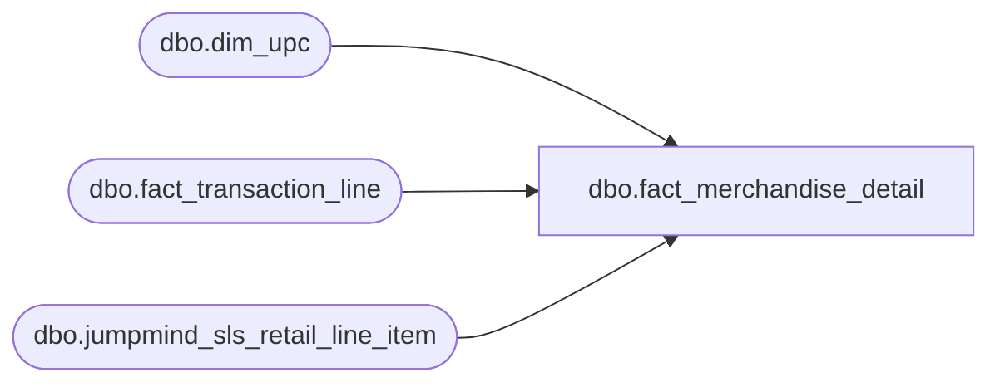

# dbo.fact_merchandise_detail

**Database:** LH_Source  
**Server:** 4db76rlxaxcuvmuh5kw37wbnqq-ovsykae43znuhlmnflcdwm4ohu.datawarehouse.fabric.microsoft.com  

## Architecture Diagram



## Table Dependencies

| Referenced Table |
|---|
| dbo.dim_upc |
| dbo.fact_transaction_line |
| dbo.jumpmind_sls_retail_line_item |

## View Code

```sql
CREATE   VIEW dbo.fact_merchandise_detail AS WITH merch_lines AS (     SELECT         l.transaction_id,         l.line_id,         l.line_object,         l.line_action,         l.upc,         l.units,         l.item_type,         l.return_flag,         l.is_stock_order_line_item,         l.source_system,         l.find_a_bear_id,         l.db_cr_none,                /* passthrough for rpt_merch_report Net Sales formula */         l.voiding_reversal_flag,     /* passthrough for rpt_merch_report Net Sales formula */         l.gross_line_amount,         /* passthrough; aliased to sold_at_price in final SELECT */         u.dept_class,         u.aptos_dept_class_code,         u.is_giftcard,         u.is_donation,         u.item_description       FROM dbo.fact_transaction_line AS l       LEFT JOIN dbo.dim_upc           AS u ON u.upc = l.upc      WHERE l.line_object IN (100, 101, 102, 103, 104, 105, 106, 115)            /* AuditWorks line_object_type=1 (Merchandise) only per               AuditWorks_line_object_join_line_object_type.csv and Aptos M-record               spec. Prior BETWEEN 100-199 OR 200-299 range included Fee-type codes               (200 Shipping, 202 Embroidery, 296 GSR) producing false-positive rows               not present in legacy sv_merchandise_detail. */ ), pos_extras AS (     /* Synthetic transaction_id per JumpMind composite-key convention.        Per Ryan May 6 schema dump, retail_line_item has no transaction_id;        composite is (device_id, business_date, sequence_number).         Aptos M-record fields 8/9/17/18/19/20/22 (salesperson, salesperson_2,        scanned_flag, originating/source/fulfillment store, unit_cost) are        INTENTIONALLY NULL: column-usage audit (May 6) confirmed none are        consumed by any of the 19 SmartLook reports or fabric-sql-dev drafts.        Preserved as lineage shape only; no downstream impact. Do NOT chase. */     SELECT         CAST(rli.device_id        AS varchar(64)) + '|' +         CAST(rli.business_date    AS varchar(8))  + '|' +         CAST(rli.sequence_number  AS varchar(20))                    AS transaction_id,         rli.line_sequence_number                                     AS line_id,         CAST(NULL AS varchar(20))                                    AS salesperson_id,           /* lineage only */         CAST(NULL AS varchar(20))                                    AS salesperson2_id,          /* lineage only */         CAST(NULL AS varchar(10))                                    AS source_store_id,          /* lineage only */         CAST(NULL AS varchar(10))                                    AS fulfillment_store_id,     /* lineage only */         rli.orig_business_unit_id                                    AS originating_store_id,         CAST(NULL AS decimal(18,2))                                  AS unit_cost,                /* lineage only */         CAST(NULL AS bit)                                            AS scanned_flag,             /* lineage only */         rli.pos_item_id                                              AS pos_item_identifier       FROM LH_Source.dbo.jumpmind_sls_retail_line_item AS rli ) SELECT     m.transaction_id,     m.line_id,     /* Aptos XPOLLD0013 Merchandise Detail (22 fields) */     CAST('M' AS char(1))                                AS record_type,                    /*  1 */     m.line_id                                           AS line_id_aptos,                  /*  2 */     /* Merchandise category: BBW uses 1 (Owned) for stock, 4 (Promotional) for        donations, 5 (Commissionable Services) for embroidery/services */     CASE         WHEN m.is_donation = 1                                                  THEN 4         WHEN m.item_type IN ('SERVICE','EMBROIDERY')                            THEN 5         ELSE                                                                          1     END                                                 AS merchandise_category,           /*  3 */     CAST(1 AS int)                                      AS unused_4,                       /*  4 */     m.upc                                               AS upc,                            /*  5 */     /* Units always positive per Aptos spec footnote 2 — return effect comes        from line_action (sold vs returned) not from sign of Units */     ABS(COALESCE(m.units, 1))                           AS units,                          /*  6 */     CAST(1 AS int)                                      AS units_multiplication_factor,    /*  7 */     pe.salesperson_id                                   AS salesperson,                    /*  8 */     pe.salesperson2_id                                  AS salesperson_2,                  /*  9 */     CAST(0 AS bit)                                      AS price_override_flag,            /* 10 — TODO derive */     CAST(0 AS bit)                                      AS upc_missing_in_iplu_flag,       /* 11 */     m.aptos_dept_class_code                             AS pos_dept_class,                 /* 12 */     /* Field 13 = "no-hit" dept/class, populated only when UPC lookup failed.        BBW always provides UPC, so the lookup never fails — always 0 here. */     CAST(0 AS int)                                      AS pos_no_hit_dept_class,          /* 13 */     CAST(0 AS decimal(8,4))                             AS unused_14,                      /* 14 */     CAST(0 AS decimal(8,4))                             AS unused_15,                      /* 15 */     /* Field 16 is mandatory per Aptos M-record spec; fall back to upc when        LEFT JOIN to pos_extras misses (e.g. OMS-only lines). */     COALESCE(pe.pos_item_identifier, m.upc)             AS pos_item_identifier,            /* 16 */     pe.scanned_flag                                     AS scanned_flag,                   /* 17 */     pe.originating_store_id                             AS originating_store_no,           /* 18 */     pe.source_store_id                                  AS source_store_no,                /* 19 */     pe.fulfillment_store_id                             AS fulfillment_store_no,           /* 20 */     CAST(1 AS int)                                      AS pos_item_identifier_type,       /* 21 */     pe.unit_cost                                        AS unit_cost,                      /* 22 */     /* Lineage / extension */     m.line_object,     m.line_action,     m.dept_class,     m.find_a_bear_id,                                                                      /* BBW extension */     m.return_flag,     m.is_stock_order_line_item,     m.item_type,     m.item_description,     m.source_system,     /* AUDITWORKS_INTERNAL passthroughs — consumed by rpt_merch_report Net Sales        formula SUM(units * db_cr_none * -1 * voiding_reversal_flag). Both flags        are hardcoded to 1 in fact_transaction_line per BBW Update #6 / Ryan        May 4. sold_at_price aliases gross_line_amount (signed line amount). */     m.db_cr_none,     m.voiding_reversal_flag,     m.gross_line_amount                                 AS sold_at_price   FROM merch_lines AS m   LEFT JOIN pos_extras AS pe     ON pe.transaction_id = m.transaction_id    AND pe.line_id        = m.line_id;
```

